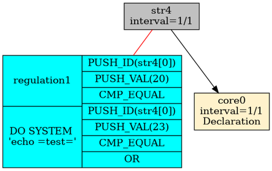

# Alarmowanie

Przez alarmowanie rozumiemy proces przetwarzania danych bieżących i bieżącego reagowania systemu w razie rozpoznania zaistniałego zjawiska przez system. Aby alarmowanie mogło funkcjonować, musza w systemie istnieć mechanizmy wspierające ten proces. W systemie RetractorDB opracowałem model alarmowania oparty na deklaracji reguł związanych z obserwacją strumieni danych. Reguły te zawierają operacje matematyczne umożliwiające analizę warunków logicznych i uruchomienie zewnętrznych procesów lub realizację zrzutu danych w wybranym oknie czasowym.

Prezentacji składni polecenia RULE na stronie 24 wspomina o tej funkcjonalności. W tym rozdziale chciałbym przybliżyć zasady działania tego rozwiązania.

Budując przykład przedstawiający zasadę działania alarmowania stwórzmy następujący plik zapytania – query.rql:

```
DECLARE a UINT STREAM core0, 1 FILE 'datafile1.txt'
SELECT str4[0] STREAM str4 FROM core0>1

RULE regulation1
ON str4
WHEN str4[0] = 20 or str4[0] = 23
DO SYSTEM 'echo "test"'
```

W pliku datafile1.txt znajdują się liczby w postaci tekstowej od 20 do 28.

```
$ seq 20 28 > datafile1.txt
```

Powyższe 3 polecenia deklarują efemeryczne źródło danych, jedno polecenie przetwarzania danych poprzez przesunięcie w czasie o jedną próbkę w czasie. Oraz regułę alarmowania. Wykonanie następującego polecenia:

```
$ xretractor -c query.rql -d -u -p -i > out.dot &&
dot -Tpng out.dot -o out.png
```

Wyświetlając plik out.png zobaczymy na ekranie coś zbliżonego:

<figure><figcaption><p>Rys. 22 Zależność obiektów w przypadku użycia alarmowania</p></figcaption></figure>

Obraz zaprezentuje jaka zachodzi zależność pomiędzy procesami odpowiedzialnymi za artefakty, alarmowanie oraz efemerydy. Równie dobrze powinno się udać podłączyć proces odpowiedzialny za alarmowanie do substratu.

Obiekty alarmowania przedstawiane są w kolorze błękitnym i połączone z obiektami, które monitorują za pomocą czerwonych, nieskierowanych linii.

Obiektów odpowiedzialnych za alarmowanie można podłączyć więcej niż jeden. Można podać więcej poleceń RULE skojarzonych z danym poleceniem tworzącym strumień danych.

Jeśli przyjrzymy się bliżej zobaczymy, że z procesem odpowiedzialnym za alarmowanie jest uruchamiany warunkiem. Następującym poleceniem możemy podejrzeć co tam właściwie się dzieje:

```
$ xretractor -c query.rql -d -u -p > out.dot &&
dot -Tpng out.dot -o out.png
```

Plik wyjściowy prezentuje się w następujący sposób:

<figure><figcaption><p>Rys. 23 Kod odpowiedzialny za warunek uruchomienia alarmowania.</p></figcaption></figure>

Ten warunek musi zostać w ostatecznej formie wyliczony do wyrażenie reprezentującego prawdę lub fałsz.

## Składnia polecenia RULE

Pełna składnia polecenia RULE ma postać:

```
RULE <nazwa>
ON <strumień>
WHEN <warunek>
DO <akcja>
```

Gdzie `<akcja>` może przyjąć jedną z dwóch form:

```
SYSTEM '<polecenie_systemowe>'
DUMP [-]<krok_wstecz> TO [-]<krok_wprzód> [RETENTION <n>]
```

### Ograniczenie

Reguła może być podpięta wyłącznie pod strumień zadeklarowany poleceniem `SELECT` (artefakt lub substrat). Podpięcie pod strumień wejściowy `DECLARE` jest błędem kompilacji:

```
# NIEPRAWIDŁOWE — core0 jest deklaracją, nie można podpiąć reguły
RULE r1 ON core0 WHEN core0[0] > 10 DO SYSTEM 'echo alarm'
```

### Warunek WHEN

Warunek to wyrażenie logiczne ewaluowane do wartości prawda/fałsz po każdej nowej próbce strumienia.

Operatory porównania: `=`, `!=`, `<`, `>`, `<=`, `>=`.
Operatory logiczne: `OR`, `AND`, `NOT`. Przykłady:

```
WHEN str1[0] > 100
WHEN str1[0] = 0 OR str1[0] = 255
WHEN str1[0] >= 10 AND str1[0] <= 90
WHEN NOT str1[0] = 0
```

## Akcja DO SYSTEM

Akcja `DO SYSTEM` wykonuje podane polecenie powłoki (przez wywołanie `system(3)`) w momencie spełnienia warunku. RetractorDB loguje kod wyjścia polecenia — niezerowy kod jest raportowany jako błąd w logu.

```
RULE alert1
ON wyniki
WHEN wyniki[0] > 1000
DO SYSTEM 'curl -s http://monitoring/alert'
```

W poleceniu można użyć dowolnego programu dostępnego w `PATH`: skryptów powłoki, programów Pythona, wywołań REST, wysyłki powiadomień, etc.

## Akcja DO DUMP

Akcja `DO DUMP` zapisuje okno próbek strumienia do pliku binarnego w momencie spełnienia warunku. Pozwala zachować kontekst zdarzenia: dane przed jego wystąpieniem i dane po nim.

```
RULE zdarzenie
ON wyniki
WHEN wyniki[0] > 500
DO DUMP -10 TO 5
```

Parametry zakresu:

| Parametr | Znaczenie |
|----------|-----------|
| ujemny `step_back` (np. `-10`) | dołącz 10 próbek **historycznych** sprzed zdarzenia |
| `0` jako `step_back` | zacznij zrzut od chwili zdarzenia |
| dodatni `step_back` (np. `2`) | opóźnij start zrzutu o 2 próbki po zdarzeniu |
| `step_forward` (np. `5`) | zbierz łącznie `step_forward - step_back` próbek |

Całkowita liczba zrzucanych rekordów: `abs(step_forward - step_back)`. Przykład: `DUMP -5 TO 5` → 10 rekordów (5 historycznych + 5 kolejnych). `DUMP 0 TO 1` → 1 rekord (bieżąca próbka).

Zakres `step_back` musi być mniejszy lub równy `step_forward`. Wartość `step_back` może być ujemna (historia) lub nieujemna (opóźnienie). Obie wartości ujemne nie są obsługiwane.

### Pliki zrzutu

Pliki są tworzone w katalogu konfigurowanym przez dyrektywę `STORAGE`. Konwencja nazewnictwa:

```
<strumień>_<nazwa_reguły>_dump.tmp          # bez RETENTION
<strumień>_<nazwa_reguły>_dump_<n>.tmp      # z RETENTION (n = 0..N-1)
```

Format pliku to surowe dane binarne zgodne z deskryptorem strumienia (bez nagłówka). Do odczytu pliku można użyć narzędzia `xtrdb`.

### Opcja RETENTION

Parametr `RETENTION <n>` ogranicza liczbę przechowywanych zrzutów — stary plik jest nadpisywany przez nowy (bufor cykliczny). Bez `RETENTION` każde wyzwolenie nadpisuje jeden plik `_dump.tmp`.

```
RULE zdarzenie
ON wyniki
WHEN wyniki[0] > 500
DO DUMP -10 TO 5 RETENTION 20
```

Powyższy przykład przechowuje 20 ostatnich zrzutów w plikach `wyniki_zdarzenie_dump_0.tmp` … `wyniki_zdarzenie_dump_19.tmp`.

## Wiele reguł dla jednego strumienia

Do jednego strumienia można przypiąć dowolną liczbę reguł różnych typów:

```
RULE alert_wysoki   ON pomiary WHEN pomiary[0] > 900 DO SYSTEM 'notify-send "Przekroczono prog"'
RULE alert_niski    ON pomiary WHEN pomiary[0] < 10  DO SYSTEM 'notify-send "Zbyt niska wartosc"'
RULE zapis_anomalii ON pomiary WHEN pomiary[0] > 900 DO DUMP -20 TO 10 RETENTION 5
```

Wszystkie reguły danego strumienia są ewaluowane przy każdej nowej próbce.
