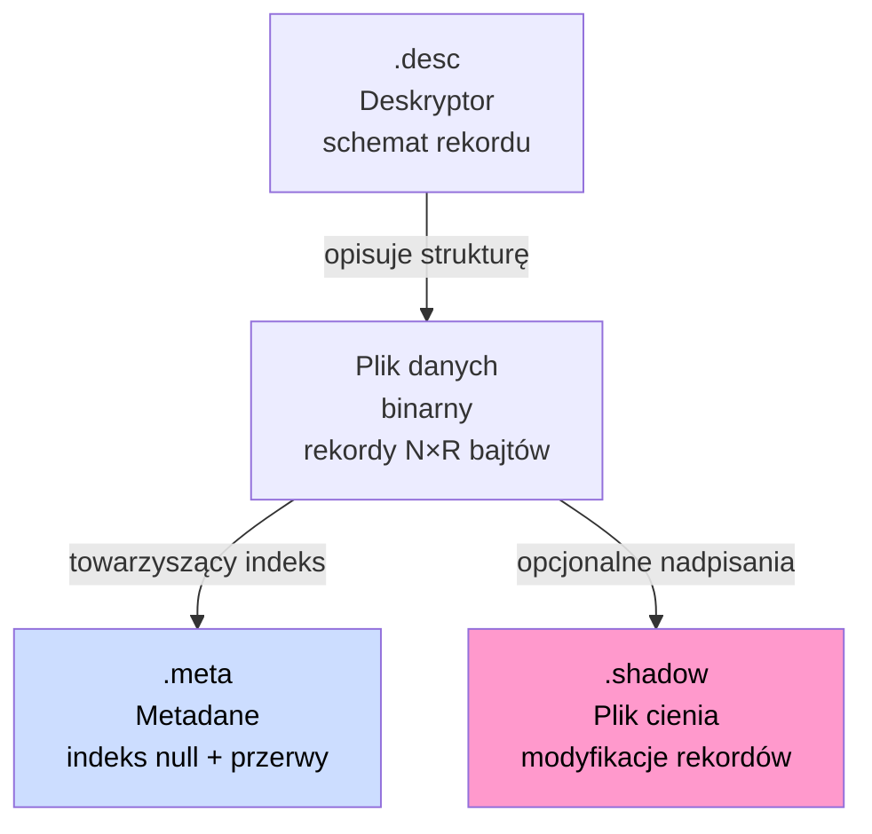
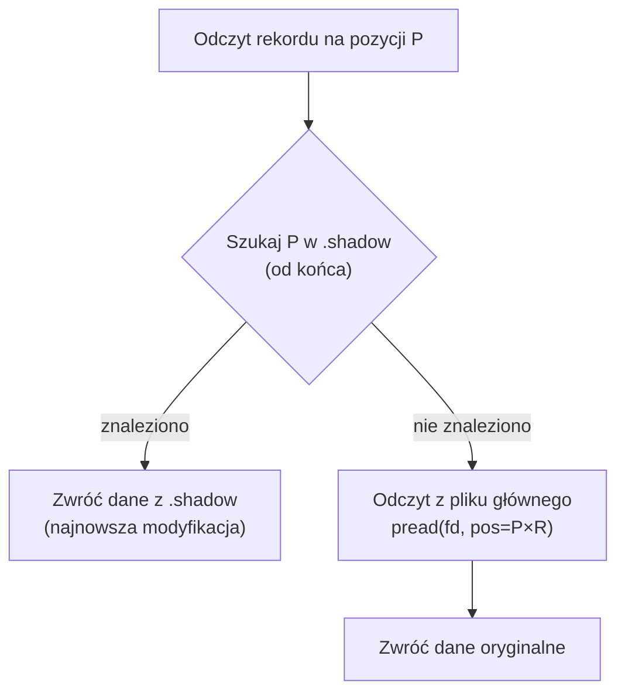
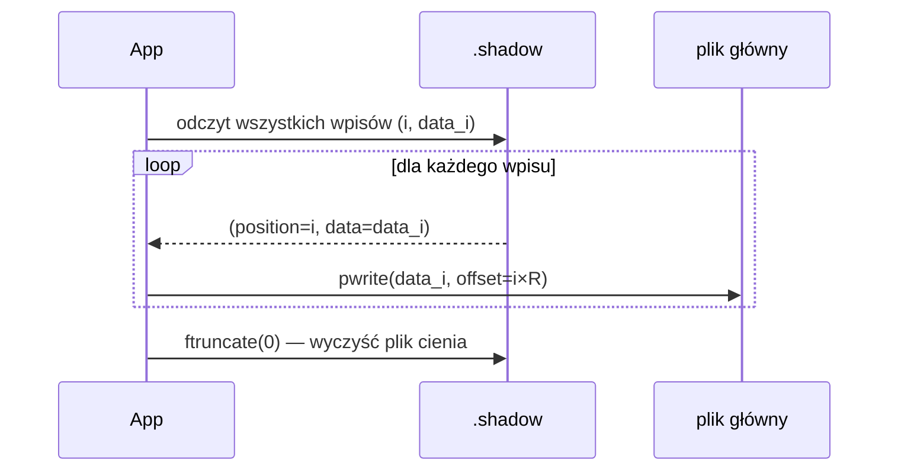
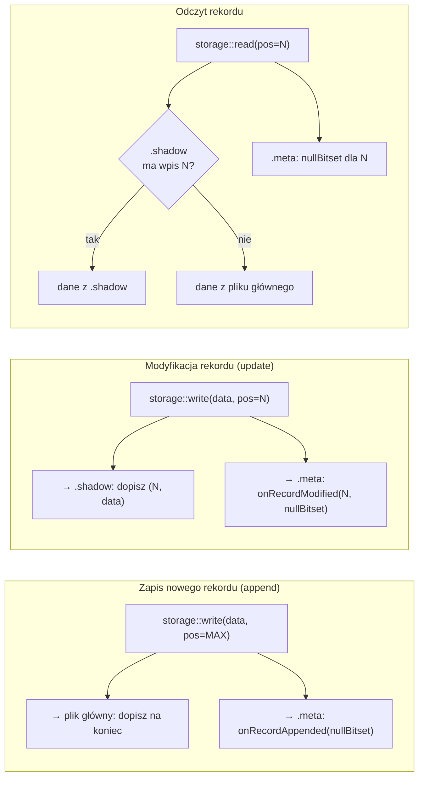

# Format zapisu artefaktów

W systemie przetwarzane są serie czasowe w postaci artefaktów, efemerydów i substratów. Dane domyślnie zapisywane są w zwykłych plikach znajdujących się pod kontrolą systemu operacyjnego.

Napływające dane organizowane są w kolejne rekordy opisane deskryptorami. Deskryptory specyfikują stałą i niezmienną postać każdego rekordu — zbiór pól z nazwami, typami i rozmiarami.

## Zestaw plików artefaktu

Każdy artefakt lub substrat może być skojarzony z maksymalnie czterema plikami:

| Plik                  | Rozszerzenie         | Cel                                                       |
| --------------------- | -------------------- | --------------------------------------------------------- |
| Plik danych binarnych | _(nazwa strumienia)_ | Główny strumień rekordów — append-only                    |
| Plik deskryptora      | `.desc`              | Schemat rekordu (pola, typy, rozmiary)                    |
| Plik metadanych       | `.meta`              | Indeks wartości null i przerw w transmisji (RLE)          |
| Plik cienia           | `.shadow`            | Modyfikacje rekordów bez nadpisywania danych oryginalnych |



_Rys. 10. Zestaw plików artefaktu i ich powiązania_

Plik cienia i plik metadanych są opcjonalne. W przypadku ciągłego napływu danych bez przerw i bez modyfikacji — wystarczy sam plik danych binarnych i deskryptor.

***

## Plik danych binarnych

Plik danych to sekwencja rekordów o stałej długości, zapisywanych jeden po drugim bez żadnego nagłówka. Rozmiar pojedynczego rekordu `R` wyznaczany jest przez deskryptor jako suma bajtów wszystkich pól.

| Offset w pliku | Zawartość  | Rozmiar  |
| -------------- | ---------- | -------- |
| 0              | Rekord 0   | R bajtów |
| R              | Rekord 1   | R bajtów |
| 2R             | Rekord 2   | R bajtów |
| ...            | ...        | ...      |
| (N-1) × R      | Rekord N-1 | R bajtów |

Każdy rekord zawiera upakowane wartości pól w kolejności zdefiniowanej przez deskryptor:

| Offset w rekordzie             | Pole    | Rozmiar       |
| ------------------------------ | ------- | ------------- |
| 0                              | pole\_0 | len\_0 bajtów |
| len\_0                         | pole\_1 | len\_1 bajtów |
| len\_0 + len\_1                | ...     | ...           |
| len\_0 + len\_1 + ... + len\_n | pole\_n | len\_n bajtów |

Operacja **append** (dodanie nowego rekordu) dopisuje dane na koniec pliku. Operacja **update** (modyfikacja istniejącego rekordu) — jeśli istnieje plik cienia — trafia do pliku cienia, a nie do pliku głównego.

### Przykład

```
DECLARE a INTEGER, b FLOAT STREAM str1, 0.1 FILE 'data.dat'
```

Rozmiar rekordu: INTEGER (4 B) + FLOAT (4 B) = **8 bajtów**. Po 5 sekundach napływu danych (10 Hz) plik `data.dat` ma rozmiar 5 × 10 × 8 = **400 bajtów**.

***

## Plik metadanych (.meta)

Plik `.meta` to indeks wartości null i przerw w transmisji. Przechowuje informację o tym, które pola rekordów mają wartość null i gdzie wystąpiły przerwy — bez duplikowania samych danych.

### Format pliku

| Pozycja    | Zawartość                                  | Rozmiar  |
| ---------- | ------------------------------------------ | -------- |
| Nagłówek   | `creationTimeNs` (int64)                   | 8 bajtów |
| Wpis RLE 0 | `gapFlag \| count \| bitsetSize \| bitset` | zmienny  |
| Wpis RLE 1 | `gapFlag \| count \| bitsetSize \| bitset` | zmienny  |
| ...        | ...                                        | ...      |
| Wpis RLE k | wpis bieżący (w pamięci)                   | zmienny  |

### Format wpisu RLE

Każdy wpis opisuje ciąg kolejnych rekordów z identycznym wzorcem null:

| Pole          | Rozmiar       | Opis                             |
| ------------- | ------------- | -------------------------------- |
| `gapFlag`     | 1 B           | 0 = normalny rekord, 1 = przerwa |
| `recordCount` | 8 B (size\_t) | liczba rekordów w ciągu          |
| `bitsetSize`  | 8 B (size\_t) | liczba pól (N)                   |
| `bitset`      | ⌈N/8⌉ B       | bit i = pole i ma wartość null   |

### Kompresja RLE

Kolejne rekordy z tym samym wzorcem null są scalane w jeden wpis przez zwiększenie `recordCount`. Nowy wpis tworzony jest dopiero gdy wzorzec się zmienia.

**10 rekordów, 2 pola, bez null:**

| Wpis   | isGap | count | bitset |
| ------ | ----- | ----- | ------ |
| wpis 0 | F     | 10    | \[F,F] |

**Null w polu 1 od rekordu 5:**

| Wpis   | isGap | count | bitset |
| ------ | ----- | ----- | ------ |
| wpis 0 | F     | 5     | \[F,F] |
| wpis 1 | F     | 5     | \[F,T] |

**Przerwa w transmisji po rekordzie 3:**

| Wpis   | isGap | count | bitset |
| ------ | ----- | ----- | ------ |
| wpis 0 | F     | 3     | \[F,F] |
| wpis 1 | T     | 7     | \[T,T] |
| wpis 2 | F     | ...   | \[F,F] |

### Marker przerwy w transmisji (gap)

Przerwa w transmisji (np. wyłączenie systemu, zanik sygnału) rejestrowana jest jako wpis z `isGap=true` i wszystkimi bitami null ustawionymi na `true`. Parametr `count` przechowuje długość przerwy w jednostkach interwału strumienia. Sam plik danych binarnych nie zawiera żadnych dodatkowych rekordów dla przerwy — informacja żyje wyłącznie w pliku `.meta`.

***

## Plik cienia (.shadow)

Plik cienia umożliwia modyfikację zarejestrowanych rekordów bez niszczenia danych oryginalnych. Usunięcie pliku `.shadow` przywraca oryginalny stan danych.

### Format wpisu

| Pole       | Rozmiar       | Opis                           |
| ---------- | ------------- | ------------------------------ |
| `position` | 8 B (size\_t) | indeks rekordu w pliku głównym |
| `data`     | R bajtów      | nowe wartości rekordu          |

Każda modyfikacja dopisuje nowy wpis na koniec pliku cienia. Przy wielu modyfikacjach tego samego rekordu plik może zawierać wiele wpisów dla tej samej pozycji — aktualny jest ostatni.

### Priorytety odczytu



_Rys. 11. Priorytety odczytu rekordu z pliku cienia_

### Scalanie (merge)

Operacja `merge()` scala zmiany z pliku cienia do pliku głównego i zeruje plik cienia. Po scaleniu dane oryginalne są bezpowrotnie nadpisane.



_Rys. 12. Scalanie pliku cienia z plikiem głównym_

### Przykład: modyfikacja rekordu

```
# Strumień str1: 2 pola INTEGER (4B każde), recordSize = 8B
# Rekord 2 (oryginał): [100, 200]
# Modyfikacja: pole 0 → 999

# Plik .shadow po modyfikacji:
# offset 0: [position=2 (8B)][999, 200 (8B)]
```

Odczyt rekordu 2 zwróci `[999, 200]`. Odczyt rekordu 0 i 1 zwróci dane z pliku głównego (nie ma ich w shadow).

***

## Relacja pomiędzy plikami



_Rys. 13. Relacja pomiędzy operacjami zapisu, modyfikacji i odczytu artefaktu_
