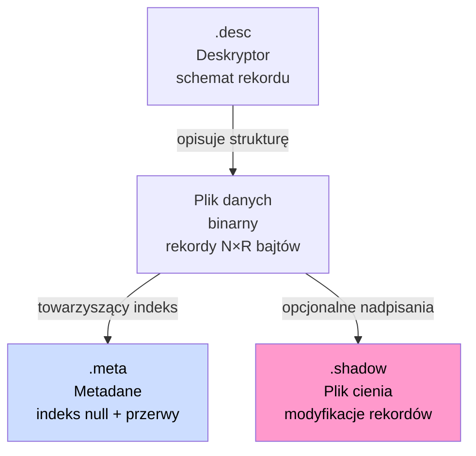
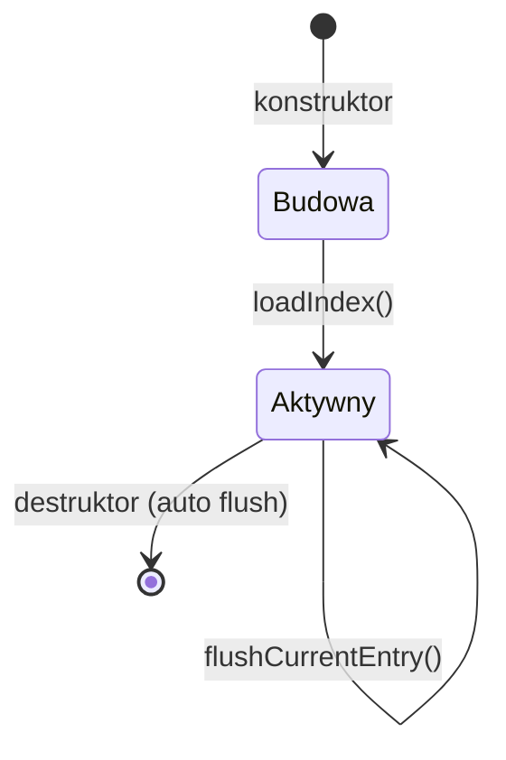
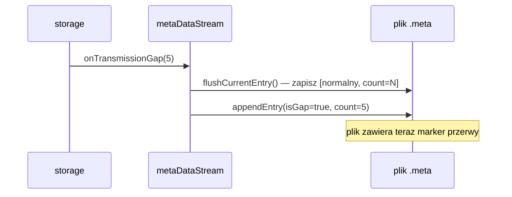
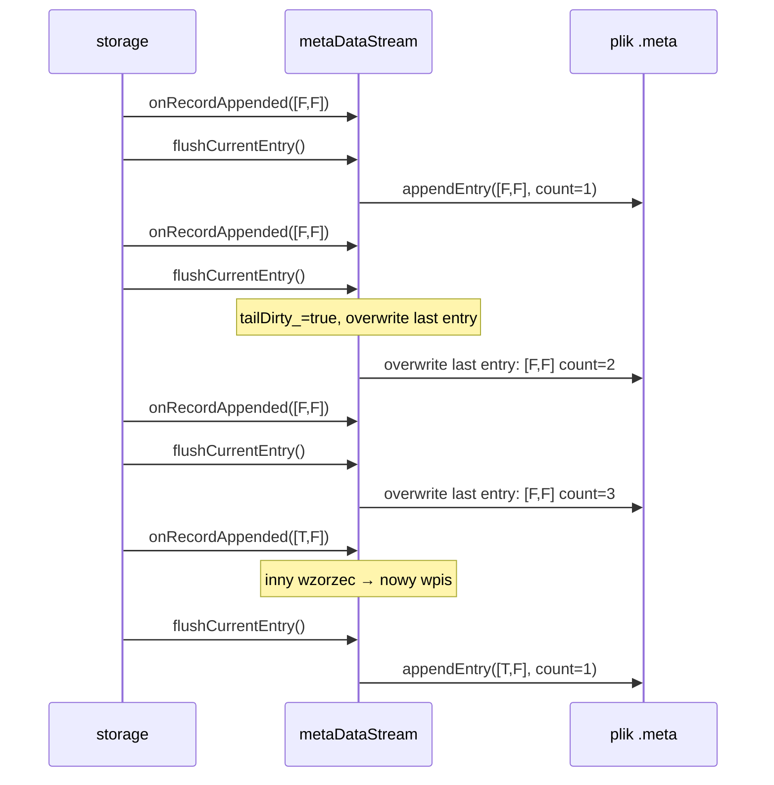
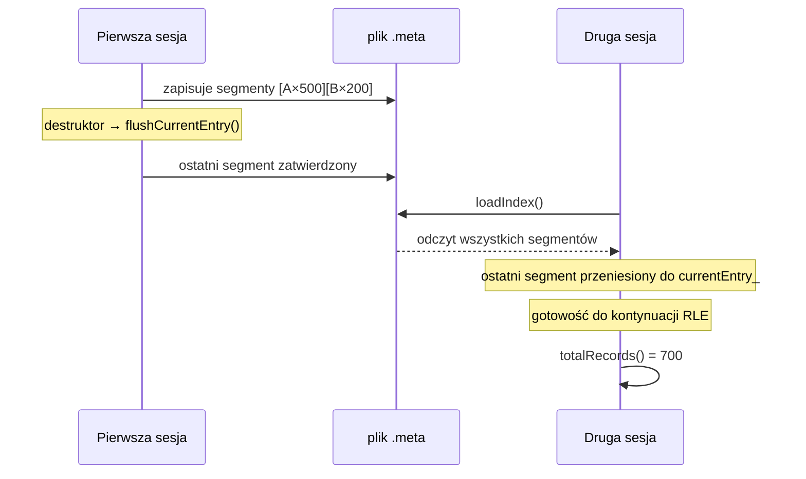
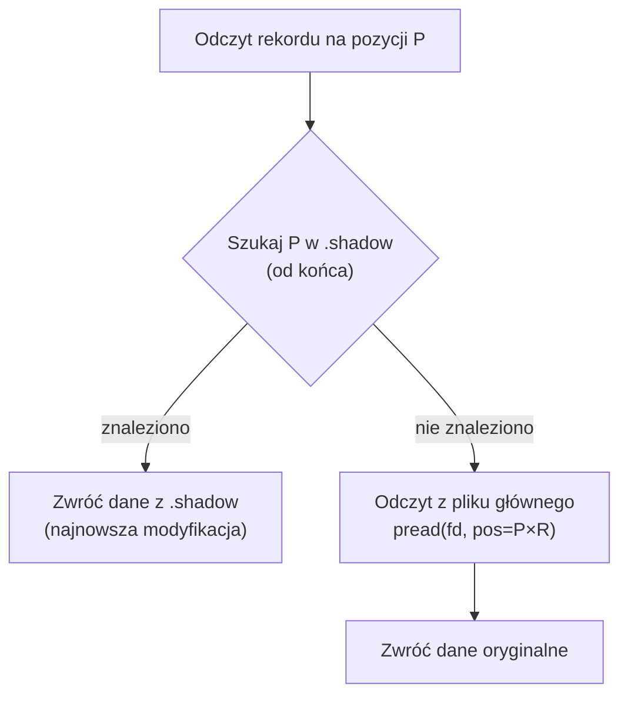
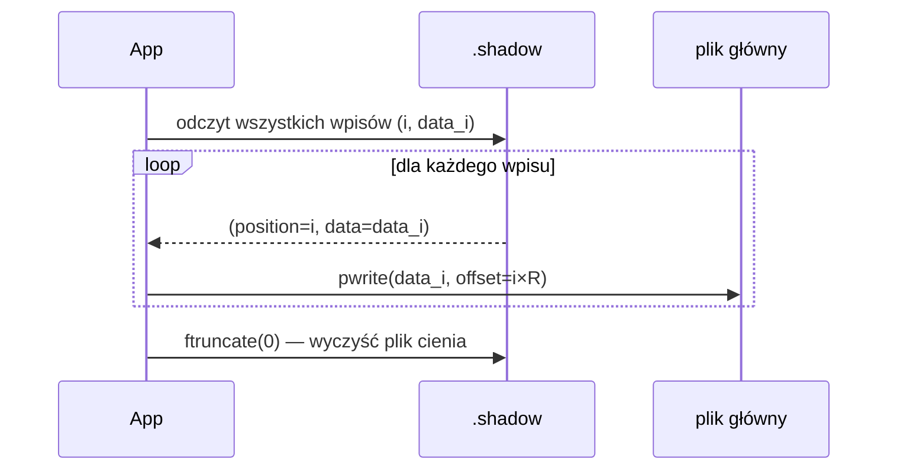
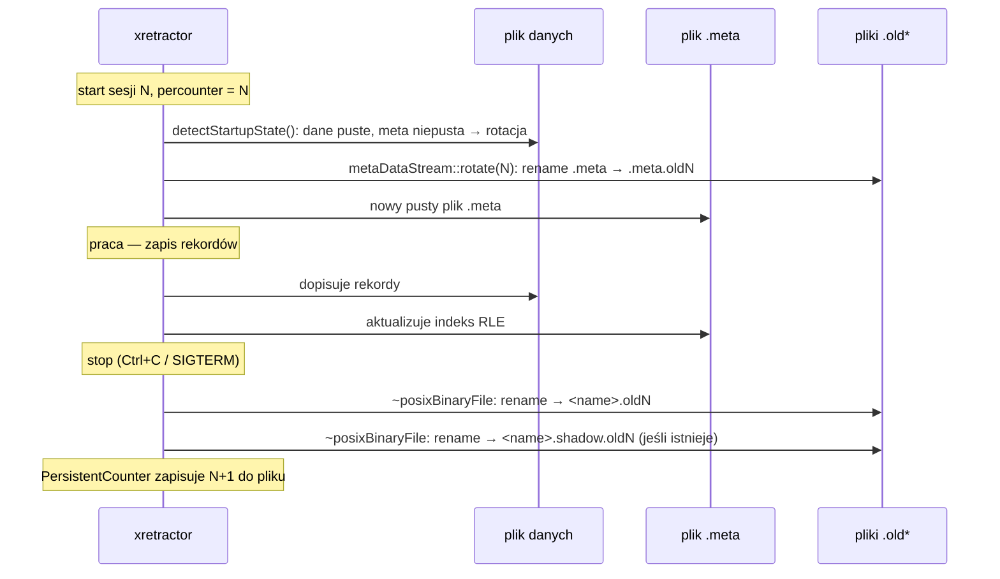
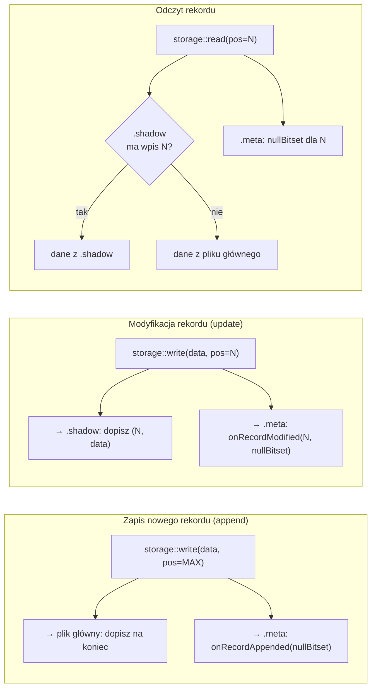

# Format zapisu danych

W systemie przetwarzane są serie czasowe w trzech postaciach: **artefaktów**, **efemerydów** i **substratów**. Każdy typ ma inne przeznaczenie i inną strategię przechowywania.

Substraty i Artefakty - formalnie niczym nie różnią się w systemie. Jedyna różnica to fakt, że substraty zostały wygenerowane w oparciu o równiania algebry strumieni danych i nie zostały zapisane bezpośrednio w ciągu poleceń dla kompilatora. Jeśli zadeklarujemy strumień Artefaktu, który pokryje postać substratu - substrat zostanie zredukowany. Efemerydy to strumienie, które powstały za pomocą polecenia Declare - zawierają wartości które istnieją tylko przez chwilkę.

### Typy akcesorów składowania

Pole `TYPE` w deskryptorze (lub dyrektywa `STORAGE` w RQL) wybiera implementację `FileInterface`:

| Typ (`TYPE_PROFILE`) | Klasa implementacji | Zastosowanie |
| -------------------- | ------------------- | ------------ |
| `DEFAULT`            | `groupFile<posixBinaryFileWithShadow>` | Artefakty domyślne — plik danych + plik cienia, z retencją |
| `DIRECT`             | `groupFile<posixBinaryFile>` | Zapis bezpośredni bez cienia, z retencją |
| `POSIX`              | `posixBinaryFile`   | Surowy zapis POSIX bez cienia |
| `POSIXSHD`           | `posixBinaryFileWithShadow` | POSIX z plikiem cienia |
| `MEMORY`             | `memoryFile`        | Składowanie wyłącznie w RAM (efemerydy) |
| `GENERIC`            | `genericBinaryFile` | Ogólny akcesor binarny |
| `DEVICE`             | `binaryDeviceRO`    | Zewnętrzne urządzenie binarnych danych wejściowych (tylko odczyt) |
| `TEXTSOURCE`         | `textSourceRO`      | Tekstowe źródło danych wejściowych (tylko odczyt) |

---

## Zestaw plików artefaktu i substratu

Artefakty i substraty zapisywane na dysk mogą być skojarzone z maksymalnie czterema plikami:

| Plik                  | Rozszerzenie         | Cel                                                       |
| --------------------- | -------------------- | --------------------------------------------------------- |
| Plik danych binarnych | _(nazwa strumienia)_ | Główny strumień rekordów — append-only                    |
| Plik deskryptora      | `.desc`              | Schemat rekordu (pola, typy, rozmiary, typ składowania)   |
| Plik metadanych       | `.meta`              | Indeks wartości null i przerw w transmisji (RLE)          |
| Plik cienia           | `.shadow`            | Modyfikacje rekordów bez nadpisywania danych oryginalnych |



_Rys. 11. Zestaw plików artefaktu i ich powiązania_

Plik cienia i plik metadanych są opcjonalne. Przy ciągłym napływie danych bez przerw i bez modyfikacji wystarczy sam plik danych binarnych i deskryptor.

Efemerydy **nie posiadają żadnych plików na dysku** — istnieją wyłącznie w pamięci operacyjnej procesu i znikają po jego zakończeniu.

---

## Plik deskryptora (.desc)

Plik `.desc` opisuje strukturę rekordu. Jest parsowany przez gramatykę ANTLR4 (`DESC.g4`) i może zawierać pola danych, metainformację o typie składowania oraz politykę retencji.

### Składnia

```
{ <polecenie>* }
```

Każde polecenie to jedno z poniższych:

```
BYTE     nazwa [N]          # tablica N bajtów (domyślnie N=1)
INTEGER  nazwa [N]          # 32-bitowe liczby całkowite ze znakiem
UINT     nazwa [N]          # 32-bitowe bez znaku
FLOAT    nazwa [N]          # 32-bitowe zmiennoprzecinkowe (IEEE 754)
DOUBLE   nazwa [N]          # 64-bitowe zmiennoprzecinkowe
RATIONAL nazwa [N]          # para int64: licznik i mianownik
STRING   nazwa [rozmiar]    # ciąg znaków o stałej długości
REF      "ścieżka/plik"     # referencja do zewnętrznego pliku deskryptora
TYPE     identyfikator      # typ składowania (DEFAULT, MEMORY, POSIXSHD, …)
RETENTION pojemność segment # retencja cykliczna na dysku
RETMEMORY pojemność         # retencja cykliczna w pamięci
```

### Przykłady plików `.desc`

**Artefakt domyślny** — dwa pola numeryczne, składowanie `DEFAULT` (plik danych + plik cienia):

```
{
  INTEGER  ts
  FLOAT    value
  TYPE     DEFAULT
}
```

**Efemeryd** — strumień ulotny wyłącznie w RAM:

```
{
  DOUBLE   x
  DOUBLE   y
  TYPE     MEMORY
}
```

**Substrat z retencją** — cykliczny bufor ostatnich 1000 rekordów na dysku (10 segmentów po 100):

```
{
  INTEGER  ts
  FLOAT    a
  FLOAT    b
  TYPE     DEFAULT
  RETENTION 1000 100
}
```

**Deklaracja źródła binarnego** (`DECLARE` w RQL generuje ten schemat):

```
{
  INTEGER  a
  FLOAT    b
  TYPE     DEVICE
  REF      "sensor/data.bin"
}
```

### Rozmiary typów pól

| Typ        | Rozmiar pojedynczej wartości |
| ---------- | ---------------------------- |
| `BYTE`     | 1 B                          |
| `INTEGER`  | 4 B                          |
| `UINT`     | 4 B                          |
| `FLOAT`    | 4 B                          |
| `DOUBLE`   | 8 B                          |
| `RATIONAL` | 16 B (dwa int64)             |
| `STRING`   | N B (deklarowany rozmiar)    |

Dla pól tablicowych `nazwa[N]` całkowity rozmiar = rozmiar_typu × N. Pola `TYPE`, `REF`, `RETENTION` i `RETMEMORY` nie zajmują miejsca w rekordzie — są metadanymi deskryptora.

Rozmiar rekordu `R` = suma rozmiarów wszystkich pól danych.

### Pole TYPE a strategia składowania

Pole `TYPE` w deskryptorze bezpośrednio wyznacza, który akcesor (`FileInterface`) zostanie użyty przez `storage::initializeAccessor()`. Brak pola `TYPE` jest równoznaczny z `DEFAULT`. Wartość jest nieczuła na wielkość liter (`MEMORY` = `memory`).

---

## Plik danych binarnych

Plik danych to sekwencja rekordów o stałej długości, zapisywanych jeden po drugim bez żadnego nagłówka. Rozmiar pojedynczego rekordu `R` wyznaczany jest przez deskryptor jako suma bajtów wszystkich pól.

| Offset w pliku | Zawartość  | Rozmiar  |
| -------------- | ---------- | -------- |
| 0              | Rekord 0   | R bajtów |
| R              | Rekord 1   | R bajtów |
| 2R             | Rekord 2   | R bajtów |
| ...            | ...        | ...      |
| (N-1) × R      | Rekord N-1 | R bajtów |

Każdy rekord zawiera upakowane wartości pól w kolejności zdefiniowanej przez deskryptor:

| Offset w rekordzie             | Pole    | Rozmiar       |
| ------------------------------ | ------- | ------------- |
| 0                              | pole\_0 | len\_0 bajtów |
| len\_0                         | pole\_1 | len\_1 bajtów |
| len\_0 + len\_1                | ...     | ...           |
| len\_0 + len\_1 + ... + len\_n | pole\_n | len\_n bajtów |

Operacja **append** (dodanie nowego rekordu) dopisuje dane na koniec pliku. Operacja **update** (modyfikacja istniejącego rekordu) — jeśli istnieje plik cienia — trafia do pliku cienia, a nie do pliku głównego.

### Przykład

```
DECLARE a INTEGER, b FLOAT STREAM str1, 0.1 FILE 'data.dat'
```

Rozmiar rekordu: INTEGER (4 B) + FLOAT (4 B) = **8 bajtów**. Po 5 sekundach napływu danych (10 Hz) plik `data.dat` ma rozmiar 5 × 10 × 8 = **400 bajtów**.

---

## Plik metadanych (.meta)

Plik `.meta` to indeks wartości null i przerw w transmisji. Przechowuje informację o tym, które pola rekordów mają wartość null i gdzie wystąpiły przerwy — bez duplikowania samych danych.

### Format pliku

| Pozycja    | Zawartość                                  | Rozmiar  |
| ---------- | ------------------------------------------ | -------- |
| Nagłówek   | `creationTimeNs` (int64)                   | 8 bajtów |
| Wpis RLE 0 | `gapFlag \| count \| bitsetSize \| bitset` | zmienny  |
| Wpis RLE 1 | `gapFlag \| count \| bitsetSize \| bitset` | zmienny  |
| ...        | ...                                        | ...      |
| Wpis RLE k | wpis bieżący (w pamięci)                   | zmienny  |

### Format wpisu RLE

Każdy wpis opisuje ciąg kolejnych rekordów z identycznym wzorcem null:

| Pole          | Rozmiar       | Opis                             |
| ------------- | ------------- | -------------------------------- |
| `gapFlag`     | 1 B           | 0 = normalny rekord, 1 = przerwa |
| `recordCount` | 8 B (size\_t) | liczba rekordów w ciągu          |
| `bitsetSize`  | 8 B (size\_t) | liczba pól (N)                   |
| `bitset`      | ⌈N/8⌉ B       | bit i = pole i ma wartość null   |

### Kompresja RLE

Kolejne rekordy z tym samym wzorcem null są scalane w jeden wpis przez zwiększenie `recordCount`. Nowy wpis tworzony jest dopiero gdy wzorzec się zmienia.

**10 rekordów, 2 pola, bez null:**

| Wpis   | isGap | count | bitset |
| ------ | ----- | ----- | ------ |
| wpis 0 | F     | 10    | \[F,F] |

**Null w polu 1 od rekordu 5:**

| Wpis   | isGap | count | bitset |
| ------ | ----- | ----- | ------ |
| wpis 0 | F     | 5     | \[F,F] |
| wpis 1 | F     | 5     | \[F,T] |

**Przerwa w transmisji po rekordzie 3:**

| Wpis   | isGap | count | bitset |
| ------ | ----- | ----- | ------ |
| wpis 0 | F     | 3     | \[F,F] |
| wpis 1 | T     | 7     | \[T,T] |
| wpis 2 | F     | ...   | \[F,F] |

### Marker przerwy w transmisji (gap)

Przerwa w transmisji (np. wyłączenie systemu, zanik sygnału) rejestrowana jest jako wpis z `isGap=true` i wszystkimi bitami null ustawionymi na `true`. Parametr `count` przechowuje długość przerwy w jednostkach interwału strumienia. Sam plik danych binarnych nie zawiera żadnych dodatkowych rekordów dla przerwy — informacja żyje wyłącznie w pliku `.meta`.

---

### Klasa metaDataStream

Plikiem `.meta` zarządza klasa `rdb::metaDataStream`. Hermetyzuje ona trzy obszary odpowiedzialności:

1. **Agregację RLE w pamięci** — buforuje bieżący segment (ostatnią serię rekordów z identycznym wzorcem null) w polu `currentEntry_`, nie zapisując go do pliku przy każdym rekordzie.
2. **Trwałość danych** — wyłącznie zakończone segmenty (gdy wzorzec się zmienia lub gdy nastąpi jawne wywołanie `flushCurrentEntry()`) trafiają do pliku jako wpisy zatwierdzone (_committed_).
3. **Indeks zapytań** — udostępnia interfejs do odpytywania wzorca null dla dowolnego rekordu oraz wykrywania przerw w transmisji.

Klasa przechowuje dwa stany:

| Stan | Lokalizacja | Opis |
| ---- | ----------- | ---- |
| Zatwierdzone segmenty | plik `.meta` na dysku | wszystkie zakończone przebiegi RLE |
| Segment bieżący (`currentEntry_`) | pamięć operacyjna | aktualnie akumulowany przebieg (jeszcze niezapisany lub do nadpisania) |

### Cykl życia obiektu



**Konstruktor** (`metaDataStream(descriptor, path)`):
- Inicjalizuje pusty `currentEntry_` na podstawie liczby pól deskryptora.
- Wywołuje `loadIndex()` — jeżeli plik istnieje, wczytuje wszystkie zatwierdzone segmenty, wyznacza `committedRecordCount_`, a ostatni niegapowy segment przenosi z powrotem do `currentEntry_` (umożliwia kontynuację serii RLE po restarcie).
- Jeżeli plik nie istnieje, tworzy go i zapisuje nagłówek (znacznik czasu utworzenia strumienia).

**Destruktor** automatycznie wywołuje `flushCurrentEntry()`, gwarantując, że bieżący bufor trafi na dysk nawet gdy program zakończy pracę w normalnym trybie.

### Interfejs aktualizacji

Klasa wyróżnia trzy scenariusze zmiany stanu metadanych:

#### `onRecordAppended(nullBitset)`

Wywoływany przez `storage` po każdym dołączeniu nowego rekordu do pliku danych.

```
wzorzec identyczny z currentEntry_?
├─ TAK → zwiększ currentEntry_.recordCount (akumulacja RLE, brak I/O)
└─ NIE → flushCurrentEntry() (poprzedni segment na dysk)
          ustaw currentEntry_ = {nullBitset, count=1}
```

Operacja I/O następuje **wyłącznie przy zmianie wzorca** — dla serii identycznych rekordów koszt to jedna inkrementacja licznika w pamięci.

#### `onRecordModified(index, nullBitset)`

Wywoływany przez `storage` przy aktualizacji istniejącego rekordu. Lokalizuje rekord w segmentach RLE i rozbija segment na maksymalnie trzy części: przed modyfikowanym rekordem, sam rekord, za nim.

```
rekord w currentEntry_ (pamięć)?
├─ TAK → splitSegment() w pamięci, nowe fragmenty dołączone do pliku
└─ NIE → wczytaj plik, splitSegment(), przepisz plik (rewriteFile)
```

Przykład rozbicia segmentu `[allNull × 5]` przy modyfikacji rekordu 2:

```
Przed:  [allNull × 5]
Po:     [allNull × 2] [allPresent × 1] [allNull × 2]
```

#### `onTransmissionGap(duration)`

Rejestruje przerwę w transmisji o podanej długości (w jednostkach interwału strumienia). Najpierw zatwierdza bieżący segment (`flushCurrentEntry()`), następnie dołącza do pliku wpis z `isGap=true`.



### Mechanizm bezpieczeństwa: `flushCurrentEntry()` i nadpisywanie (tailDirty\_)

Klasa `storage` wywołuje `flushCurrentEntry()` po **każdym** wywołaniu `write()`, aby zagwarantować przeżycie awarii procesu. Naiwna implementacja dopisywałaby nowy wpis do pliku przy każdym flushu — powodując wzrost pliku proporcjonalny do liczby rekordów, nawet bez zmian wzorca null.

Rozwiązanie: mechanizm **lazy overwrite** oznaczany flagą `tailDirty_`.

```
flushCurrentEntry() → zapis [wzorzec, count=2] na dysk
onRecordAppended(ten sam wzorzec):
    currentEntry_.count = 2 (przywrócony z dysku)
    tailDirty_ = true        ← następny flush nadpisze, nie doda
    currentEntry_.count++    → count = 3
flushCurrentEntry() → seek na ostatni wpis, overwrite [wzorzec, count=3]
    (rozmiar pliku bez zmian)
```

Diagram sekwencji dla typowego wzorca `storage` (append + flush po każdym rekordzie):



Dzięki temu plik `.meta` rośnie wyłącznie przy **zmianie wzorca null** — nie przy każdym rekordzie. Przy ciągłym napływie jednorodnych danych plik ma stały rozmiar niezależnie od liczby rekordów.

### Persystencja i odtwarzanie stanu

Po restarcie procesu nowy obiekt `metaDataStream` wczytuje plik przez `loadIndex()`:

1. Odczytuje nagłówek — znacznik czasu (`creationTimeNs`), przechowywany jako `int64` nanosekund od epoki.
2. Wczytuje wszystkie zatwierdzone wpisy z pliku.
3. Jeżeli ostatni wpis **nie jest gap-em** — przenosi go z powrotem do `currentEntry_` i usuwa z pliku (umożliwia kontynuację RLE po restarcie bez duplikacji).
4. Wyznacza `committedRecordCount_` jako sumę `recordCount` wszystkich niegalowych wpisów pozostałych w pliku.



### Interfejs zapytań

| Metoda | Opis |
| ------ | ---- |
| `getNullBitset(i)` | Zwraca wzorzec null dla rekordu `i`. Działa zarówno dla rekordów w segmentach zatwierdzonych (dysk), jak i w segmencie bieżącym (pamięć). |
| `isGapBefore(i)` | Zwraca `true`, jeżeli bezpośrednio przed rekordem `i` w indeksie RLE znajduje się wpis `isGap=true`. Rekord 0 nigdy nie ma przerwy przed sobą. |
| `segments()` | Zwraca wszystkie segmenty RLE: zatwierdzone (z dysku) oraz bieżący (z pamięci), jeżeli jest niepusty. Służy do inspekcji i testów. |
| `totalRecords()` | Suma rekordów we wszystkich segmentach (committed + pending). |
| `isEmpty()` | Skrót: `totalRecords() == 0`. |
| `rotate(percounter)` | Rotuje plik indeksu: przemianowuje bieżący plik `.meta` na `.meta.old<N>`, tworzy nowy pusty plik. Wywoływana przez `storage::detectStartupState()` po wykryciu rotacji pliku danych (plik danych pusty, indeks niepusty). Gdy `percounter < 0`, plik nie jest przemianowywany — wykonywany jest tylko reset indeksu. |
| `reset()` | Czyści indeks w miejscu: zeruje liczniki, przepisuje plik z samym nagłówkiem bez zmiany jego nazwy. Wywoływany przez `storage` przy czyszczeniu bez zachowania historii (np. po `purge()`). |

### Przykład użycia — typowy scenariusz produkcyjny

```
storage.write(rec0)           → onRecordAppended([F,F,F]) + flushCurrentEntry()
storage.write(rec1)           → onRecordAppended([F,F,F]) + flushCurrentEntry()
storage.write(rec2_val_null)  → onRecordAppended([T,F,F]) + flushCurrentEntry()
storage.write(rec3)           → onRecordAppended([F,F,F]) + flushCurrentEntry()

Plik .meta po powyższych operacjach (4 flushe, 2 segmenty):
  [isGap=F, count=2, bitset=[F,F,F]]   ← wpis 0
  [isGap=F, count=1, bitset=[T,F,F]]   ← wpis 1  (rec2)
  [isGap=F, count=1, bitset=[F,F,F]]   ← wpis 2  (rec3, bieżący w pamięci)

getNullBitset(2) → [T,F,F]   (pole 0 rekordu 2 jest null)
isGapBefore(2)  → false
totalRecords()  → 4
```

---

## Plik cienia (.shadow)

Plik cienia umożliwia modyfikację zarejestrowanych rekordów bez niszczenia danych oryginalnych. Usunięcie pliku `.shadow` przywraca oryginalny stan danych.

### Format wpisu

| Pole       | Rozmiar       | Opis                           |
| ---------- | ------------- | ------------------------------ |
| `position` | 8 B (size\_t) | indeks rekordu w pliku głównym |
| `data`     | R bajtów      | nowe wartości rekordu          |

Każda modyfikacja dopisuje nowy wpis na koniec pliku cienia. Przy wielu modyfikacjach tego samego rekordu plik może zawierać wiele wpisów dla tej samej pozycji — aktualny jest ostatni.

### Priorytety odczytu



_Rys. 12. Priorytety odczytu rekordu z pliku cienia_

### Scalanie (merge)

Operacja `merge()` scala zmiany z pliku cienia do pliku głównego i zeruje plik cienia. Po scaleniu dane oryginalne są bezpowrotnie nadpisane.



_Rys. 13. Scalanie pliku cienia z plikiem głównym_

### Przykład: modyfikacja rekordu

```
# Strumień str1: 2 pola INTEGER (4B każde), recordSize = 8B
# Rekord 2 (oryginał): [100, 200]
# Modyfikacja: pole 0 → 999

# Plik .shadow po modyfikacji:
# offset 0: [position=2 (8B)][999, 200 (8B)]
```

Odczyt rekordu 2 zwróci `[999, 200]`. Odczyt rekordu 0 i 1 zwróci dane z pliku głównego (nie ma ich w shadow).

---

## Mechanizm rotacji plików

### Domyślne zachowanie (bez dyrektywy `ROTATION`)

Bez dyrektywy `ROTATION` w skrypcie RQL, `xretractor` przy każdym starcie **usuwa** pliki artefaktów (dane binarne, `.desc`, `.meta`) i zaczyna rejestrację od nowa. Pliki deklaracji (`DECLARE`) oraz efemerydy nie są usuwane — nie mają plików na dysku.

### Dyrektywa `ROTATION` i licznik sesji

Dyrektywa `ROTATION` włącza tryb zachowania historii. Przyjmuje ścieżkę do pliku przechowującego trwały licznik sesji:

```
ROTATION rdb_counter
```

Obiekt `PersistentCounter` wczytuje wartość `N` z pliku przy starcie (`getCount()` = `N`) i zapisuje `N+1` przy zamknięciu. Licznik rośnie monotonicznie z każdą sesją `xretractor`.

### Przepływ rotacji



Rotacja pliku `.meta` następuje **przy starcie** sesji N — `detectStartupState()` wykrywa niezgodność (plik danych pusty, indeks niepusty ze starej sesji) i wywołuje `metaDataStream::rotate(N)`. Plik danych binarnych jest przemianowywany dopiero przy **zamknięciu** sesji przez destruktor `posixBinaryFile`.

### Co trafia do plików `.old<N>`

| Plik | Kiedy powstaje |
| ---- | -------------- |
| `<name>.oldN` | Zamknięcie sesji N — destruktor `posixBinaryFile` przemianowuje plik danych |
| `<name>.shadow.oldN` | Zamknięcie sesji N — destruktor `posixBinaryFileWithShadow` przemianowuje plik cienia |
| `<name>.meta.oldN` | Start sesji N — `detectStartupState()` wykrywa rotację i przemianowuje `.meta` pozostawiony przez sesję N−1 |

Wskutek tej kolejności: plik `.meta.oldN` zawiera metadane null dla danych z sesji `N−1`, podczas gdy plik `.oldN` zawiera dane sesji `N`. W sekcji `ROTATED FILES` narzędzia `xtrdb -s` pliki są grupowane według numeru suffiksu — pary `.oldN` i `.meta.oldN` różnią się więc o 1 w stosunku do sesji, której fizycznie odpowiadają.

### Przykład sekwencji trzech sesji

Po trzech zakończonych sesjach (0, 1, 2) i w trakcie czwartej (3):

```
pomiar.old0         ← dane z sesji 0 (zapis sesji 0, przemianowanie w destruktorze sesji 0)
pomiar.meta.old1    ← metadane z sesji 0 (przemianowanie przy starcie sesji 1)
pomiar.old1         ← dane z sesji 1
pomiar.meta.old2    ← metadane z sesji 1 (przemianowanie przy starcie sesji 2)
pomiar.old2         ← dane z sesji 2
pomiar.meta.old3    ← metadane z sesji 2 (przemianowanie przy starcie sesji 3)
pomiar              ← dane bieżące (sesja 3)
pomiar.meta         ← metadane bieżące (sesja 3)
```

Widok `xtrdb -s` w trakcie sesji 3:

```
$ xtrdb -s pomiar
...
├──────────────────────────────────────────────────────────────┤
│  ROTATED FILES                                               │
│  [3] pomiar.meta.old3                                   26 B │
│  [2] pomiar.old2                                       800 B │
│      pomiar.meta.old2                                   26 B │
│  [1] pomiar.old1                                       800 B │
│      pomiar.meta.old1                                   26 B │
│  [0] pomiar.old0                                       400 B │
└──────────────────────────────────────────────────────────────┘
```

Plik `pomiar.meta.old3` jest w grupie `[3]` sam — odpowiadający mu plik `pomiar.old3` powstanie dopiero przy zamknięciu bieżącej sesji.

### Otwieranie pliku rotowanego w `xtrdb`

Pliki rotowane można analizować poleceniem `open` w trybie interaktywnym `xtrdb`. Polecenie `open` automatycznie wyciąga nazwę bazową (usuwa `.old<N>`) i szuka deskryptora `<nazwa_bazowa>.desc`:

```
$ xtrdb
. open pomiar.old1
ok
. print
...
```

---

## Relacja pomiędzy plikami



_Rys. 14. Relacja pomiędzy operacjami zapisu, modyfikacji i odczytu artefaktu_

---

## Narzędzie inspekcji: `xtrdb -s`

Polecenie `xtrdb -s <ścieżka>` wyświetla kompletny obraz stanu składowania artefaktu — bez otwierania procesu `xretractor`, bez wchodzenia w tryb interaktywny. Wystarczy wskazać ścieżkę bazową (bez rozszerzenia), a narzędzie samo znajdzie powiązane pliki: `.desc`, dane binarne, `.meta`, `.shadow`, segmenty cykliczne i pliki rotowane.

### Cel i zastosowanie

| Sytuacja | Co daje `xtrdb -s` |
| -------- | ------------------- |
| Diagnoza po awarii | Widać od razu, czy plik danych jest spójny z metadanymi — różne liczby rekordów sygnalizują problem |
| Weryfikacja retencji | Sekcja DATA TOTAL pokazuje podział na segmenty i aktualny stopień wypełnienia bufora cyklicznego |
| Kontrola modyfikacji | Sekcja SHADOW ujawnia liczbę niezatwierdzonych zmian — `Updates: N` oznacza, że `merge()` nie był wykonany |
| Analiza jakości danych | Pasek META z symbolami `=`, `-`, `~`, `X` pokazuje wzorzec null i przerwy bez parsowania pliku binarnego |
| Audyt historii rotacji | Sekcja ROTATED FILES wymienia stare wersje pliku po kolejnych rotacjach |

Polecenie jest **tylko do odczytu** — nie modyfikuje żadnego pliku. Można je uruchamiać również gdy `xretractor` nie działa.

### Co pokazuje mapa

Górna część raportu to trzyelementowa mapa poglądowa:

```
│ [shadow]   │ [binary data] │ [meta index]                    │
```

Każdy wiersz mapy odpowiada jednemu segmentowi RLE lub segmentowi danych:

| Kolumna | Zawartość |
| ------- | --------- |
| `[shadow]` | Dla artefaktu bez retencji: liczba niezapisanych modyfikacji (`N updates`). Dla retencji segmentowej: etykieta segmentu `sN` z liczbą modyfikacji. |
| `[binary data]` | Zakres indeksów rekordów w pliku binarnym (`begin-end`) lub etykieta segmentu `sN begin-end`. Wiersze z przerwą w transmisji (gap) mają puste pole. |
| `[meta index]` | Opis segmentu RLE z pliku `.meta`: liczba rekordów i wzorzec null w formie `[====]`. |

Poniżej mapy następują kolejne sekcje:

| Sekcja | Opis |
| ------ | ---- |
| `DESCRIPTOR` | Ścieżka i rozmiar pliku `.desc`, lista pól z typami i rozmiarami, rozmiar rekordu w bajtach. |
| `DATA` | Liczba rekordów, ścieżka do pliku danych. Przy retencji (`RETENTION`): podział na segmenty, polityka (liczba segmentów i pojemność), maksymalny dopuszczalny rozmiar bufora, lista plików `_segment_*`. |
| `META` | Liczba segmentów RLE i rekordów w indeksie, graficzny pasek obrazujący wzorzec null w czasie. |
| `SHADOW` | Ścieżka i rozmiar pliku cienia oraz liczba niezatwierdzonych modyfikacji. |
| `ROTATED FILES` | Pliki z poprzednich rotacji (`.old1`, `.old2`, …) wraz z rozmiarami. |

#### Legenda paska META

```
[====] — dane bez wartości null
[----] — częściowe null (przynajmniej jedno pole ma wartość null)
[~~~~] — wszystkie pola mają wartość null (nullfill)
[XXXX] — przerwa w transmisji (gap)
```

---

### Przykład 1 — artefakt prosty

Strumień `pomiar` z dwoma polami, 100 rekordów, bez modyfikacji, bez przerw:

```
{
  INTEGER  ts
  FLOAT    value
  TYPE     DEFAULT
}
```

```
$ xtrdb -s pomiar
```

```
Storage map: pomiar

[shadow]   | [binary data] | [meta index]
           | 0-100         | [====] 100 records, no nulls

DESCRIPTOR  pomiar.desc                               43 B
  INTEGER   ts                                         4 B
  FLOAT     value                                      4 B
  Record size:                                         8 B

DATA        pomiar                                   800 B
  Records: 100

META        pomiar.meta                               26 B
  Segments: 1   Records: 100
  [=========================100==========================]
  Legend: [====] data  [----] partial null
          [~~~~] nullfill  [XXXX] gap

SHADOW      pomiar.shadow (missing)                    0 B
```

Interpretacja: jeden segment RLE, brak przerw, brak null, plik cienia nieobecny. Plik binarny ma dokładnie 100 × 8 = 800 bajtów.

---

### Przykład 2 — artefakt z przerwą w transmisji i modyfikacją

Strumień `czujnik` z trzema polami. Po 50 rekordach nastąpiła przerwa (10 jednostek interwału), następnie napłynęło 30 rekordów z częściowymi brakami w polu `pressure`. Dwa rekordy zostały później zmodyfikowane (plik cienia obecny):

```
{
  INTEGER  ts
  FLOAT    temp
  FLOAT    pressure
  TYPE     DEFAULT
}
```

```
$ xtrdb -s czujnik
```

```
Storage map: czujnik

[shadow]   | [binary data] | [meta index]
           | 0-50          | [====] 50 records, no nulls
           |               | [XXXX] 10 records, gap
2 updates  | 50-80         | [----] 30 records, some nulls

DESCRIPTOR  czujnik.desc                              52 B
  INTEGER   ts                                         4 B
  FLOAT     temp                                       4 B
  FLOAT     pressure                                   4 B
  Record size:                                        12 B

DATA        czujnik                                  960 B
  Records: 80

META        czujnik.meta                              60 B
  Segments: 3   Records: 80
  [========50=========][gap:10][===========30============]
  Legend: [====] data  [----] partial null
          [~~~~] nullfill  [XXXX] gap

SHADOW      czujnik.shadow                            26 B
  Updates: 2
```

Interpretacja: plik binarny zawiera 80 rekordów (gap nie zajmuje miejsca w pliku danych), przerwa jest zakodowana wyłącznie w `.meta`. Kolumna `[binary data]` pokazuje pusty zakres dla segmentu gapowego — dane binarnych nie ma. Pole `pressure` w rekordach 50–79 ma wartości null w niektórych polach (`[----]`). Plik cienia zawiera 2 modyfikacje, które jeszcze nie zostały scalone z plikiem głównym.

---

### Przykład 3 — artefakt z retencją segmentową

Strumień `bufor` z retencją cykliczną: maksymalnie 10 segmentów po 100 rekordów (łącznie 1000 rekordów). Aktualnie zapisano 280 rekordów w trzech segmentach:

```
{
  DOUBLE   value
  TYPE     DEFAULT
  RETENTION 1000 100
}
```

```
$ xtrdb -s bufor
```

```
Storage map: bufor

[shadow]   | [binary data] | [meta index]
s0         | s0 0-100      | [====] 100 records, no nulls
s1         | s1 100-200    | [====] 100 records, no nulls
s2         | s2 200-280    | [====] 80 records, no nulls

DESCRIPTOR  bufor.desc                                48 B
  DOUBLE    value                                      8 B
  Record size:                                         8 B

DATA TOTAL  rec=280 src=0 seg=280                  2240 B
  Records: 280
  Source: bufor   Segments: bufor_segment_*
  Segmented data (RETENTION): 3
  Policy: segments=10 capacity=100
  Retention cap records: 1000
  Retention cap bytes: 8000
  Total records: 280
    current=0  segments=280
  Total bytes: 2240
    current=0  segments=2240
    [0] bufor_segment_0 rec:100 range:0-100
    [1] bufor_segment_1 rec:100 range:100-200
    [2] bufor_segment_2 rec:80 range:200-280

META        bufor.meta                                26 B
  Segments: 1   Records: 280
  [========================280=========================]
  Legend: [====] data  [----] partial null
          [~~~~] nullfill  [XXXX] gap

SHADOW      bufor.shadow (missing)                     0 B
```

Interpretacja: kolumna `[binary data]` pokazuje każdy segment z etykietą `sN` i zakresem indeksów globalnych. Sekcja DATA TOTAL zawiera pełne zestawienie: `src=0` (brak rekordów poza segmentami), `seg=280` (wszystkie rekordy w segmentach). Przy wypełnieniu bufora (10 segmentów × 100 = 1000 rekordów) najstarszy segment zostanie usunięty, a nowy dopisany.

---

## Podsumowanie: uzasadnienie przyjętej struktury

### Punkt wyjścia — plik binarny bez metadanych

Najprostszy możliwy zapis serii czasowej to sekwencja surowych wartości w pliku binarnym: stały rozmiar rekordu, brak nagłówka, brak opisu struktury. Takie podejście ma jedną zaletę — minimalny narzut — i szereg istotnych ograniczeń:

- Interpretacja danych wymaga wiedzy zewnętrznej wobec pliku (nazwy pól, typy, kolejność).
- Brak informacji o przerwach w transmisji — ciągłość danych jest pozorna.
- Każda modyfikacja historycznego rekordu niszczy dane oryginalne nieodwracalnie.
- Zmiana struktury rekordu unieważnia cały plik.

RetractorDB rejestruje dane z czujników działających w czasie rzeczywistym, gdzie przerwy zasilania, zaniki sygnału i konieczność retrospektywnej korekty danych są normalnym zjawiskiem eksploatacyjnym, nie wyjątkiem. Struktura czterech plików odpowiada bezpośrednio na każde z tych ograniczeń.

### Co wnosi każdy plik

**Deskryptor (`.desc`) — samoopisywalność i niezależność od kodu**

Plik danych binarnych jest bezużyteczny bez znajomości struktury rekordu. Deskryptor przechowuje tę wiedzę obok danych, co oznacza:

- Dane można odczytać i zinterpretować bez dostępu do kodu źródłowego ani konfiguracji — wystarczy plik `.desc`.
- Narzędzie `xtrdb` może analizować dowolny artefakt bez dodatkowych parametrów.
- Zmiana struktury strumienia (dodanie pola, zmiana typu) jest jawna i wersjonowalna.
- Pole `TYPE` w deskryptorze decyduje o strategii składowania, co pozwala temu samemu silnikowi obsługiwać trwałe artefakty, ulotne efemerydy i zewnętrzne źródła danych bez zmiany logiki zapytań.

**Plik metadanych (`.meta`) — wiarygodność serii czasowej**

Seria czasowa z dziurami, traktowana jako ciągła, prowadzi do błędnych obliczeń okien czasowych, błędnych agregacji i fałszywych korelacji. Plik `.meta` zapewnia:

- Odróżnienie rekordu z wartością zero od rekordu nieobecnego (null) — semantycznie zupełnie różnych stanów.
- Rejestrację przerw w transmisji bez wstawiania fikcyjnych rekordów do pliku danych — plik binarny pozostaje gęsty i adresowalny pozycyjnie.
- Kompresję RLE — typowe serie czasowe mają długie okresy bez null, więc koszt metadanych jest bliski zeru dla danych dobrej jakości.
- Możliwość odtworzenia dokładnego harmonogramu rejestracji, w tym długości przerw, co jest niezbędne przy obliczaniu interwałów w algebrze strumieni.

**Plik cienia (`.shadow`) — niedestruktywna korekta danych**

W systemach pomiarowych korekta błędnych próbek po fakcie jest standardową procedurą. Nadpisanie pliku binarnego jest nieodwracalne i usuwa dowód oryginalnego pomiaru. Plik cienia:

- Pozwala skorygować dowolny historyczny rekord bez modyfikacji pliku głównego.
- Zachowuje oryginalny pomiar jako domyślny — usunięcie pliku `.shadow` w pełni przywraca stan wyjściowy.
- Umożliwia scalenie (`merge`) korekt do pliku głównego wtedy, gdy jest to świadoma decyzja operatora, nie skutek uboczny zapisu.
- Separuje dane certyfikowane (plik główny) od danych roboczych (plik cienia), co ma znaczenie w zastosowaniach wymagających audytowalności.


### Porównanie podejść

| Właściwość | Surowy plik binarny | Struktura RetractorDB |
| ---------- | ------------------- | --------------------- |
| Samoopisywalność | brak — wymaga zewnętrznej dokumentacji | tak — deskryptor `.desc` przy danych |
| Obsługa przerw w transmisji | brak — przerwy niewidoczne lub fikcyjne rekordy | tak — `.meta` rejestruje przerwy bez rozszerzania pliku danych |
| Wartości null per pole | brak — zero = null nierozróżnialne | tak — bitset null w `.meta` |
| Korekta danych historycznych | destruktywna | niedestruktywna — `.shadow` |
| Przywrócenie oryginału po korekcie | niemożliwe | tak — usunięcie `.shadow` |
| Wielokrotność strategii składowania | brak | tak — pole `TYPE` w deskryptorze |
| Koszt przy danych bez przerw i null | — | minimalny: `.meta` ≈ 17 B nagłówek + 1 wpis RLE |
