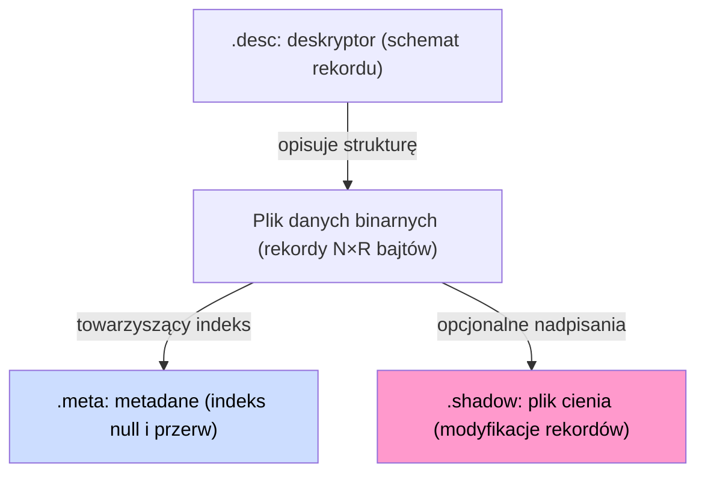

# Format zapisu danych

W systemie przetwarzane są serie czasowe w trzech postaciach: **artefaktów**, **efemerydów** i **substratów**. Każdy typ ma inne przeznaczenie i inną strategię przechowywania.

Substraty i Artefakty - formalnie niczym nie różnią się w systemie. Jedyna różnica to fakt, że substraty zostały wygenerowane w oparciu o równiania algebry strumieni danych i nie zostały zapisane bezpośrednio w ciągu poleceń dla kompilatora. Jeśli zadeklarujemy strumień Artefaktu, który pokryje postać substratu - substrat zostanie zredukowany. Efemerydy to strumienie, które powstały za pomocą polecenia Declare - zawierają wartości które istnieją tylko przez chwilkę.

### Typy akcesorów składowania

> **_NOTE:_** Opisana funkcjonalność ma pokrycie w teście: `txtsrc` opisanym w załączniku pt. [Testy Integracyjne](../../zalaczniki/testy-integracyjne.md).

Pole `TYPE` w deskryptorze (lub dyrektywa `STORAGE` w RQL) wybiera implementację `FileInterface`:

| Typ (`TYPE_PROFILE`) | Klasa implementacji                    | Zastosowanie                                                      |
| -------------------- | ------------------------------------------------------- | -------------------------------------------- |
| `DEFAULT`            | `groupFile<posixBinaryFileWithShadow>` | Artefakty domyślne — plik danych + plik cienia, z retencją        |
| `DIRECT`             | `groupFile<posixBinaryFile>`           | Zapis bezpośredni bez cienia, z retencją                          |
| `POSIX`              | `posixBinaryFile`                      | Surowy zapis POSIX bez cienia                                     |
| `POSIXSHD`           | `posixBinaryFileWithShadow`            | POSIX z plikiem cienia                                            |
| `MEMORY`             | `memoryFile`                           | Składowanie wyłącznie w RAM (efemerydy)                           |
| `GENERIC`            | `genericBinaryFile`                    | Ogólny akcesor binarny                                            |
| `DEVICE`             | `binaryDeviceRO`                       | Zewnętrzne urządzenie binarnych danych wejściowych (tylko odczyt) |
| `TEXTSOURCE`         | `textSourceRO`                         | Tekstowe źródło danych wejściowych (tylko odczyt)                 |

***

## Zestaw plików artefaktu i substratu

Artefakty i substraty zapisywane na dysk mogą być skojarzone z maksymalnie czterema plikami:

| Plik                  | Rozszerzenie         | Cel                                                       |
| --------------------- | -------------------- | --------------------------------------------------------- |
| Plik danych binarnych | _(nazwa strumienia)_ | Główny strumień rekordów — append-only                    |
| Plik deskryptora      | `.desc`              | Schemat rekordu (pola, typy, rozmiary, typ składowania)   |
| Plik metadanych       | `.meta`              | Indeks wartości null i przerw w transmisji (RLE)          |
| Plik cienia           | `.shadow`            | Modyfikacje rekordów bez nadpisywania danych oryginalnych |

_Rys. 11. Zestaw plików artefaktu i ich powiązania_

Diagram przedstawia statyczną relację między plikami artefaktu: `.desc` definiuje strukturę rekordu, `.meta` indeksuje null i przerwy, a `.shadow` przechowuje opcjonalne nadpisania rekordów.

Plik cienia i plik metadanych są opcjonalne. Przy ciągłym napływie danych bez przerw i bez modyfikacji wystarczy sam plik danych binarnych i deskryptor.

Efemerydy **nie posiadają żadnych plików na dysku** — istnieją wyłącznie w pamięci operacyjnej procesu i znikają po jego zakończeniu.

***

## Rozdziały

* [Pliki artefaktu](pliki.md) — deskryptor, dane binarne, metadane, plik cienia i relacje między nimi
* [Mechanizm rotacji plików](rotacja.md) — dyrektywa `ROTATION`, cykl życia plików, przykłady sesji
* [Narzędzie inspekcji `xtrdb -s`](narzedzie-inspekcji.md) — mapa składowania, sekcje raportu, przykłady
* [Podsumowanie](podsumowanie.md) — uzasadnienie przyjętej struktury, porównanie podejść
