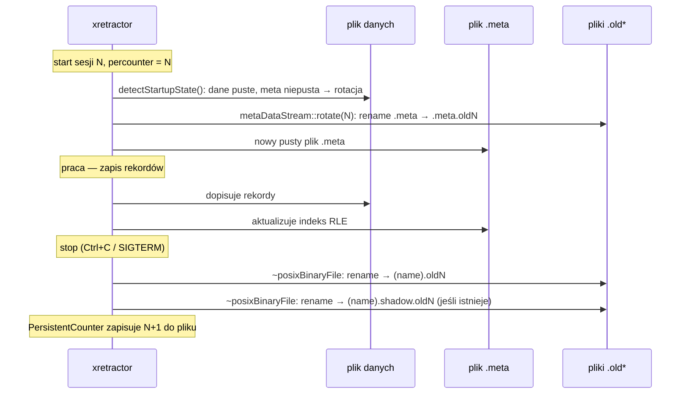

# Mechanizm rotacji plików

Przez rotację plików rozumiemy kontrolowane zamykanie bieżącego zestawu plików danych i metadanych oraz przeniesienie ich do wersji historycznych (`.old<N>`), tak aby nowa sesja mogła rozpocząć zapis od czystego stanu bez utraty wcześniejszych pomiarów. Stosuje się to po to, aby oddzielić kolejne sesje akwizycji, zachować pełną ścieżkę audytu i ułatwić diagnostykę problemów w czasie. Celem rotacji jest jednocześnie utrzymanie porządku operacyjnego (aktualny zestaw roboczy + archiwum sesji) oraz zapewnienie możliwości odtworzenia i porównania danych historycznych.

> **_NOTE:_** Opisana funkcjonalność ma pokrycie w testach: `rotation_test`, `retention` opisanych w załączniku pt. [Testy Integracyjne](../../zalaczniki/testy-integracyjne.md).

## Domyślne zachowanie (bez dyrektywy `ROTATION`)

Bez dyrektywy `ROTATION` w skrypcie RQL, `xretractor` przy każdym starcie **usuwa** pliki artefaktów (dane binarne, `.desc`, `.meta`) i zaczyna rejestrację od nowa. Pliki deklaracji (`DECLARE`) oraz efemerydy nie są usuwane — nie mają plików na dysku.

## Dyrektywa `ROTATION` i licznik sesji

Dyrektywa `ROTATION` włącza tryb zachowania historii. Przyjmuje ścieżkę do pliku przechowującego trwały licznik sesji:

```
ROTATION rdb_counter
```

Obiekt `PersistentCounter` wczytuje wartość `N` z pliku przy starcie (`getCount()` = `N`) i zapisuje `N+1` przy zamknięciu. Licznik rośnie monotonicznie z każdą sesją `xretractor`.

## Przepływ sterowania w procesie rotacji

W tym punkcie chcemy pokazać pełną sekwencję życia plików podczas jednej sesji i przejścia do kolejnej. Diagram (Rys. 21) ma wyjaśnić kolejność zdarzeń: wykrycie rotacji przy starcie, utworzenie nowego indeksu `.meta`, normalny zapis danych w trakcie pracy oraz archiwizację plików przy zamknięciu procesu. Kluczowy przekaz jest taki, że rotacja nie jest pojedynczą operacją, lecz procesem rozłożonym w czasie, który łączy moment startu i stopu sesji.




_Rys. 21. Sekwencja rotacji plików — start i stop sesji_

Rotacja pliku `.meta` następuje **przy starcie** sesji N — `detectStartupState()` wykrywa niezgodność (plik danych pusty, indeks niepusty ze starej sesji) i wywołuje `metaDataStream::rotate(N)`. Plik danych binarnych jest przemianowywany dopiero przy **zamknięciu** sesji przez destruktor `posixBinaryFile`.

## Co trafia do plików `.old<N>`

| Plik | Kiedy powstaje |
| ---- | -------------- |
| `<name>.oldN` | Zamknięcie sesji N — destruktor `posixBinaryFile` przemianowuje plik danych |
| `<name>.shadow.oldN` | Zamknięcie sesji N — destruktor `posixBinaryFileWithShadow` przemianowuje plik cienia |
| `<name>.meta.oldN` | Start sesji N — `detectStartupState()` wykrywa rotację i przemianowuje `.meta` pozostawiony przez sesję N−1 |

Wskutek tej kolejności: plik `.meta.oldN` zawiera metadane null dla danych z sesji `N−1`, podczas gdy plik `.oldN` zawiera dane sesji `N`. W sekcji `ROTATED FILES` narzędzia `xtrdb -s` pliki są grupowane według numeru suffiksu — pary `.oldN` i `.meta.oldN` różnią się więc o 1 w stosunku do sesji, której fizycznie odpowiadają.

## Przykład sekwencji trzech sesji

Po trzech zakończonych sesjach (0, 1, 2) i w trakcie czwartej (3):

```text
pomiar.old0         ← dane z sesji 0 (zapis sesji 0, przemianowanie
                      w destruktorze sesji 0)
pomiar.meta.old1    ← metadane z sesji 0 (przemianowanie przy starcie sesji 1)
pomiar.old1         ← dane z sesji 1
pomiar.meta.old2    ← metadane z sesji 1 (przemianowanie przy starcie sesji 2)
pomiar.old2         ← dane z sesji 2
pomiar.meta.old3    ← metadane z sesji 2 (przemianowanie przy starcie sesji 3)
pomiar              ← dane bieżące (sesja 3)
pomiar.meta         ← metadane bieżące (sesja 3)
```

Widok `xtrdb -s` w trakcie sesji 3:

```bash
$ xtrdb -s pomiar
...
├──────────────────────────────────────────────────────────────┤
│  ROTATED FILES                                               │
│  [3] pomiar.meta.old3                                   26 B │
│  [2] pomiar.old2                                       800 B │
│      pomiar.meta.old2                                   26 B │
│  [1] pomiar.old1                                       800 B │
│      pomiar.meta.old1                                   26 B │
│  [0] pomiar.old0                                       400 B │
└──────────────────────────────────────────────────────────────┘
```

Plik `pomiar.meta.old3` jest w grupie `[3]` sam — odpowiadający mu plik `pomiar.old3` powstanie dopiero przy zamknięciu bieżącej sesji.

## Otwieranie pliku rotowanego w `xtrdb`

Pliki rotowane można analizować poleceniem `open` w trybie interaktywnym `xtrdb`. Polecenie `open` automatycznie wyciąga nazwę bazową (usuwa `.old<N>`) i szuka deskryptora `<nazwa_bazowa>.desc`:

```
$ xtrdb
. open pomiar.old1
ok
. print
...
```
