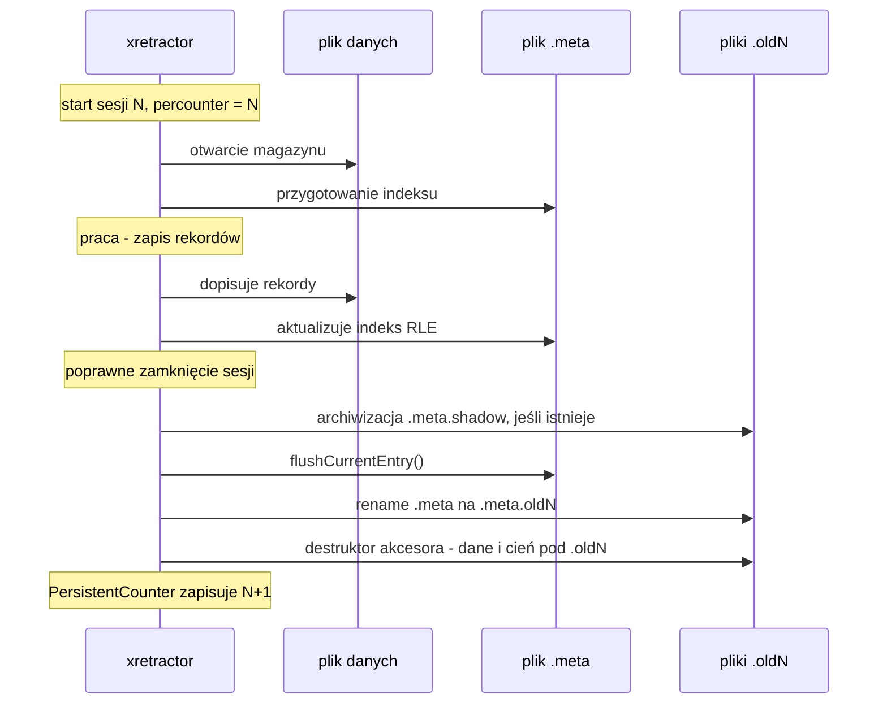

# Mechanizm rotacji plików

Przez rotację plików rozumiemy kontrolowane zamykanie bieżącego zestawu plików danych i metadanych oraz przeniesienie ich do wersji historycznych (`.old<N>`), tak aby nowa sesja mogła rozpocząć zapis od czystego stanu bez utraty wcześniejszych pomiarów. Stosuje się to po to, aby oddzielić kolejne sesje akwizycji, zachować pełną ścieżkę audytu i ułatwić diagnostykę problemów w czasie. Celem rotacji jest jednocześnie utrzymanie porządku operacyjnego (aktualny zestaw roboczy + archiwum sesji) oraz zapewnienie możliwości odtworzenia i porównania danych historycznych.

> **_NOTE:_** Opisana funkcjonalność ma pokrycie w testach: `rotation_test`, `retention` opisanych w załączniku pt. [Testy Integracyjne](../../zalaczniki/testy-integracyjne.md). Zgodność wartości i bitów `NULL` w archiwach kolejnych sesji sprawdzają dodatkowo `it_rotation_null` oraz `ut_rdb`.

## Domyślne zachowanie (bez dyrektywy `ROTATION`)

Bez dyrektywy `ROTATION` w skrypcie RQL, `xretractor` przy każdym starcie **usuwa** pliki artefaktów (dane binarne, `.desc`, `.meta`) i zaczyna rejestrację od nowa.

Rotacja i usuwanie nie dotyczą efemerydów (`DECLARE`). Nie znaczy to, że efemeryda nie ma żadnego pliku: jej źródło danych (plik tekstowy, urządzenie) jest zewnętrzne wobec systemu i nietykalne, a obok niego powstaje deskryptor `.desc` opisujący schemat odczytu - `storage::attachDescriptor()` zapisuje go dla każdego strumienia, także deklarowanego. Efemeryda nie dostaje natomiast indeksu `.meta`: fabryka `makeMetaIndex()` wstrzykuje dla źródeł deklarowanych wariant **inertny** (`metaData` z pustą ścieżką pliku), który utrzymuje wzorce null w pamięci i nie wykonuje żadnego I/O. Jest to więc brak persystencji metadanych, nie brak samego obiektu indeksu.

## Dyrektywa `ROTATION` i licznik sesji

Dyrektywa `ROTATION` włącza tryb zachowania historii. Przyjmuje ścieżkę do pliku przechowującego trwały licznik sesji:

```rql
ROTATION 'rdb_counter'
```

Obiekt `PersistentCounter` wczytuje wartość `N` z pliku przy starcie (`getCount()` = `N`) i zapisuje `N+1` przy zamknięciu. Licznik rośnie monotonicznie z każdą sesją `xretractor`.

## Przepływ sterowania w procesie rotacji

Przy poprawnym zamknięciu sesji N plik danych, indeks metadanych i istniejące pliki cienia otrzymują ten sam przyrostek `.oldN`. Diagram przedstawia kolejność archiwizacji magazynu dyskowego; magazyny `MEMORY` i źródła `DECLARE` nie uczestniczą w tej rotacji.


```mermaid
%% pdf-width: 100%
sequenceDiagram
    participant RQL as xretractor
    participant D as plik danych
    participant M as plik .meta
    participant Old as pliki .oldN

    Note over RQL: start sesji N, percounter = N
    RQL->>D: otwarcie magazynu
    RQL->>M: przygotowanie indeksu
    Note over RQL: praca - zapis rekordów
    RQL->>D: dopisuje rekordy
    RQL->>M: aktualizuje indeks RLE
    Note over RQL: poprawne zamknięcie sesji
    RQL->>Old: archiwizacja .meta.shadow, jeśli istnieje
    RQL->>M: flushCurrentEntry()
    RQL->>Old: rename .meta na .meta.oldN
    RQL->>Old: destruktor akcesora - dane i cień pod .oldN
    Note over RQL: PersistentCounter zapisuje N+1
```

_Rys. 25. Sekwencja rotacji plików - start i stop sesji_

`storage::~storage()` wywołuje `metaData::rotate(N, false)`: zapisuje oczekujący wpis RLE, archiwizuje indeks i odłącza go od pliku, bez tworzenia nowego roboczego `.meta`. Wariant `storageShadow` wcześniej archiwizuje istniejący `.meta.shadow`. Następnie destruktor akcesora rotuje dane oraz ich cień. Pliki z tym samym numerem odpowiadają tej samej sesji i pozwalają odtworzyć jej wartości oraz bity `NULL`.

Jeżeli przy starcie dane są puste, ale pozostał niepusty indeks po starszej wersji silnika, `detectStartupState()` resetuje osierocony indeks. Nie nadaje mu numeru bieżącej sesji. Dzieje się to także przy wyłączonej detekcji przerw. Archiwizacja przy zamknięciu nie jest transakcją obejmującą całą rodzinę plików; przerwanie procesu w trakcie przemianowań może pozostawić zestaw niekompletny.

## Co trafia do plików `.old<N>`

| Plik | Kiedy powstaje |
| ---- | -------------- |
| `<name>.oldN` | Zamknięcie sesji N - akcesor przemianowuje plik danych |
| `<name>.shadow.oldN` | Zamknięcie sesji N - akcesor z cieniem przemianowuje istniejący plik cienia danych |
| `<name>.meta.oldN` | Zamknięcie sesji N - indeks zapisuje oczekujący wpis i przemianowuje plik metadanych |
| `<name>.meta.shadow.oldN` | Zamknięcie sesji N - `storageShadow` archiwizuje istniejący cień metadanych |

Sekcja `ROTATED FILES` narzędzia `xtrdb -s` grupuje pliki według numeru przyrostka. Dla archiwów utworzonych po poprawce #322 para `.oldN` i `.meta.oldN` należy do tej samej sesji. Starsze archiwa nie są automatycznie przenumerowywane: mogą zachowywać dawną rozbieżność o jedną sesję i wymagają sprawdzenia pochodzenia przed analizą.

## Przykład sekwencji trzech sesji

Po trzech zakończonych sesjach (0, 1, 2) i po rozpoczęciu zapisu w czwartej (3), przykładowy zestaw bez plików cienia wygląda tak:

```text
pomiar.old0         - dane z sesji 0
pomiar.meta.old0    - metadane z sesji 0
pomiar.old1         - dane z sesji 1
pomiar.meta.old1    - metadane z sesji 1
pomiar.old2         - dane z sesji 2
pomiar.meta.old2    - metadane z sesji 2
pomiar             - dane bieżące (sesja 3)
pomiar.meta        - metadane bieżące (sesja 3)
```

`xtrdb -s pomiar` grupuje archiwa w grupach `[0]`, `[1]` i `[2]`. Grupa `[3]` powstanie dopiero przy zamknięciu bieżącej sesji. Przykład pokazuje nazwy i ich znaczenie, bez zakładania stałych rozmiarów plików.

## Otwieranie pliku rotowanego w `xtrdb`

Pliki rotowane można analizować poleceniem `open` w trybie interaktywnym `xtrdb`. Polecenie `open` automatycznie wyciąga nazwę bazową (usuwa `.old<N>`) i szuka deskryptora `<nazwa_bazowa>.desc`:

```
$ xtrdb
. open pomiar.old1
ok
. print
...
```
