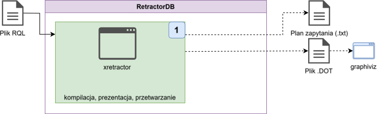
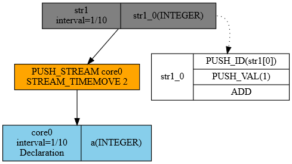

# Kompilacja i budowa planu

Proces kompilacji odbywa się przed każdym uruchomieniem procesu xretractor. Argument w postaci pliku z sekwencją poleceń i zapytań jest wymagany. W oparciu o przepływ przedstawiony na Rys. 10 przygotowałem opis procesu Rys. 22 realizujący proces kompilacji w trybie rozwojowym. Proces kompilacji można wywołać nawet jak już jakiś inny proces xretractor funkcjonuje. Blokowanie jednej instancji procesu przetwarzania danych odnosi się tylko do procesu realizacji planu zapytania. Wywołanie kompilacji w tym przypadku, nawet jeśli funkcjonuje już ten proces w systemie nie zgłosi błędu. Próba uruchomienia kolejnego przetwarzania – tak.

<figure><figcaption><p>Rys. 22. Proces kompilacji</p></figcaption></figure>

Jako przykładowy plik przeznaczony do kompilacji przyjmiemy plik query.rql o następującej zawartości:

```
DECLARE a INTEGER \
STREAM core0, 0.1 \
FILE 'datafile1.dat'

SELECT str1[0]+1 \
STREAM str1 \
FROM core0>2
```

Jest to bardzo prosty przykład pliku zawierającego dwie dyrektywy. Pierwsza deklaruje istnieje efemerydu w postaci źródła danych binarnych zawierającego 4-bajtowe liczby typu INTEGER. Dane z tego pliku będą czytane z szybkością 10 razy na sekundę. A nazwa tego obiektu to core0.

Drugie polecenie tworzy artefakt o nazwie str1 pobierający przesunięte w czasie od dwa odczyty czyli 0.2 sekundy dane efemeryczne. W trakcie tworzenia kolejnych elementów strumienia wynikowego dochodzi do przetwarzania danych odczytanych z core0 i do każdej odczytanej wartości dodawana jest wartość 1.

Aby przeprowadzić kompilację tego pliku należy wywołać następujące polecenie:

```
$ xretractor -c query.rql
```

Na ekranie wyświetli się następująca odpowiedź systemu:

```
str1(1/10)
      :- PUSH_STREAM(core0)
      :- STREAM_TIMEMOVE(2)
      str1_0: INTEGER
            PUSH_ID(str1[0])
            PUSH_VAL(1)
            ADD
core0(1/10) datafile1.dat
      a: INTEGER
```

Pominięcie parametru -c spowoduje podjęcie próby kompilacji i natychmiastowego wysłania skompilowanego planu realizacji zapytania do wykonania. Taka akcja spowoduje wystąpienie błędu. Bowiem pliku z danymi datafile1.dat zapewne jeszcze nie przygotowaliśmy.

Oprócz przeglądu tekstowego możemy obejrzeć również pliki kompilacji w postaci graficznej. Do tego celu należy wywołać następujący ciąg poleceń:

```
$ xretractor -c -d -f -s query.rql > out.dot && dot -Tpng out.dot -o out.png
```

Zakładając że w środowisku uruchomieniowym masz zainstalowany program dot z pakietu graphivz wygenerujesz tym poleceniem plik graficzny przedstawiający odpowiedź systemu w postaci grafu.

<figure><figcaption><p>Rys. 23. Graficzna reprezentacja planu zapytania</p></figcaption></figure>

System RetractorDB potrafi wygenerować rysunek jako odpowiedź na jeden ze zleconych ciągów przetwarzania danych. Prezentacja graficzna jest najbardziej odpowiednia w przypadku tworzenia i przedstawiania grafów przetwarzania danych. Niestety czytelność ucierpi w przypadku bardzo skomplikowanych schematów.

Na Rys. 23 widać trywialny plan realizacji zapytania jaki powstał w wyniku kompilacji dwulinijkowego pliku query.rql. U samej góry widać obiekt str1 tworzący artefakty z częstotliwością 10 rekordów na sekundę. Informacja o szybkości tworzenia artefaktów nie występuje w zapytaniu, jest wyznaczana w oparciu wyrażenie algebraiczne z klauzuli FROM w zapytaniu SELECT. Widać też w jaki sposób wytwarzane są kolejne rekordy strumienia str1. Tutaj mamy do czynienia z typowym algorytmem przetwarzania danych na stosie. Najpierw na stos odkładana jest wartość efemeryczna powstałego z wyrażenia algebraicznego a następnie umieszczana jest na stosie wartość 1. Polecenie ADD zdejmuje obie wartości ze stosu pozostawiając na stosie wynik dodawania. To co zostało na stosie – czyli wynik dodawania umieszczane jest w polu tworzonego rekordu.

Z drugiej strony widać operacje na strumieniach. Operacje na strumieniach realizowane są w innej domenie. Tam występuje przetwarzanie obiektów dwu lub jednowartościowych. Operacjom poddawane są albo dwa strumienie albo tylko jeden z argumentem. Klasyczny stos w przypadku Algebraicznych operacji strumieniowych nie ma zastosowania. Dla uproszczenia zapis przypomina trochę operacje na stosie. Widzimy w załączonym przykładzie że operacje na danych bieżących realizujemy poprzez przesunięcie danych w czasie o 2. Celowo nie mówię że to 2 sekundy – tutaj 2 oznacza wartość relatywną względem szybkości napływu. W przypadku szybkości napływu 10 próbek na sekundę – wartość 2 oznacza przesunięcie w czasie o 0.2 sekundy.

Skomplikowane wyrażenia algebraiczne w których biorą udział co najmniej dwa operatory strumieniowe powodują powstanie wspominanych w poprzednich rozdziałach substratów. Każde zapytanie, które zawiera wyrażenia algebraiczne w klauzuli from z więcej niż jednym operatorem są rozbijane na operacje dwuargumentowe, zależne od siebie. Lista argumentów substratu to domyślnie pełne rozwinięcie schematu.

## Dostępne flagi xretractor

W trybie kompilacji (`-c`) i w trybie wykonania dostępne są różne zestawy flag. Poniżej flagi trybu kompilacji używane przy generowaniu grafów:

| Flaga | Pełna nazwa      | Znaczenie                                      |
| ----- | ---------------- | ---------------------------------------------- |
| `-c`  | `--onlycompile`  | tylko kompilacja — nie uruchamia przetwarzania |
| `-d`  | `--dot`          | generuj wyjście w formacie DOT (graphviz)      |
| `-f`  | `--fields`       | pokaż pola strumieni w grafie DOT              |
| `-s`  | `--streamprogs`  | pokaż programy strumieni w grafie DOT          |
| `-u`  | `--rules`        | pokaż reguły RULE w grafie DOT                 |
| `-p`  | `--transparent`  | przezroczyste tło grafu DOT                    |
| `-i`  | `--hideruleprog` | ukryj program warunku reguły (z `-u`)          |
| `-m`  | `--csv`          | wyjście w formacie CSV                         |

Flagi trybu wykonania (bez `-c`):

| Flaga  | Pełna nazwa     | Znaczenie                                        |
| ------ | --------------- | ------------------------------------------------ |
| `-m N` | `--tlimitqry N` | uruchom N cykli przetwarzania, potem zakończ     |
| `-k`   | `--noanykey`    | nie czekaj na klawisz — tryb daemon/skrypt       |
| `-t`   | `--realtime`    | tryb czasu rzeczywistego (SCHED\_FIFO, mlockall) |
| `-x`   | `--xqrywait`    | czekaj na pierwsze połączenie xqry przed startem |
| `-s`   | `--status`      | sprawdź czy instancja xretractor już działa      |
| `-v`   | `--verbose`     | wyświetl parametry strumieni przy starcie        |

> **ℹ️ Info**
>
> Parametr `-m N` liczy iteracje pętli głównej, nie sekundy. Dla strumieni z interwałem 0.1 s (10 Hz), `-m 10` oznacza \~1 sekundę przetwarzania.


> **⚠️ Ostrzeżenie**
>
> Przy użyciu `-m N` w skryptach i testach zawsze dodawaj `-x` (`--xqrywait`). Bez tej flagi serwer może przetworzyć wszystkie N cykli zanim klient (`xqry`) zdąży się podłączyć — klient nie otrzyma żadnych danych i będzie czekał do przekroczenia limitu czasowego. Flaga `-x` wstrzymuje przetwarzanie do nadejścia pierwszej komendy od `xqry`.


Pełna lista wszystkich opcji z opisem każdej z nich — w tym opcja `--realtime` wymagająca uprawnień systemowych — znajduje się w [Załączniku A](../zalaczniki/zalacznik-a-opcje-wywolania-xretractor.md).
