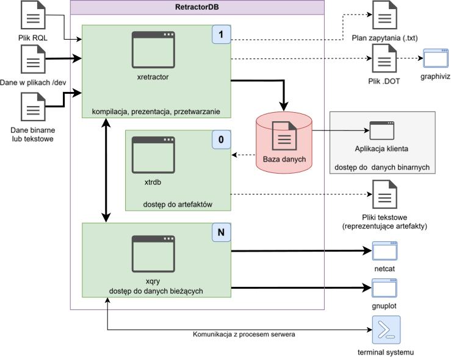

# Przepływ danych i sterowania

Dane i sterowanie w systemie RetractorDB tworzą kilka potencjalnych sposobów użycia komponentów systemu. Na Rys. 9 przedstawiono schematycznie przepływ danych pomiędzy procesami systemu RetractorDB, procesami systemu Linux oraz danymi źródłowymi i rezultatami pracy poszczególnych procesów.

Najgrubsze linie przedstawiają przepływ, który występuje zawsze w procesie przetwarzania regularnych serii czasowych. Proces xretractor aby wystartować na chwilę obecną potrzebuje pliku .rql ze sekwencją zapytań. Po przeprowadzeniu kompilacji, proces xretractor buduje drzewo planu zapytania i rozpoczyna proces przetwarzania napływających danych i tworzenia plików binarnych zawierających artefakty.

Aby móc sterować procesem xretractor po wystartowaniu używamy procesu xqry. Za jego pomocą możemy zatrzymać proces xretractor, pobrać statystyki lub zażądać dostępu do danych bieżących.

Reszta strzałek prezentuje przepływy danych zależne od prowadzonego z użyciem RetractorDB procesu. Strzałki przerywane są typowo przeznaczone do celów diagnostycznych.

Każdy z procesów na schemacie został oznaczony dodatkowo liczbą utrzymywanych ciągłych procesów w systemie. Oznaczenie „1” przy procesie xretractor oznacza że ten program będzie pilnował aby tylko jedna instancja tego procesu funkcjonowała w systemie. Próba uruchomienia kolejnej zakończy się błędem i komunikatem przy uruchomieniu. Program xtrdb nie utrzymuje żadnych ciągłych i nieskończonych procesów. Czyta dane, przetwarza, zwraca wyniki i kończy pracę. Oferuje też opcję pracy w trybie interaktywnym. Proces xqry oznaczony został jako „N”. W ten sposób chciałem wyrazić że procesów xqry można wywoływać więcej niż jeden. Jest to typowy scenariusz pracy z systemem RetractorDB. Klientów komunikujących się z procesorem planów realizacji zapytań z definicji występuje kilka.

<figure><figcaption>
Rys. 9. Przepływ danych i sterowania
</figcaption></figure>

## Zatrzymanie xretractor

Proces xretractor obsługuje sygnały systemowe i kończy pracę w kontrolowany sposób po otrzymaniu:

| Sygnał    | Polecenie          | Znaczenie                             |
| --------- | ------------------ | ------------------------------------- |
| `SIGINT`  | Ctrl+C w terminalu | przerwanie interaktywne               |
| `SIGTERM` | `kill <pid>`       | standardowe zakończenie procesu       |
| `SIGHUP`  | `kill -HUP <pid>`  | zakończenie przy zamknięciu terminala |

Wszystkie trzy sygnały powodują ten sam efekt: graceful shutdown — pętla przetwarzania kończy bieżący cykl i zatrzymuje się. Pozwala to bezpiecznie zamknąć xretractor działającego jako usługa bez ryzyka uszkodzenia plików artefaktów.
