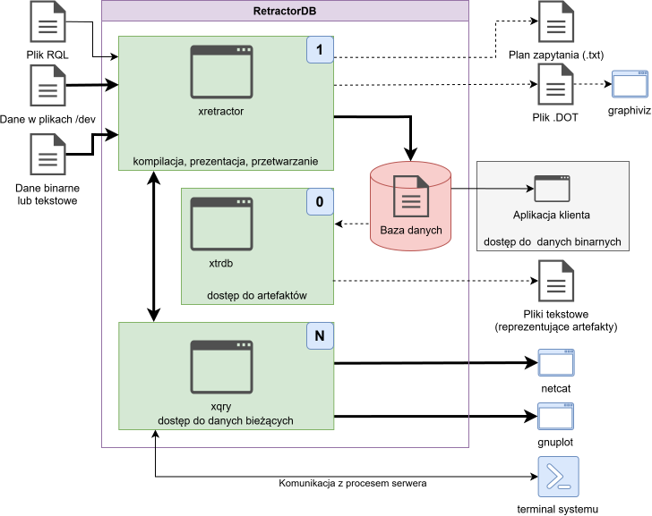

# Przepływ danych i sterowania

Dane i sterowanie w systemie RetractorDB tworzą kilka potencjalnych sposobów użycia komponentów systemu. Na Rys. 13 przedstawiono schematycznie przepływ danych pomiędzy procesami systemu RetractorDB, procesami systemu Linux oraz danymi źródłowymi i rezultatami pracy poszczególnych procesów.

Najgrubsze linie przedstawiają przepływ, który występuje zawsze w procesie przetwarzania regularnych serii czasowych. Po otrzymaniu pliku `.rql` proces xretractor kompiluje go, buduje drzewo planu i rozpoczyna przetwarzanie napływających danych oraz tworzenie plików binarnych zawierających artefakty. Bez pliku może uruchomić się w stanie bezczynnym i czekać na pełny plan przesłany przez `xqry --reset`.

> **_NOTE:_** Opisana funkcjonalność ma pokrycie w teście: `consistency` opisanym w załączniku pt. [Testy Integracyjne](../zalaczniki/testy-integracyjne.md).

Aby móc sterować procesem xretractor po wystartowaniu używamy procesu xqry. Za jego pomocą możemy zatrzymać proces xretractor, pobrać statystyki lub zażądać dostępu do danych bieżących.

Reszta strzałek prezentuje przepływy danych zależne od prowadzonego z użyciem RetractorDB procesu. Strzałki przerywane są typowo przeznaczone do celów diagnostycznych.

Każdy z procesów na schemacie został oznaczony dodatkowo liczbą utrzymywanych ciągłych procesów w systemie. Historyczne oznaczenie „1” przy xretractor opisuje jedną instancję planu przedstawioną na rysunku, a nie współczesny limit całego hosta. Nazwane instancje mogą działać równocześnie; w domyślnej przestrzeni hosta dokładnie jedna może pracować jako usługa. Magistrala `xrdbbus` egzekwuje rozłączność ich zasobów. Program xtrdb nie utrzymuje ciągłego procesu: czyta dane, zwraca wynik i kończy pracę, ewentualnie działa interaktywnie. Proces xqry oznaczony jest jako „N”, ponieważ do każdej instancji xretractor może być podłączonych wielu klientów.

<figure><figcaption><p>Rys. 13. Przepływ danych i sterowania</p></figcaption></figure>

## Zatrzymanie xretractor

Proces xretractor obsługuje sygnały systemowe i kończy pracę w kontrolowany sposób po otrzymaniu:

| Sygnał    | Polecenie          | Znaczenie                             |
| --------- | ------------------ | ------------------------------------- |
| `SIGINT`  | Ctrl+C w terminalu | przerwanie interaktywne               |
| `SIGTERM` | `kill <pid>`       | standardowe zakończenie procesu       |
| `SIGHUP`  | `kill -HUP <pid>`  | zakończenie przy zamknięciu terminala |

Wszystkie trzy sygnały powodują ten sam efekt: graceful shutdown — pętla przetwarzania kończy bieżący cykl i zatrzymuje się. Pozwala to bezpiecznie zamknąć xretractor działającego jako usługa bez ryzyka uszkodzenia plików artefaktów.

### Zatrzymanie przez xqry

Obok sygnałów systemowych xretractor można zatrzymać programowo — za pomocą polecenia:

```bash
xqry --server nazwa --kill
```

#### Jak przebiega zamknięcie krok po kroku

**1. xqry wysyła żądanie „kill"**

Proces xqry rozstrzyga instancję z opcji `--server` albo z magistrali, buduje komunikat IPC i umieszcza go w jej kolejce poleceń. Nazwa bazowa `RetractorQueryQueue` otrzymuje sufiks nazwanej instancji. Wiadomość zawiera identyfikator procesu xqry (PID) i polecenie `kill`.

**2. xretractor odbiera polecenie i ustawia flagę zatrzymania**

Wątek komunikacyjny obiektu `IpcServer` wybranej instancji stale nasłuchuje na swojej
kolejce. Dyspozytor `executorsm::commandProcessor` po odebraniu komunikatu `kill` ustawia
atomowy licznik `iLoopLimitCnt` na wartość `stop_now` i budzi pętlę wykonawczą. Ten sam
mechanizm jest używany przez obsługę sygnałów systemowych — niezależnie od źródła efekt
jest identyczny dla tej jednej instancji.

**3. Główna pętla przetwarzania wykrywa flagę i kończy bieżący cykl**

Pętla główna sprawdza `iLoopLimitCnt` przy każdej iteracji. Gdy wykryje wartość `stop_now`, kończy bieżący cykl i wychodzi z pętli — bez przerywania w połowie obliczeń. Zapewnia to integralność zapisywanych artefaktów.

**4. xretractor powiadamia wszystkich podłączonych klientów (broadcast OOB)**

Po wyjściu z pętli xretractor wywołuje `IpcServer::broadcastOutOfBusiness()`. Obiekt IPC
przegląda rejestr subskrypcji, w którym polecenie `show` zapisało PID klienta i nazwę
strumienia. Dla każdego zarejestrowanego klienta wysyła do jego dedykowanej kolejki
komunikat specjalny o wartości `OUT_OF_BUSSINESS`.

**5. Każdy klient xqry odbiera sygnał zakończenia i kończy działanie**

Każda subskrypcja xqry ma własną kolejkę zawierającą nazwę serwera i PID klienta. Po odebraniu komunikatu `OUT_OF_BUSSINESS` xqry ustawia wewnętrzną flagę `done` i kończy działanie w kontrolowany sposób — niezależnie od tego, ile danych zdążył odebrać.

**6. Sprzątanie zasobów IPC**

Na zakończenie xretractor usuwa własny segment odpowiedzi, kolejkę poleceń, muteks i kolejki swoich klientów, zwalnia plik blokady oraz slot w magistrali. Zasoby innych instancji pozostają nietknięte.

### Błąd krytyczny i sprzątanie awaryjne

Błąd krytyczny podczas startu albo w wątku komunikacyjnym przechodzi przez tę samą końcową
politykę własności zasobów, ale nie próbuje kontynuować cyklu. Dziennik `spdlog` jest
opróżniany, a nie niszczony przed procedurami `atexit`. Jeżeli błąd powstał w samym wątku
komunikacyjnym, sprzątanie odłącza ten wątek zamiast próbować dołączyć go do niego samego.
Następnie usuwa kolejki i pamięć IPC, a blokadę usługi zwalnia jako ostatnią.

Proces kończy się statusem 1. Dzięki temu kolejny start nie zastaje osieroconych zasobów ani
blokady, a błąd pierwotny nie jest maskowany wtórnym `SIGSEGV` lub `SIGABRT` podczas
zamykania.

> **_NOTE:_** Obie ścieżki — błąd podczas startu i błąd zgłoszony z wątku komunikacyjnego —
> sprawdza test `fatal_exit_path`.

#### Co się dzieje przy wielu procesach xqry

RetractorDB jest zaprojektowany do pracy z wieloma równoległymi klientami. Gdy w systemie działają jednocześnie — powiedzmy — trzy procesy xqry subskrybujące różne strumienie, a jeden z nich wywoła `xqry --kill`:

- wskazany xretractor przetworzy żądanie kill **jednorazowo**, niezależnie od tego, który klient je wysłał,
- mechanizm `IpcServer::broadcastOutOfBusiness()` roześle komunikat `OUT_OF_BUSSINESS` do **wszystkich** zarejestrowanych klientów tej instancji,
- każdy z trzech procesów xqry otrzyma sygnał zakończenia i zakończy działanie samodzielnie,
- klienci, którzy nie subskrybowali żadnego strumienia (np. xqry wywołany tylko z `--dir` lub `--hello`), nie są wpisani do mapy i nie muszą być powiadamiani — te polecenia kończą działanie natychmiast po udzieleniu odpowiedzi.

Klienci podłączeni do innych nazwanych instancji nie otrzymują tego komunikatu i pracują dalej.

Warto zwrócić uwagę, że xqry wykrywa również nieaktywność serwera: jeżeli przez 10 sekund nie napłyną żadne dane, klient sam się wyłącza z ostrzeżeniem w logu. Jest to zabezpieczenie na wypadek nagłej awarii xretractor bez możliwości rozesłania komunikatu OOB.
