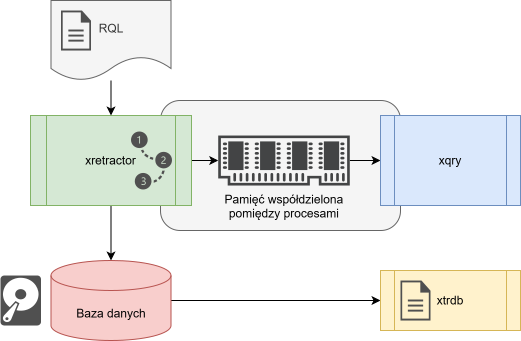

# Perspektywa ogólna

System zbudowany jest w oparciu o 3 programy dostępne jako polecenia systemowe. Pierwszym jest kompilator oraz system realizujący plany zapytań. Drugim jest klient dostępu do danych bieżących, trzecim jest program umożliwiający dostęp zrzutów binarnych. Ich nazwy to kolejno:

* xretractor
* xqry
* xtrdb

Program xretractor tworzy proces wykonujący jeden niezależny plan systemu RetractorDB. Na hoście może działać wiele nazwanych instancji, każda z własnym obszarem pamięci współdzielonej. Program xqry tworzy procesy komunikujące się z wybraną instancją, a wspólna magistrala umożliwia ich wykrywanie i routing. Program xtrdb służy do analizy danych i metadanych zapisywanych w plikach bazy danych.

Poniżej przedstawiona jest na Rys. 12 schematycznie architektura systemu RetractorDB. Uwzględniono wszystkie istniejące aktualnie komponenty. Obszary ujęte w prostokątach z nagłówkami wypełnionymi poleceniami systemowymi odpowiadają istniejącym komponentom. Obszar zapisu artefaktów to symboliczna reprezentacja systemu plików.

<figure><figcaption>
Rys. 12 Schemat przepływu danych pomiędzy procesami RetractorDB
</figcaption></figure>

Na Rys. 12 widzimy procesy realizowane przez programy xretractor, xtrdb oraz xqry. Rysunek przedstawia jedną instancję wykonawczą; przy uruchomieniu wieloserwerowym blok `xretractor` wraz z jego IPC i klientami powtarza się dla każdej nazwy. Relacje pomiędzy instancjami opisano w rozdziale [Wiele instancji i magistrala](wiele-instancji-i-magistrala.md).

Proces xretractor komunikuje się z procesami xqry poprzez własny, nazwany obszar pamięci współdzielonej. W tej pamięci dla każdej subskrypcji xqry tworzona jest kolejka danych. Dane są odbierane na bieżąco przez procesy xqry. Zadaniem procesów xqry jest wysyłka danych dalej do innych systemów lub procesów. Jeśli proces xqry ginie lub jest kończony, właściwa instancja xretractor zwalnia zasoby dedykowane temu klientowi.

Oprócz kierowania danych do wysyłki poprzez pamięć współdzieloną, system RetractorDB zapisuje dane do tzw. Obszaru zapisu artefaktów. Aktualnie jest to katalog do którego zapisywane są na bieżąco efekty procesu przetwarzania strumieni danych w oparciu o plany realizacji zapytań realizowane w systemie RetractorDB.

> **⚠️ Ostrzeżenie**
>
> Przedstawiona na rysunku Baza danych to nie jest Relacyjna baza danych. Przez bazę danych na przedstawionym rysunku rozumiemy zbiór plików binarnych lub tekstowych, którymi zarządza RetractorDB. Dane pobierane są z urządzeń i zapisywane w rotujących lub nie plikach binarnych lub tekstowych. Dostęp do tych danych realizowany jest za pomocą narzędzia xtrdb lub w trakcie działania systemu przez proces xqry.

Plik z zapytaniami i dyrektywami RQL podaje się jako pierwszy argument polecenia uruchamiającego system. Argument ten jest **opcjonalny**: wywołanie `xretractor` bez pliku zapytań uruchamia **tryb bezczynny (idle)** — proces wstaje, zajmuje blokadę usługi, otwiera kanał IPC i czeka, nie budując planu ani siatki czasu. Dzięki temu jednostka systemd może wstać razem z systemem operacyjnym, zanim operator dostarczy zestaw zapytań. Wyjątkiem jest tryb `--onlycompile`, gdzie brak pliku pozostaje błędem — nie ma czego kompilować.

Zestaw zapytań można dostarczyć później trzema drogami. `xqry -a` dodaje pojedyncze `SELECT`, `DECLARE` albo `RULE` do aktywnego planu. `xqry --reset plik.rql` atomowo zastępuje cały plan bez restartu procesu i może uruchomić pierwszą epokę instancji bezczynnej. Uruchomienie `xretractor plik.rql` przy działającej usłudze może natomiast zweryfikować plik, zapisać go jako plan startowy i zrestartować jednostkę systemd. Pełny zestaw wraz z dyrektywami `:STORAGE`, `:SUBSTRAT` i `:ROTATION` przyjmują dwie ostatnie drogi.

> **_NOTE:_** Tryb idle ma pokrycie w teście `service_idle` (warianty z flagą `--service` i ze zmienną `XRETRACTOR_SERVICE`).
