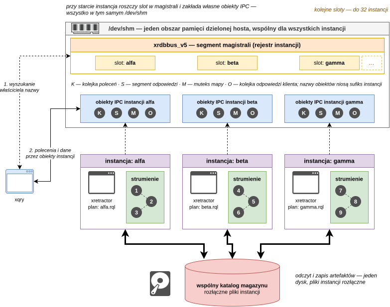

# Wiele instancji i magistrala

Na jednym hoście może działać równocześnie wiele procesów `xretractor`. Każda instancja
ma własną nazwę, blokadę, obszar IPC, plan i klientów. Wspólna magistrala `xrdbbus`
rejestruje żywe instancje, umożliwia ich wyszukiwanie przez `xqry` i pilnuje, aby dwa
plany nie przejęły zasobów, których nie mogą bezpiecznie współdzielić.

<figure><figcaption><p>Rys. 13. Równolegle działające instancje i wspólna magistrala xrdbbus</p></figcaption></figure>

Na Rys. 13 każda instancja kompiluje własny plan, ma własne obiekty IPC i własny zestaw
nazw strumieni zgłoszony w slocie magistrali. Wspólne pozostają dwa zasoby: magistrala,
z której `xqry` odczytuje właściciela nazwy strumienia, oraz katalog magazynu, w którym
pliki poszczególnych instancji są rozłączne.

Wyjątkiem jest tryb usługowy: w domyślnej przestrzeni hosta może działać dokładnie jedna
instancja oznaczona jako usługa. Domyślnie otrzymuje ona stałą nazwę `service`, dzięki
czemu skrypty mogą kierować polecenia do `--server service` bez wcześniejszego przeglądania
magistrali.

## Tożsamość instancji

Instancję można wskazać na trzy sposoby:

| Mechanizm | Znaczenie |
| --- | --- |
| `xretractor --name pomiary plan.rql` | Stała nazwa podana przez operatora. |
| `xretractor --autoname plan.rql` | Losowa nazwa w stylu nazw kontenerów; jest wypisywana przy starcie. |
| `server.autoname = true` | Automatyczna nazwa ustawiona w pliku TOML, o ile nie podano `--name`. |

Jawne `--name` ma pierwszeństwo przed konfiguracją. Nazwa musi pasować do
`[a-z][a-z0-9_-]*` i może mieć najwyżej 32 znaki. `--name` i `--autoname` wzajemnie
się wykluczają.

Brak nazwy zachowuje historyczną tożsamość: nazwy obiektów IPC i pliku blokady nie mają
sufiksu. Taka instancja również pojawia się w magistrali, jako `(unnamed)`, i uczestniczy
w kontroli kolizji.

Zmienna `RDB_NAMESPACE` tworzy osobną przestrzeń nazw instancji, magistrali i IPC oraz,
jeżeli nie podano `--name` ani `--autoname`, staje się domyślną nazwą serwera i celem
`xqry`. Jest używana przede wszystkim przez równoległe testy integracyjne. Jawne opcje
`--name`, `--autoname` i `--server` pozostają nadrzędne. Również limit jednej usługi jest
egzekwowany osobno w każdej takiej przestrzeni.

## Zasoby prywatne i wspólne

Nazwane instancje mają rozłączne obiekty Boost.Interprocess. Nazwy bazowe kolejki poleceń,
segmentu odpowiedzi i muteksu otrzymują sufiks instancji, a kolejka subskrybenta zawiera
również PID klienta. Zatrzymanie jednej instancji usuwa wyłącznie jej IPC i kończy tylko
jej subskrypcje.

Magistrala jest wspólna dla hosta lub przestrzeni `RDB_NAMESPACE`. Każdy żywy serwer
publikuje w niej nazwę, PID, tryby pracy, plik planu i nazwy strumieni. Slot jest uznawany
za żywy tylko wtedy, gdy PID oraz czas startu zgadzają się z `/proc`; proces zombie nie
blokuje zasobów.

Przed uruchomieniem albo wymianą planu magistrala sprawdza rozłączność:

- nazw wszystkich strumieni, również wygenerowanych przez kompilator i dodanych ad hoc;
- znormalizowanych ścieżek zapisywanych plików magazynu;
- pliku licznika dyrektywy `:ROTATION`.

Roszczenie następuje przed usuwaniem starych artefaktów i zakładaniem IPC. Przegrana
instancja nie może więc skasować danych działającego właściciela. Komunikat odmowy podaje
kolidujący zasób, nazwę instancji i jej PID.

Przy `xqry --reset` zasoby nowego planu są najpierw rezerwowane. Dopiero po poprawnym
zbudowaniu nowej epoki rezerwacja atomowo zastępuje aktywny zestaw. Błąd parsowania,
kompilacji, limitu lub kolizja pozostawia dotychczasowy plan i jego roszczenia bez zmian.

> **⚠️ Ostrzeżenie**
>
> Niedostępność lub uszkodzenie magistrali nie zatrzymuje pojedynczego serwera. Start jest
> dopuszczany z ostrzeżeniem, ale globalna ochrona przed kolizjami nie jest wtedy
> egzekwowana. To tryb awaryjny, a nie poprawna konfiguracja wieloserwerowa.

## Routing poleceń `xqry`

`xqry` rozstrzyga cel na podstawie jednej migawki magistrali, bez odpytywania kolejnych
serwerów i bez czekania na ich timeouty.

| Sytuacja | Wynik |
| --- | --- |
| Podano `--server nazwa` | Wskazana instancja jest używana bez automatycznego routingu. |
| Działa dokładnie jedna instancja | Klient wybiera ją automatycznie. |
| Kilka instancji, `--select` lub `--detail` | Wybierany jest właściciel strumienia. |
| Kilka instancji, ad hoc `SELECT` | Wszystkie źródła muszą należeć do jednej instancji. |
| Kilka instancji, ad hoc `RULE` | Celem jest właściciel strumienia z klauzuli `ON`. |
| Kilka instancji, ad hoc `DECLARE` | Trzeba podać `--server`, bo deklaracja nie ma właściciela wejścia. |
| Kilka instancji, polecenie całej instancji | `--hello`, `--dir`, `--kill` i `--reset` wymagają `--server`. |

Zapytanie ad hoc nie może łączyć źródeł z różnych instancji. RetractorDB nie przesyła
strumieni pomiędzy serwerami; plany są niezależnymi grafami wykonania.

## Przegląd magistrali

Polecenie `xqry --bus` nie kontaktuje się z żadnym serwerem. Pokazuje nazwę, PID, tryb,
plik zapytań i strumienie każdej żywej instancji. Modyfikator `--yaml` daje dokument
`apiVersion: xqry/v1`, dogodny do przetwarzania przez skrypty.

Kolumna `MODE` może zawierać kilka liter:

| Litera | Tryb |
| --- | --- |
| `N` | zwykłe wykonanie taktowane zegarem |
| `R` | `--realtime` |
| `F` | `--no-clock` |
| `U` | `--until-eof` |
| `M` | ustawiony limit `--llimitqry` |
| `X` | `--xqrywait` |
| `S` | tryb usługowy lub jednostka systemd |

Przykładowa sesja:

```bash
xretractor alfa.rql --name alfa --noanykey &
xretractor beta.rql --name beta --noanykey &

xqry --bus
xqry --select temperatura          # routing według właściciela strumienia
xqry --server alfa --dir           # jawne polecenie całej instancji
xqry --server beta --kill          # zatrzymuje tylko instancję beta
```
