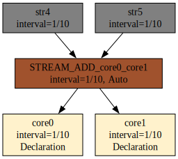
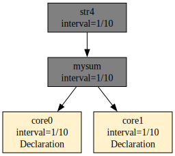

# Budowa drzewa zależności

Drzewo zależności to plan realizacji zapytań w postaci grafu skierowanego. Jest to struktura danych, która budowana jest w trakcie kompilacji oraz modyfikowana w trakcie dodawania zapytań AdHoc. Korzeniami tego grafu są deklaracje efemerydów. Wszelkiej postaci deklaracje tworzące obiekty zewnętrzne – tzw. Źródła danych. Wewnątrz grafu występują artefakty i substraty. Na końcu łańcucha przetwarzania znajdują się artefakty – jako wyniki końcowe łańcucha.

Taka konstrukcja to graf skierowany. Graf, który posiada wiele korzeni i wiele wierzchołków końcowych. Wewnątrz grafu znajdują się węzły łączące. Każdy węzeł znajduje się na drodze od korzenia do wierzchołka końcowego. Najlepiej to zwizualizuje przykład.

Na początku rozważmy następujące trywialne zapytanie:

```
DECLARE a UINT STREAM core0, 0.1 FILE 'datafile1.txt'
SELECT str1[0] STREAM str1 FROM core0
```

Graf, w którym uwypuklone zostaną dependencje pomiędzy poszczególnymi obiektami uzyskamy w następujący sposób (Rys. 21):

```
$ xretractor -c query5.rql -d > out.dot && dot -Tsvg out.dot -o out.svg
```

Pełny opis flag `-d -f -s` i interpretacja wyjścia — patrz [Debugowanie kompilacji](debugowanie-kompilacji.md).

<figure><figcaption><p>Rys. 21. Dependencja efemeryd-artefakt</p></figcaption></figure>

Skomplikujmy trochę ten graf dodając dwie deklaracje efemerydów i dodatkowy artefakt.

```
DECLARE a UINT STREAM core0, 0.1 FILE 'datafile1.txt'
DECLARE a UINT STREAM core1, 0.1 FILE 'datafile2.txt'
SELECT str1[0] STREAM str1 FROM core0
SELECT str2[0] STREAM str2 FROM core0 + core1
```

Graf zależności dla powyższego zestawu zapytań prezentuje się następująco (Rys. 22):

<figure><figcaption><p>Rys. 22. Dependencja efemerydy-artefakty</p></figcaption></figure>

Zbudujmy dodatkowy węzeł zależny od artefaktów. Najprościej dodać następujące zapytanie na końcu:

```
SELECT str3[0] STREAM str3 FROM str1#str2
```

Graf zmieni swoją postać:

<figure><figcaption><p>Rys. 23. Dependencja efemerydy-artefakty-artefakty</p></figcaption></figure>

Jak widać na Rys. 23 strumień str3 nie jest zależny bezpośrednio od danych dostarczanych przez strumienie core0 i core1. Zapytania tworzą graf zależności a kolejności ich wywoływania jest uporządkowana. Wartość interwału w strumieniach rośnie w kierunku korzeni. Wzrost w kierunku korzenia wynika z równań wyznaczających interwały opracowanej algebry.

Proszę zwrócić uwagę, że zapytania w pliku rql przetwarzane są sekwencyjnie. Próba odwołania się w zapytaniu do obiektu, który nie jest jeszcze zdefiniowany, skończy się błędem kompilacji.

W przypadku dołączenia do drzewa zależności następującego zapytania wytworzymy dodatkowy substrat.

```
SELECT str4[0] STREAM str4 FROM (core1+core0)>2
```

Tak dołączone zapytanie spowoduje modyfikację drzewa zależności w sposób przedstawiony na Rys. 24.

<figure><figcaption><p>Rys. 24. Dependencja z substratem</p></figcaption></figure>

Substrat został oznaczony innym kolorem oraz oznaczeniem Auto znajdującym się obok interwału czasowego.

Graf zależności musi być acyklicznym grafem skierowanym (DAG). Próba zdefiniowania strumienia odwołującego się do własnych wyników tworzy cykl i kończy się błędem kompilacji. Mechanizm wykrywania opisany jest w rozdziale [Wykrywanie pętli w kompilacji](wykrywanie-petli.md).

## Eliminacja duplikatów substratów

Gdy kilka zapytań korzysta z tej samej operacji strumieniowej – np. `core0 + core1` – faza ekstrakcji substratów (`extractIntermediateStreams`) tworzy dla każdego z nich osobny substrat. Bez kolejnej fazy naprawczej w grafie powstawałyby równoległe, identyczne węzły pośrednie obliczające dokładnie tę samą wartość.

### Kiedy substrat jest tworzony

Substrat generowany jest dla każdego zapytania, którego program zawiera więcej niż jeden operator strumieniowy. Dotyczy to operatorów: `STREAM_ADD`, `STREAM_SUBTRACT`, `STREAM_HASH`, `STREAM_DEHASH_DIV`, `STREAM_DEHASH_MOD`, `STREAM_TIMEMOVE`, `STREAM_AGSE`. Warunek sprawdza funkcja `query::isReductionRequired()` (`src/retractor/lib/query.cpp:51`).

Nowo powstałemu substratowi nadawana jest nazwa zbudowana z symbolu operacji i nazw operandów, np. `STREAM_ADD_core1_core0` (funkcja `composeStreamName`, `src/retractor/lib/compiler.cpp:184`). W programie zapytania macierzystego token operatora zastępowany jest tokenem `PUSH_STREAM` wskazującym na ten substrat.

### Algorytm deduplikacji

Po ekstrakcji substratów i wyznaczeniu interwałów czasowych kompilator uruchamia krok `deduplicateSubstrats()` (`src/retractor/lib/compiler.cpp:759`). Algorytm działa iteracyjnie – pętla `while(changed)` powtarza przeszukiwanie aż do momentu, gdy żadna para duplikatów nie zostanie już znaleziona.

W każdym przebiegu dla każdej pary substratów `(it, it2)` sprawdzane są kolejno cztery warunki równoważności:

1. **Interwał czasowy** – `it->rInterval == it2->rInterval`
2. **Długość programu** – liczba tokenów w `lProgram` musi być identyczna
3. **Długość schematu** – liczba pól w `lSchema` musi być identyczna
4. **Zawartość programu** – każdy token porównywany jest według typu polecenia (`getCommandID()`) i wartości parametru (`getVT()`)
5. **Zawartość schematu** – każde pole porównywane jest według typu (`rtype`), rozmiaru w bajtach (`rlen`) i liczności (`rarray`)

Jeśli wszystkie warunki są spełnione, substrat `it` uznawany jest za duplikat substratu `it2`. Kompilator przechodzi przez cały `coreInstance` i we wszystkich tokenach `PUSH_STREAM` odnoszących się do starej nazwy (`it->id`) podstawia nową nazwę (`it2->id`). Następnie duplikat jest usuwany z listy zapytań (`coreInstance.erase(it)`), a pętla startuje od początku.

### Miejsce w potoku kompilacji

Deduplikacja jest czwartym krokiem ośmiofazowego potoku (`src/retractor/lib/compiler.cpp:799`):

```
1. extractIntermediateStreams   – wyodrębnienie substratów
2. expandSchemaWildcards        – rozwinięcie symboli wieloznacznych w schematach
3. resolveStreamIntervals       – obliczenie interwałów czasowych
4. deduplicateSubstrats         – eliminacja duplikatów  ← ten krok
5. resolveFieldReferences       – rozwiązanie referencji do pól
6. expandIndexWildcards         – rozwinięcie indeksów wieloznacznych
7. localizeFieldOffsets         – wyznaczenie przesunięć pól
8. validateConstraints / applyCapacities
```

Deduplikacja musi nastąpić po kroku 3, ponieważ porównanie interwałów jest jednym z kryteriów równoważności – substraty o różnych interwałach nie są identyczne nawet jeśli realizują tę samą operację algebraiczną.

### Efekt w grafie zależności

Rozważmy zapytania:

```
DECLARE a UINT STREAM core0, 0.1 FILE 'datafile1.txt'
DECLARE a UINT STREAM core1, 0.1 FILE 'datafile2.txt'
SELECT str4[0] STREAM str4 FROM (core0+core1)>2
SELECT str5[0] STREAM str5 FROM (core0+core1)>3
```

Oba zapytania wymagają uprzedniego obliczenia sumy `core0+core1`. Faza `extractIntermediateStreams` tworzy osobny substrat dla każdego zapytania, co daje dwa identyczne węzły pośrednie w grafie (Rys. 25):

<figure><figcaption><p>Rys. 25. Graf przed deduplikacją — dwa identyczne substraty STREAM_ADD_core0_core1</p></figcaption></figure>

Po uruchomieniu `deduplicateSubstrats()` jeden z duplikatów jest usuwany, a wszystkie odwołania `PUSH_STREAM` przepinane są do ocalałego węzła. W grafie pozostaje jeden wspólny substrat (Rys. 26):

<figure><figcaption><p>Rys. 26. Graf po deduplikacji — jeden wspólny substrat, wygenerowany poleceniem: xretractor dedup_after.rql -c -d</p></figcaption></figure>

Graf po deduplikacji to dokładnie to, co zwraca `xretractor -c -d` — kompilator zawsze prezentuje wynik po wszystkich fazach optymalizacji.

## Wchłonięcie substratu przez jawny strumień

Pętla wewnętrzna w `deduplicateSubstrats()` nie sprawdza flagi `isSubstrat` dla kandydata `it2` (linia 766 w `compiler.cpp`). Oznacza to, że substrat automatyczny może zostać wchłonięty nie tylko przez inny substrat, ale przez **dowolny strumień o identycznym programie i schemacie** — w tym przez strumień zdefiniowany jawnie przez użytkownika.

Rozważmy zapytanie zawierające wyłącznie złożone wyrażenie:

```
DECLARE a UINT STREAM core0, 0.1 FILE 'datafile1.txt'
DECLARE a UINT STREAM core1, 0.1 FILE 'datafile2.txt'
SELECT str4[0] STREAM str4 FROM (core0+core1)>2
```

`extractIntermediateStreams` wyodrębnia tutaj substrat `STREAM_ADD_core0_core1` dla wyrażenia `core0+core1`. Artefakt `str4` zależy od niego (Rys. 27):

<figure><figcaption><p>Rys. 27. Graf z automatycznym substratem STREAM_ADD_core0_core1</p></figcaption></figure>

Gdy użytkownik doda jawną deklarację strumienia będącego dokładnie tą samą sumą:

```
SELECT * STREAM mysum FROM core0+core1
```

substrat `STREAM_ADD_core0_core1` spełnia wszystkie warunki równoważności względem `mysum` — identyczny interwał, identyczny program tokenów, identyczny schemat pól. Faza `deduplicateSubstrats()` usuwa substrat i przepina wszystkie odwołania `PUSH_STREAM` na `mysum`. Substrat znika z grafu w zupełności (Rys. 28):

<figure><figcaption><p>Rys. 28. Graf po dodaniu SELECT * STREAM mysum FROM core0+core1 — substrat zastąpiony przez jawny strumień</p></figcaption></figure>

Efekt uboczny: `mysum` staje się węzłem wspólnym — obsługuje zarówno własnych konsumentów, jak i tych, którzy wcześniej korzystali z automatycznego substratu. Użytkownik zyskuje przy tym jawną nazwę dla wyników pośrednich i może odpytywać je przez `xqry`.
