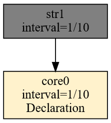
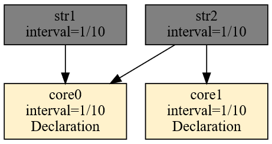
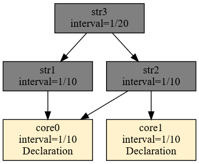
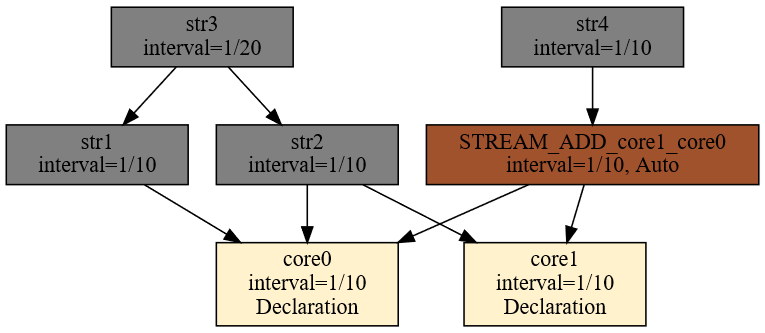

# Budowa drzewa zależności

Drzewo zależności to plan realizacji zapytań w postaci grafu skierowanego. Jest to struktura danych, która budowana jest w trakcie kompilacji oraz modyfikowana w trakcie dodawania zapytań AdHoc. Korzeniami tego grafu są deklaracje efemerydów. Wszelkiej postaci deklaracje tworzące obiekty zewnętrzne – tzw. Źródła danych. Wewnątrz grafu występują artefakty i substraty. Na końcu łańcucha przetwarzania znajdują się artefakty – jako wyniki końcowe łańcucha.

Taka konstrukcja to graf skierowany. Graf, który posiada wiele korzeni i wiele wierzchołków końcowych. Wewnątrz grafu znajdują się węzły łączące. Każdy węzeł znajduje się na drodze od korzenia do wierzchołka końcowego. Najlepiej to zwizualizuje przykład.

Na początku rozważmy następujące trywialne zapytanie:

```
DECLARE a UINT STREAM core0, 0.1 FILE 'datafile1.txt'
SELECT str1[0] STREAM str1 FROM core0
```

Graf, w którym uwypuklone zostaną dependencje pomiędzy poszczególnymi obiektami uzyskamy w następujący sposób:

```
$ xretractor -c query5.rql -d > out.dot && dot -Tsvg out.dot -o out.svg
```

Pełny opis flag `-d -f -s` i interpretacja wyjścia — patrz [Debugowanie kompilacji](debugowanie-kompilacji.md).

<figure><figcaption><p>Rys. 21. Dependencja efemeryd-artefakt</p></figcaption></figure>

Skomplikujmy trochę ten graf dodając dwie deklaracje efemerydów i dodatkowy artefakt.

```
DECLARE a UINT STREAM core0, 0.1 FILE 'datafile1.txt'
DECLARE a UINT STREAM core1, 0.1 FILE 'datafile2.txt'
SELECT str1[0] STREAM str1 FROM core0
SELECT str2[0] STREAM str2 FROM core0 + core1
```

Graf zależności dla powyższego zestawu zapytań prezentuje się następująco:

<figure><figcaption><p>Rys. 22. Dependencja efemerydy-artefakty</p></figcaption></figure>

Zbudujmy dodatkowy węzeł zależny od artefaktów. Najprościej dodać następujące zapytanie na końcu:

```
SELECT str3[0] STREAM str3 FROM str1#str2
```

Graf zmieni swoją postać:

<figure><figcaption><p>Rys. 23. Dependencja efemerydy-artefakty-artefakty</p></figcaption></figure>

Jak widać na Rys. 23 strumień str3 nie jest zależny bezpośrednio od danych dostarczanych przez strumienie core0 i core1. Zapytania tworzą graf zależności a kolejności ich wywoływania jest uporządkowana. Wartość interwału w strumieniach rośnie w kierunku korzeni. Wzrost w kierunku korzenia wynika z równań wyznaczających interwały opracowanej algebry.

Proszę zwrócić uwagę, że zapytania w pliku rql przetwarzane są sekwencyjnie. Próba odwołania się w zapytaniu do obiektu, który nie jest jeszcze zdefiniowany, skończy się błędem kompilacji.

W przypadku dołączenia do drzewa zależności następującego zapytania wytworzymy dodatkowy substrat.

```
SELECT str4[0] STREAM str4 FROM (core1+core0)>2
```

Tak dołączone zapytanie spowoduje modyfikację drzewa zależności w sposób przedstawiony na Rys. 24.

<figure><figcaption><p>Rys. 24. Dependencja z substratem</p></figcaption></figure>

Substrat został oznaczony innym kolorem oraz oznaczeniem Auto znajdującym się obok interwału czasowego.

Graf zależności musi być acyklicznym grafem skierowanym (DAG). Próba zdefiniowania strumienia odwołującego się do własnych wyników tworzy cykl i kończy się błędem kompilacji. Mechanizm wykrywania opisany jest w rozdziale [Wykrywanie pętli w kompilacji](wykrywanie-petli.md).
