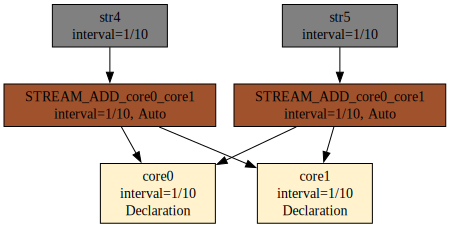
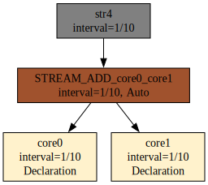

# Substraty

O substratach, efemerydach i artefaktach wspomniałem w rozdziale dotyczącym architektury systemu. W tym przypadku przedstawię przykład.

Na początek chciałbym zwrócić uwagę na pewną własność wprowadzonych wyrażeń algebraicznych. W praktyce możemy zapisać dowolne wyrażenie, skompilować i przedstawić wzór na operacje na poszczególnych elementach serii czasowych umożliwiających uzyskanie pożądanego wyniku.

W praktyce w systemie realizuję wyłącznie operacje jedno lub dwuargumentowe. Przykładem operacji jednoargumentowych to przesunięcie w czasie lub operacja Agse. Tam argumentem jest tylko jeden strumień danych. Reszta operacji to operacje na dwóch strumieniach danych. W trakcie kompilacji wszystkie wyrażenia algebraiczne rozbijane są na takie, które mają dwa argumenty.

Parser akceptuje zarówno formę z nawiasami, jak i łańcuchy bez nawiasów, np. `s1+s2+s3`, `s1#s2#s3` oraz `s1+s2+s3+s4`. Taki zapis jest następnie redukowany do sekwencji operacji dwuargumentowych z automatycznymi substratami pośrednimi.

Przykład używa kanonicznych deklaracji z całego rozdziału — trzy strumienie o różnych typach i interwałach:

```
DECLARE a BYTE, b INTEGER
STREAM core0, 0.1
FILE 'sensor_a.txt'

DECLARE c INTEGER, d FLOAT
STREAM core1, 0.2
FILE 'sensor_b.txt'

DECLARE e INTEGER
STREAM core2, 0.3
FILE 'sensor_c.txt'

SELECT merged[0]
STREAM merged
FROM (core0 # core1) + core2
```

Kompilacja:

```
$ xretractor -c query.rql
STREAM_HASH_core0_core1(1/15)
        :- PUSH_STREAM(core0)
        :- PUSH_STREAM(core1)
        :- STREAM_HASH
        a: BYTE
                PUSH_ID(STREAM_HASH_core0_core1[0])
        b: INTEGER
                PUSH_ID(STREAM_HASH_core0_core1[1])
        c: INTEGER
                PUSH_ID(STREAM_HASH_core0_core1[2])
        d: FLOAT
                PUSH_ID(STREAM_HASH_core0_core1[3])
merged(1/15)
        :- PUSH_STREAM(STREAM_HASH_core0_core1)
        :- PUSH_STREAM(core2)
        :- STREAM_ADD
        merged_0: BYTE
                PUSH_ID(merged[0])
core0(1/10)     sensor_a.txt
        a: BYTE
        b: INTEGER
core1(1/5)      sensor_b.txt
        c: INTEGER
        d: FLOAT
core2(3/10)     sensor_c.txt
        e: INTEGER
```

Pojawił się niezapowiedziany strumień `STREAM_HASH_core0_core1` — to właśnie substrat. Kompilator rozbił `(core0 # core1) + core2` na dwie operacje dwuargumentowe i wstawił pośredni strumień. Delta substratu: Δ = (1/10 · 1/5) / (1/10 + 1/5) = 1/15.

Co się stanie po dołączeniu zapytania:

```
SELECT merged2[0] STREAM merged2 FROM (core0 # core1) > 2
```

Do planu dołączone zostanie tylko jedno nowe zapytanie:

```
merged2(1/15)
        :- PUSH_STREAM(STREAM_HASH_core0_core1)
        :- STREAM_TIMEMOVE(2)
        merged2_0: BYTE
                PUSH_ID(merged2[0])
```

Zastanawiasz się pewnie dlaczego tylko jedno a nie ponownie dwa? Odpowiedź to optymalizacja. Korzystamy z pośrednich wyników poprzedniego. To jedna z nieoczekiwanych korzyści zastosowania RetractorDB.

Jest jeszcze jedna istotna rzecz o której należy wspomnieć w tym punkcie. Istnieje dyrektywa SUBSTRAT, której argumentem jest ciąg znaków ujęty w apostrofy. Można użyć następujących typów ‘memory’, ‘default’, ‘direct’, ‘posix’, ‘posixshd’, ‘generic’, ‘device’, ‘textsource’. Pełny opis każdego typu znajdziesz w rozdziale [Typy STORAGE](../konstrukcja-jezyka-zapytan/polecenie-select/typy-storage.md). Domyślny typ ‘default’ spowoduje, że substraty będą materializować się w całości na dysku. To nie jest oczekiwana wartość w systemie produkcyjnym, ale oczekiwana w trakcie rozwoju i debugowania. Typ użyteczny to ‘memory’. Substraty tego typu lądują tylko w pamięci. Ich dane nigdy nie lądują na dysku – wszystko odbywa się w pamięci, danych jest tylko tyle ile jest wymaganych do realizacji zapytań. Reszta typów na chwilę obecną jest nieprzetestowana i znajduje się w fazie rozwojowej.

Dodanie zapytania o tych samych operacjach, ale innej nazwie może spowodować deduplikację substratów. Jeśli program, delta i schemat są równoważne, kompilator przepnie odwołania `PUSH_STREAM` na istniejący strumień i usunie duplikat.

> **_NOTE:_** Opisana funkcjonalność ma pokrycie w testach: `issue96_no_substrat_reduction`, `issue96_substrat_reference` opisanych w załączniku pt. [Testy Integracyjne](../zalaczniki/testy-integracyjne.md).

## Redukcja substratów

Kompilator realizuje optymalizację zwaną **redukcją substratów** (funkcja `deduplicateSubstrats`). Polega ona na tym, że jeśli użytkownik zdefiniował zapytanie strukturalnie identyczne z wygenerowanym substratem, substrat jest usuwany z planu, a jego odwołania zastępowane są nazwą zapytania użytkownika.

### Warunki redukcji

Redukcja substratu do zapytania użytkownika następuje wtedy i tylko wtedy, gdy spełnione są jednocześnie trzy warunki:

1. **Ten sam schemat** — typy i nazwy pól wyjściowych są identyczne.
2. **Ta sama delta** — częstotliwość próbkowania strumieni jest taka sama.
3. **Te same operacje przetwarzania** — sekwencja instrukcji `PUSH_STREAM` / `STREAM_TIMEMOVE` / `STREAM_HASH` itp. jest identyczna.

### Przykład redukcji

Rozważmy zapytanie z kanonicznymi deklaracjami:

```
DECLARE a BYTE, b INTEGER   STREAM core0, 0.1 FILE 'sensor_a.txt'
DECLARE c INTEGER, d FLOAT  STREAM core1, 0.2 FILE 'sensor_b.txt'

SELECT merged[0] STREAM merged FROM (core0 > 2) + core1
SELECT shifted[0] STREAM shifted FROM core0 > 2
```

Bez redukcji kompilator wygenerowałby trzy strumienie: substrat `STREAM_TIMEMOVE_core0`, `merged` i `shifted`. Substrat i `shifted` mają identyczną strukturę — ten sam strumień źródłowy `core0` i tę samą operację `>2`. Po redukcji substrat jest usuwany, a odwołanie `PUSH_STREAM(STREAM_TIMEMOVE_core0)` w `merged` zostaje zastąpione przez `PUSH_STREAM(shifted)`:

```
merged(1/10)
        :- PUSH_STREAM(shifted)
        :- PUSH_STREAM(core1)
        :- STREAM_ADD
        merged_0: BYTE
                PUSH_ID(merged[0])
shifted(1/10)
        :- PUSH_STREAM(core0)
        :- STREAM_TIMEMOVE(2)
        shifted_0: BYTE
                PUSH_ID(shifted[0])
core0(1/10)     sensor_a.txt
        a: BYTE
        b: INTEGER
core1(1/5)      sensor_b.txt
        c: INTEGER
        d: FLOAT
```

### Ważne ograniczenie: tylko substraty są redukowane

Redukcja dotyczy wyłącznie substratów wygenerowanych przez kompilator (`isSubstrat = true`). Zapytania zdefiniowane jawnie przez użytkownika **nigdy** nie są redukowane, nawet jeśli dwa z nich mają identyczną strukturę.

Przykład — dwa zapytania użytkownika o tej samej operacji:

```
DECLARE a BYTE, b INTEGER   STREAM core0, 0.1 FILE 'sensor_a.txt'

SELECT shifted1[0] STREAM shifted1 FROM core0 > 2
SELECT shifted2[0] STREAM shifted2 FROM core0 > 2
```

Wynik kompilacji zachowa oba strumienie bez żadnej redukcji:

```
shifted1(1/10)
        :- PUSH_STREAM(core0)
        :- STREAM_TIMEMOVE(2)
        shifted1_0: BYTE
                PUSH_ID(shifted1[0])
shifted2(1/10)
        :- PUSH_STREAM(core0)
        :- STREAM_TIMEMOVE(2)
        shifted2_0: BYTE
                PUSH_ID(shifted2[0])
core0(1/10)     sensor_a.txt
        a: BYTE
        b: INTEGER
```

Semantyczna decyzja jest tu celowa: użytkownik zadeklarował dwa odrębne strumienie wynikowe i oba mają prawo istnieć niezależnie w planie wykonania.

## Eliminacja duplikatów substratów

Gdy kilka zapytań korzysta z tej samej operacji strumieniowej – np. `core0 + core1` – faza ekstrakcji substratów (`extractIntermediateStreams`) tworzy dla każdego z nich osobny substrat. Bez kolejnej fazy naprawczej w grafie powstawałyby równoległe, identyczne węzły pośrednie obliczające dokładnie tę samą wartość.

### Kiedy substrat jest tworzony

Substrat generowany jest dla każdego zapytania, którego program zawiera więcej niż jeden operator strumieniowy. Dotyczy to operatorów: `STREAM_ADD`, `STREAM_SUBTRACT`, `STREAM_HASH`, `STREAM_DEHASH_DIV`, `STREAM_DEHASH_MOD`, `STREAM_TIMEMOVE`, `STREAM_AGSE`. Warunek sprawdza funkcja `query::isReductionRequired()`.

Nowo powstałemu substratowi nadawana jest nazwa zbudowana z symbolu operacji i nazw operandów, np. `STREAM_ADD_core1_core0` (funkcja `composeStreamName` w `compiler.cpp`). W programie zapytania macierzystego token operatora zastępowany jest tokenem `PUSH_STREAM` wskazującym na ten substrat.

### Algorytm deduplikacji

Po ekstrakcji substratów i wyznaczeniu interwałów czasowych kompilator uruchamia krok `deduplicateSubstrats()`. Algorytm działa iteracyjnie – pętla `while(changed)` powtarza przeszukiwanie aż do momentu, gdy żadna para duplikatów nie zostanie już znaleziona.

W każdym przebiegu dla każdej pary substratów `(it, it2)` sprawdzane są kolejno pięć warunków równoważności:

1. **Interwał czasowy** – `it->rInterval == it2->rInterval`
2. **Długość programu** – liczba tokenów w `lProgram` musi być identyczna
3. **Długość schematu** – liczba pól w `lSchema` musi być identyczna
4. **Zawartość programu** – każdy token porównywany jest według typu polecenia (`getCommandID()`) i wartości parametru (`getVT()`)
5. **Zawartość schematu** – każde pole porównywane jest według typu (`rtype`), rozmiaru w bajtach (`rlen`) i liczności (`rarray`)

Jeśli wszystkie warunki są spełnione, substrat `it` uznawany jest za duplikat substratu `it2`. Kompilator przechodzi przez cały `coreInstance` i we wszystkich tokenach `PUSH_STREAM` odnoszących się do starej nazwy (`it->id`) podstawia nową nazwę (`it2->id`). Następnie duplikat jest usuwany z listy zapytań (`coreInstance.erase(it)`), a pętla startuje od początku.

### Miejsce w potoku kompilacji

Deduplikacja jest czwartym krokiem ośmiofazowego potoku (funkcja `compiler::compile()`):

```
1. extractIntermediateStreams   – wyodrębnienie substratów
2. expandSchemaWildcards        – rozwinięcie symboli wieloznacznych w schematach
3. resolveStreamIntervals       – obliczenie interwałów czasowych
4. deduplicateSubstrats         – eliminacja duplikatów  ← ten krok
5. resolveFieldReferences       – rozwiązanie referencji do pól
6. expandIndexWildcards         – rozwinięcie indeksów wieloznacznych
7. localizeFieldOffsets         – wyznaczenie przesunięć pól
8. validateConstraints / applyCapacities
```

Deduplikacja musi nastąpić po kroku 3, ponieważ porównanie interwałów jest jednym z kryteriów równoważności – substraty o różnych interwałach nie są identyczne nawet jeśli realizują tę samą operację algebraiczną.

### Efekt w grafie zależności

Rozważmy zapytania:

```
DECLARE a UINT STREAM core0, 0.1 FILE 'datafile1.txt'
DECLARE a UINT STREAM core1, 0.1 FILE 'datafile2.txt'
SELECT str4[0] STREAM str4 FROM (core0+core1)>2
SELECT str5[0] STREAM str5 FROM (core0+core1)>3
```

Oba zapytania wymagają uprzedniego obliczenia sumy `core0+core1`. Faza `extractIntermediateStreams` tworzy osobny substrat dla każdego zapytania, co daje dwa identyczne węzły pośrednie w grafie (Rys. 25):

<figure><figcaption><p>Rys. 25. Graf przed deduplikacją — dwa identyczne substraty STREAM_ADD_core0_core1</p></figcaption></figure>

Po uruchomieniu `deduplicateSubstrats()` jeden z duplikatów jest usuwany, a wszystkie odwołania `PUSH_STREAM` przepinane są do ocalałego węzła. W grafie pozostaje jeden wspólny substrat (Rys. 26):

<figure><figcaption><p>Rys. 26. Graf po deduplikacji — jeden wspólny substrat, wygenerowany poleceniem: xretractor dedup_after.rql -c -d</p></figcaption></figure>

Graf po deduplikacji to dokładnie to, co zwraca `xretractor -c -d` — kompilator zawsze prezentuje wynik po wszystkich fazach optymalizacji.

## Wchłonięcie substratu przez jawny strumień

Pętla wewnętrzna w `deduplicateSubstrats()` nie sprawdza flagi `isSubstrat` dla kandydata `it2` — sprawdzenie to istnieje tylko w pętli zewnętrznej. Oznacza to, że substrat automatyczny może zostać wchłonięty nie tylko przez inny substrat, ale przez **dowolny strumień o identycznym programie i schemacie** — w tym przez strumień zdefiniowany jawnie przez użytkownika.

Rozważmy zapytanie zawierające wyłącznie złożone wyrażenie:

```
DECLARE a UINT STREAM core0, 0.1 FILE 'datafile1.txt'
DECLARE a UINT STREAM core1, 0.1 FILE 'datafile2.txt'
SELECT str4[0] STREAM str4 FROM (core0+core1)>2
```

`extractIntermediateStreams` wyodrębnia tutaj substrat `STREAM_ADD_core0_core1` dla wyrażenia `core0+core1`. Artefakt `str4` zależy od niego (Rys. 27):

<figure><figcaption><p>Rys. 27. Graf z automatycznym substratem STREAM_ADD_core0_core1</p></figcaption></figure>

Gdy użytkownik doda jawną deklarację strumienia będącego dokładnie tą samą sumą:

```
SELECT * STREAM mysum FROM core0+core1
```

substrat `STREAM_ADD_core0_core1` spełnia wszystkie warunki równoważności względem `mysum` — identyczny interwał, identyczny program tokenów, identyczny schemat pól. Faza `deduplicateSubstrats()` usuwa substrat i przepina wszystkie odwołania `PUSH_STREAM` na `mysum`. Substrat znika z grafu w zupełności (Rys. 28):

<figure><figcaption><p>Rys. 28. Graf po dodaniu SELECT * STREAM mysum FROM core0+core1 — substrat zastąpiony przez jawny strumień</p></figcaption></figure>

Efekt uboczny: `mysum` staje się węzłem wspólnym — obsługuje zarówno własnych konsumentów, jak i tych, którzy wcześniej korzystali z automatycznego substratu. Użytkownik zyskuje przy tym jawną nazwę dla wyników pośrednich i może odpytywać je przez `xqry`.

## Aktualizacja schematu po wchłonięciu

Samo przepięcie tokenów `PUSH_STREAM` to za mało. Każdy strumień przechowuje w `lSchema` sekwencję instrukcji opisujących, jak zbudować wartość wyjściową każdego pola — w tym tokeny `PUSH_ID(nazwa_strumienia, N)`, które mówią: „weź N-te pole z bufora wejściowego o nazwie `nazwa_strumienia`". Gdy substrat zostaje wchłonięty, te tokeny wciąż odnoszą się do starej, usuniętej nazwy substratu. Krok `localizeFieldOffsets()` buduje mapę offsetów na podstawie tokenów `PUSH_STREAM` w programie — jeśli klucz z `PUSH_ID` nie pasuje do żadnego wpisu w mapie, domyślnie przyjmuje offset 0.

### Scenariusz błędu przy niezerowym offsecie

Rozważmy zapytanie:

```
DECLARE a INTEGER STREAM s1, 1 FILE 'data1.dat'
DECLARE b INTEGER STREAM s2, 1 FILE 'data2.dat'
DECLARE c INTEGER STREAM s3, 1 FILE 'data3.dat'

SELECT * STREAM mysum  FROM s1+s2
SELECT * STREAM merged FROM s3+(s1+s2)
```

Kompilator tworzy substrat `STREAM_ADD_s1_s2`. Strumień `merged` ma dwa źródła: `s3` (offset 0) i substrat `STREAM_ADD_s1_s2` (offset 1, bo s3 zajmuje pozycję 0). Funkcja `buildOutputSchema` zapisuje w `merged.lSchema` tokeny:

```
PUSH_ID(STREAM_ADD_s1_s2, 0)   ← pole a ze źródła na offsecie 1
PUSH_ID(STREAM_ADD_s1_s2, 1)   ← pole b ze źródła na offsecie 1
```

Po wchłonięciu `deduplicateSubstrats()` przepina `PUSH_STREAM` z `STREAM_ADD_s1_s2` na `mysum`. Jednak bez aktualizacji `lSchema` tokeny `PUSH_ID` wciąż noszą starą nazwę. Gdy `localizeFieldOffsets()` nie znajdzie `STREAM_ADD_s1_s2` w mapie offsetów, przyjmuje offset 0 — kolizję z polami `s3`. Efekt: pola `a` i `b` z `mysum` były odczytywane z offsetu 0 (pozycja `s3`) zamiast z offsetu 1 (pozycja `mysum`).

### Poprawka: aktualizacja lSchema w deduplicateSubstrats

Aby uniknąć tej rozbieżności, `deduplicateSubstrats()` po zaktualizowaniu tokenów `PUSH_STREAM` wykonuje dodatkowy przebieg przez `lSchema` wszystkich zapytań i przepisuje:

- tokeny `PUSH_ID(stara_nazwa, N)` na `PUSH_ID(nowa_nazwa, N)` — to przypadek pól z `buildOutputSchema` dla `STREAM_ADD`,
- tokeny `PUSH_ID2("stara_nazwa[N]")` na `PUSH_ID2("nowa_nazwa[N]")` — to przypadek symbolicznych nazw tworzonych przez `buildOutputSchema` dla `STREAM_TIMEMOVE`, `STREAM_HASH`, `STREAM_SUBTRACT`.

Po poprawce wyjście kompilatora dla powyższego przykładu wygląda poprawnie:

```
merged(1/1)
        :- PUSH_STREAM(mysum)
        :- PUSH_STREAM(s3)
        :- STREAM_ADD
        a: INTEGER
                PUSH_ID(merged[1])
        b: INTEGER
                PUSH_ID(merged[2])
```

Pola `a` i `b` z `mysum` mają offset 1 (`merged[1]`, `merged[2]`), co odpowiada faktycznej pozycji `mysum` w buforze `merged` — po polu `c` ze strumienia `s3`.

### Kaskadowe wchłonięcie

> **_NOTE:_** Opisana funkcjonalność ma pokrycie w testach: `issue167_dedup_cascaded`, `issue167_dedup_field_names`, `issue167_dedup_nonzero_offset`, `issue167_dedup_positive`, `issue167_triarg` opisanych w załączniku pt. [Testy Integracyjne](../zalaczniki/testy-integracyjne.md).

`deduplicateSubstrats()` działa iteracyjnie (`while(changed)`), co pozwala na wielokrokowe wchłonięcia. W przykładzie:

```
SELECT * STREAM mysum   FROM s1+s2
SELECT * STREAM shifted FROM (s1+s2)>1
SELECT * STREAM merged  FROM s3+((s1+s2)>1)
```

w pierwszej rundzie `mysum` wchłania `STREAM_ADD_s1_s2` i przepisuje jego nazwy — również w schemacie pośredniego substratu `STREAM_TIMEMOVE_STREAM_ADD_s1_s2`. Dzięki temu w drugiej rundzie `shifted` może wchłonąć ten substrat (warunek programowy jest teraz spełniony, bo oba wskazują na `mysum`). Po dwóch rundach w planie nie pozostaje żaden substrat automatyczny, a `merged` korzysta bezpośrednio z `s3` i `shifted`.
