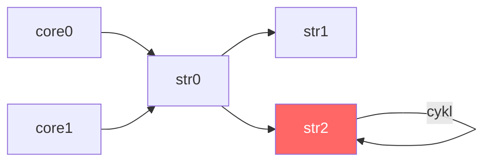

# Wykrywanie pętli w kompilacji

Graf zależności zapytań musi być acyklicznym grafem skierowanym (DAG). Jeśli zapytanie odwołuje się — bezpośrednio lub pośrednio — do własnych wyników, powstaje cykl. Kompilator wykrywa taką sytuację i kończy kompilację z błędem.

## Przykład pętli

```
DECLARE a INTEGER STREAM core0, 0.1 FILE 'datafile1.dat'
DECLARE b INTEGER STREAM core1, 0.2 FILE 'datafile2.dat'

SELECT str0[0]*10,(str0[1]+10)*10 STREAM str0 FROM core0+core1
SELECT str1[0] STREAM str1 FROM str0.max
SELECT * STREAM str2 FROM str0 + str2
```

Ostatnie zapytanie definiuje `str2` jako wynik operacji `str0 + str2` — strumień zależy od samego siebie. Graf zależności zawiera cykl:



_Rys. 24. Cykl w grafie zależności zapytań_

## Efekt kompilacji

Próba kompilacji takiego pliku kończy się błędem:

```
$ xretractor brokenQuery.rql -c 2>out.txt
$ echo $?
1
$ cat out.txt
[error] Circular dependency: stream interval resolution stalled with 1 unresolved streams
```

Komunikat `"Circular dependency in stream definitions"` pojawia się, gdy etap `resolveStreamIntervals` wykryje, że liczba nierozwiązanych strumieni przestała maleć.

## Mechanizm wykrywania

Etap `resolveStreamIntervals` w każdej rundzie iteracji liczy strumienie, dla których nie udało się jeszcze wyznaczyć interwału (`unresolvedCount`). W poprawnym grafie acyklicznym liczba ta maleje co rundę — zawsze co najmniej jeden strumień uzyskuje wyznaczoną deltę. W grafie z cyklem strumienie wzajemnie od siebie zależą i żaden nie może uzyskać wartości — `unresolvedCount` zatrzymuje się.

```cpp
if (unresolvedCount >= prevUnresolved) {
    SPDLOG_ERROR("Circular dependency: stream interval resolution stalled with {} unresolved streams",
                 unresolvedCount);
    return std::string("Circular dependency in stream definitions");
}
prevUnresolved = unresolvedCount;
```

Warunek `>=` (a nie `>`) chroni przed fałszywymi pozytywami: jeśli liczba nie maleje nawet o jeden, postęp jest niemożliwy.

## Jak naprawić

Usunąć odwołanie strumienia do samego siebie lub do strumienia, który od niego zależy. W powyższym przykładzie zapytanie:

```
SELECT * STREAM str2 FROM str0 + str2
```

należy zastąpić odwołaniem do strumienia, który istnieje niezależnie od `str2`:

```
SELECT * STREAM str2 FROM str0 + core0
```
