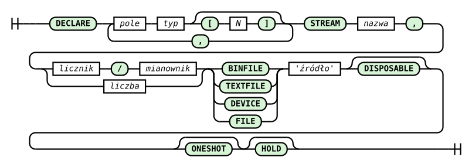

# Polecenie DECLARE

Polecenie DECLARE służy do zadeklarowania źródła danych.

Jego składnia opisana jest następująco:

```rql
DECLARE pole typ[N] [, pole typ[N]]
STREAM nazwa, szybkość
BINFILE | TEXTFILE | DEVICE źródło
[TIMEOUT czas]
[DISPOSABLE]
[ONESHOT]
[HOLD]
```



_Rys. 3. Diagram składni polecenia DECLARE_

Diagram składni (railroad) przedstawiony na Rys. 3 został wygenerowany na podstawie reguły `declare_statement` z gramatyki ANTLR4 systemu (`RQL.g4`). Diagram czyta się, podążając liniami od lewej do prawej: zaokrąglone zielone pola to słowa kluczowe i symbole wpisywane dosłownie, prostokąty to wartości podawane przez użytkownika. Pętla powracająca przez przecinek oznacza, że deklaracji pól może być wiele; rozgałęzienie przy szybkości pokazuje, że można ją zapisać ułamkiem (licznik/mianownik) lub pojedynczą liczbą; rozgałęzienie przed źródłem to wybór rodzaju źródła (`BINFILE`, `TEXTFILE`, `DEVICE` albo przestarzałe `FILE`); tor omijający TIMEOUT oznacza, że termin odczytu jest opcjonalny, a jego wartość - jak szybkość - zapisuje się ułamkiem albo liczbą; tory omijające DISPOSABLE, ONESHOT i HOLD oznaczają, że każda z tych dyrektyw jest opcjonalna.

## Rodzaje źródeł

Format danych wynika ze słowa kluczowego, nigdy z nazwy ani rozszerzenia ścieżki:

| Słowo      | Co czyta                                                                                      | Rodzaj pliku pod ścieżką      | Po końcu danych                                   |
| ---------- | --------------------------------------------------------------------------------------------- | ----------------------------- | ------------------------------------------------- |
| `BINFILE`  | surowe rekordy binarne o rozmiarze wynikającym z pól                                          | wyłącznie plik zwykły         | powrót na początek (pętla), z `ONESHOT` koniec źródła |
| `TEXTFILE` | tekst: wartości rozdzielone białymi znakami, token `NULL` oznacza brak wartości              | wyłącznie plik zwykły         | jak `BINFILE`                                     |
| `DEVICE`   | surowe rekordy binarne ze źródła żywego; nie interpretuje tekstu ani tokenu `NULL`, bajt zero jest zerem | urządzenie znakowe albo FIFO  | brak pisarza: rekordy `NULL` do powrotu danych; z `ONESHOT` koniec źródła |

```rql
DECLARE MLII INTEGER, V1 INTEGER STREAM ecg, 1/360 BINFILE 'rec205'
DECLARE bp_coef INTEGER[25] STREAM bpf, 1 TEXTFILE 'bp_coef.txt'
DECLARE sample BYTE STREAM sensor, 0.02 DEVICE '/dev/urandom'
```

Rozszerzenie niczego nie wybiera: `BINFILE 'bajty.txt'` czyta surowe bajty, a `TEXTFILE 'wartosci.dat'` parsuje tekst.

`DEVICE` jest źródłem żywym, dlatego nie przyjmuje `DISPOSABLE` ani `HOLD` - te dyrektywy dotyczą plików odtwarzanych (`BINFILE`, `TEXTFILE`), patrz [Opcje odczytu](polecenie-declare-opcje-odczytu.md). Przyjmuje natomiast `ONESHOT` oraz własną klauzulę `TIMEOUT`, opisane w punkcie [Odczyt źródła DEVICE i TIMEOUT](#odczyt-źródła-device-i-timeout). Otwarcie FIFO zadeklarowanego jako `DEVICE` nie czeka na pisarza - plan startuje, a pisarz może podłączyć się później.

Słowa `BINFILE`, `TEXTFILE`, `DEVICE` i `TIMEOUT` są zastrzeżone - żaden strumień ani pole nie może się tak nazywać (również pisane małymi literami).

### Kontrola rodzaju pliku

Przed startem planu - także przy przeładowaniu planu (`xqry --reset`) i imporcie ad hoc (`xqry -a`) - system sprawdza rodzaj pliku pod ścieżką każdej deklaracji, bez otwierania go. Ścieżka niewłaściwego rodzaju (katalog, urządzenie blokowe, gniazdo, FIFO dla `BINFILE`/`TEXTFILE`, zwykły plik dla `DEVICE`) daje odmowę planu z nazwą strumienia i ścieżką, np.:

```
xretractor: stream 'src': BINFILE 'feed.fifo' is a FIFO, not a regular file
```

Ścieżka, której nie ma, nie jest odmową: strumień daje wtedy rekordy `NULL`, a dziennik ostrzeżenie. Kompilacja w trybie `-c` tej kontroli nie wykonuje - nie musi biec na maszynie z danymi.

## Odczyt źródła DEVICE i TIMEOUT

Odczyt źródła `DEVICE` nigdy nie czeka bez końca i nie wstrzymuje reszty systemu. Urządzenie albo FIFO jest otwierane i czytane bez blokowania, a jedyne czekanie odbywa się przed obliczeniem slotu, poza blokadami modelu danych. Klient `xqry` dostaje więc odpowiedź także wtedy, gdy silnik czeka na dane urządzenia, a czas czekania nie wchodzi do mierzonego czasu obliczeń slotu (E1).

Opcjonalna klauzula `TIMEOUT` podaje termin odczytu w sekundach. Wartość zapisuje się tak samo jak szybkość strumienia - ułamkiem, liczbą z kropką albo liczbą całkowitą:

```rql
DECLARE a BYTE STREAM s0, 1/50 DEVICE '/dev/sensor0'
DECLARE b BYTE STREAM s1, 1/50 DEVICE '/dev/sensor1' TIMEOUT 1/100
DECLARE c BYTE STREAM s2, 1/50 DEVICE '/dev/sensor2' TIMEOUT 0
```

| Wartość | Znaczenie |
| ------- | --------- |
| `TIMEOUT 0` | próba natychmiastowa: brak pełnego rekordu w należnym takcie daje rekord `NULL` bez czekania |
| `TIMEOUT t`, `t > 0` | jeden termin na cały rekord, liczony od początku należnego slotu; po nim rekord `NULL` |
| brak klauzuli | termin z klucza `timeout_s` w sekcji `[sources]` pliku `retractor.toml`, a bez tego klucza 0 |

Jawna klauzula wygrywa z konfiguracją - także jawne `TIMEOUT 0`, które wyłącza dodatnią wartość z `retractor.toml` dla jednego źródła. Wartość ujemna jest błędem: nie istnieje termin „czekaj bez końca". Błędem planu jest też termin dłuższy od doby oraz `TIMEOUT` przy `BINFILE`, `TEXTFILE` i przestarzałym `FILE` (przy `FILE` z podpowiedzią, żeby zadeklarować źródło jawnym `DEVICE`). Klucz konfiguracji opisuje rozdział [Opcje wywołania - xretractor](../zalaczniki/opcje-wywolania/xretractor.md#plik-konfiguracyjny-toml).

Właściwości odczytu:

- **Termin się nie odnawia.** Przerwanie wywołania systemowego sygnałem ani fałszywe przebudzenie nie przedłużają czekania - termin jest stały od początku slotu.
- **Wiele źródeł czeka równolegle.** Wszystkie należne w danym slocie źródła `DEVICE` czekają razem, więc slot wydłuża się najwyżej o największy termin, a nie o ich sumę.
- **Niepełny rekord przeżywa termin.** Bajty, które przyszły przed terminem, czekają w buforze źródła; rekord dokończony później trafia do pierwszego kolejnego należnego taktu. Tylko rekord niepełny w chwili, gdy pisarz się odłącza, jest odrzucany z ostrzeżeniem - granica rekordu zginęła razem z pisarzem, więc następny pisarz zaczyna od nowego rekordu.
- **Chwila odczytu.** Rekord `DEVICE` konsumowany w slocie k jest czytany na początku slotu k, a nie na końcu slotu poprzedniego, jak w przypadku `BINFILE` i `TEXTFILE`. Indeksy logiczne rekordów są te same: te same bajty podane jako `BINFILE` i przez FIFO jako `DEVICE` dają te same wyniki, także za operatorami łączącymi strumienie o różnych szybkościach.
- **Koniec danych.** O końcu danych decyduje wyłącznie odczyt zwracający zero bajtów (FIFO bez pisarza, zawieszony terminal). Bez `ONESHOT` oznacza to „w tej chwili nie ma pisarza": takt dostaje rekord `NULL`, źródło zostaje otwarte, a ponowne podłączenie pisarza wznawia dane. Z `ONESHOT` (także w trybie `--until-eof`) wyczerpaniem jest pierwszy koniec danych **po** otrzymaniu co najmniej jednego bajtu - koniec przed pierwszymi danymi to pisarz, który jeszcze się nie podłączył. Pisarz, który podłączy się i odłączy bez zapisu, nie kończy więc przebiegu.
- **Błąd odczytu** inny niż chwilowy brak danych (np. odłączone urządzenie USB) daje rekordy `NULL` i ostrzeżenie przy zmianie stanu, bez wyczerpania źródła. Ponowne otwarcie odłączonego urządzenia nie jest obsługiwane.
- **Tryb bez zegara.** W trybie `--no-clock` (`-f`) termin każdego źródła `DEVICE` wynosi 0: sekundy rzeczywiste nie mają przelicznika na czas wirtualny. Jedna próba natychmiastowa w każdym należnym takcie zostaje, więc FIFO z danymi zapisanymi z góry daje przebieg powtarzalny.

Efektywny termin każdego źródła `DEVICE` i jego pochodzenie (`RQL`, `config`, `default` albo `no-clock`) trafia do dziennika silnika przy starcie planu i przy imporcie ad hoc, np. `DEVICE stream 's1': effective TIMEOUT 0.01 s (RQL)`. Wydruk `xretractor -c` pokazuje jawną klauzulę w tej samej postaci co szybkość, np. `timeout=1/100`.

> **⚠️ Ostrzeżenie** Granice czasu rzeczywistego:
>
> * Odczyt bez blokowania nie chroni przed sterownikiem, który blokuje wewnątrz wywołania odczytu mimo trybu nieblokującego. Takie urządzenie wymaga izolacji w osobnym procesie lub wątku.
> * Termin dłuższy od szybkości strumienia przekracza slot. Kompilacja wypisuje wtedy ostrzeżenie, np. `DECLARE s1: TIMEOUT 0.05 s (RQL) is longer than the interval 0.02 s; waiting overruns the slot`, uwzględniając także wartość z `retractor.toml`.
> * Każdy tryb taktowany, z opcją `--realtime` i bez niej, planuje sloty względem stałej kotwicy osi czasu. Czekanie na źródło `DEVICE`, które razem z obliczeniami mieści się w slocie, nie przesuwa następnych slotów. Dłuższe czekanie opóźnia kolejne sloty, które potem są nadrabiane bez snu; jeżeli czekanie i obliczenia stale przekraczają okres, zaległość narasta - patrz [Harmonogram slotów](../realizacja-zapytan/algorytm-przegladu-drzewa-zapytan.md#harmonogram-slotów).
> * Harmonogram nie synchronizuje zegara urządzenia. Producent stale szybszy od planu nadal tworzy zaległość w buforze źródła. Stale wolniejszemu brakuje próbek: daje to rekordy `NULL` w taktach, w których rekord nie zdążył nadejść, a `TIMEOUT` może najwyżej zamienić je na opóźnienie narastające razem z niedoborem.

> **_NOTE:_** Odczyt źródła `DEVICE`, `TIMEOUT` i koniec danych mają pokrycie w teście `device_timeout` i w teście jednostkowym `ut_faccbindev`.

## Typy pól

Każde pole ma nazwę i typ. Dostępne typy:

| Typ       | Rozmiar | Opis                               |
| --------- | ------- | ---------------------------------- |
| `BYTE`    | 1 B     | liczba całkowita bez znaku 8-bit   |
| `INTEGER` | 4 B     | liczba całkowita ze znakiem 32-bit |
| `UINT`    | 4 B     | liczba całkowita bez znaku 32-bit  |
| `FLOAT`   | 4 B     | liczba zmiennoprzecinkowa 32-bit   |
| `DOUBLE`  | 8 B     | liczba zmiennoprzecinkowa 64-bit   |
| `STRING`  | N B     | ciąg bajtów o stałej długości N    |

### Tablice pól (`typ[N]`)

Do każdego pola można dodać mnożnik tablicowy `[N]` - pole zajmuje `N × rozmiar_typu` bajtów i tworzy `N` kolejnych pozycji w schemacie rekordu:

```rql
DECLARE coef INTEGER[25] STREAM filter, 1 TEXTFILE 'coefficients.txt'
```

Pole `coef INTEGER[25]` tworzy rekord o rozmiarze 25 × 4 = 100 bajtów i daje dostęp do indeksów `filter[0]` … `filter[24]`. Jest to standardowy sposób przekazywania tablic współczynników (np. filtry FIR) do systemu.

Wiele pól różnych typów można łączyć w jednym rekordzie:

```rql
DECLARE id UINT, wartosc FLOAT, nazwa STRING[16] \
STREAM pomiar, 0.1 \
BINFILE 'czujnik.dat'
```

Rozmiar rekordu: 4 + 4 + 16 = 24 bajty.

System RetractorDB działając pod kontrolą systemu Linux pobiera i zapisuje dane do plików. W systemie Linux dostęp do większości zasobów jest realizowany za pomocą dostępu do różnego rodzaju plików. Takie rozwiązanie ujednolica sposób dostępu do danych.

Przykładem polecenia tworzącego w systemie RetractorDB obiekt zwracający wartości przypadkowe ze strumienia /dev/random 10 razy na sekundę o wartościach typu int wygląda następująco

```rql
DECLARE pole_przypadkowe INTEGER STREAM random_stream, 0.1 DEVICE '/dev/random'
```

Plik zadeklarowany jako `TEXTFILE` jest interpretowany jako ciągły i nieskończony plik danych czytany wiersz po wierszu. Po napotkaniu końca pliku odczyt danych zaczyna się od początku. Zapewnione jest podstawowe wsparcie dla formatu - jeśli podamy dwa pola całkowite w deklaracji, a w pliku po spacji podamy dwie wartości całkowite, wartości te trafią jako kolejne elementy czytanego rekordu.

```rql
DECLARE pole_1 INTEGER STREAM cykliczny_stream, 0.1 TEXTFILE 'plik.txt'
```

> **_NOTE:_** Opisana funkcjonalność ma pokrycie w teście: `Pattern7` opisanym w załączniku pt. [Testy Integracyjne](../zalaczniki/testy-integracyjne.md).

Plik zadeklarowany jako `BINFILE` jest czytany jako ciąg surowych rekordów, również w pętli: po przeczytaniu ostatniego rekordu pozycja odczytu wraca na początek pliku.

Trzy opcjonalne dyrektywy (`ONESHOT`, `DISPOSABLE`, `HOLD`) sterują cyklem życia źródeł plikowych - szczegółowy opis i tabela porównawcza znajdują się w rozdziale [Opcje odczytu](polecenie-declare-opcje-odczytu.md).

## Forma przestarzała `FILE`

`DECLARE ... FILE 'ścieżka'` jest nadal przyjmowane dla wstecznej zgodności. Rodzaj źródła wybiera wtedy stała reguła ze ścieżki - ta sama, którą system stosował, zanim pojawiły się jawne słowa. Wiersze tabeli sprawdzane są po kolei:

| Ścieżka w `FILE`                                                                       | Rodzaj po tłumaczeniu |
| -------------------------------------------------------------------------------------- | --------------------- |
| zawiera `.txt` w dowolnym miejscu, bez względu na wielkość liter (`dane.txt`, `X.TXT`, `/x.txt.d/rec`) | `TEXTFILE`            |
| zaczyna się od `/dev/`                                                                 | `DEVICE`              |
| każda inna                                                                             | `BINFILE`             |

Po tłumaczeniu obowiązują reguły wybranego rodzaju, łącznie z kontrolą rodzaju pliku. `FILE` wskazujący FIFO spoza `/dev` daje odmowę z podpowiedzią właściwego słowa:

```
xretractor: stream 'src': BINFILE 'feed.fifo' is a FIFO, not a regular file (deprecated FILE resolved this path as BINFILE; declare it with DEVICE)
```

Deklaracja `FILE` rozstrzygnięta jako `DEVICE` dostaje cały opisany wyżej odczyt źródła `DEVICE` i przyjmuje `ONESHOT`, ale nie `DISPOSABLE`, `HOLD` ani `TIMEOUT` - jej termin pochodzi wyłącznie z `[sources] timeout_s` albo wynosi 0. Nowe plany powinny używać jawnych słów - forma `FILE` zostanie w przyszłości usunięta z języka. `FILE` w poleceniu `SELECT` nadal tylko nazywa plik wyniku i nie jest formą przestarzałą.

Ostrzeżenie o formie przestarzałej jest domyślnie wyciszone, więc istniejące plany nie zmieniają wyjścia programu. Z opcją `--verbose` (`-v`) `xretractor` wypisuje na stderr jedno ostrzeżenie na deklarację - przy starcie i w trybie `-c`:

```
xretractor: warning: line 3: DECLARE core: FILE 'dane.txt' is deprecated, resolved as TEXTFILE
```

Przy imporcie ad hoc (`xqry -a`) i przeładowaniu planu (`xqry --reset`) decyduje `--verbose` serwera, a ostrzeżenie trafia na jego stderr.

## Deskryptor źródła

System zapisuje deskryptor każdej deklaracji w katalogu magazynu jako `<nazwa_strumienia>.desc`: pola, ścieżkę (`REF`) i typ (`TYPE BINFILE`, `TYPE TEXTSOURCE` albo `TYPE DEVICE`). Deskryptor zostaje między uruchomieniami i przy następnym starcie musi pasować do planu także w typie i ścieżce. Zmiana rodzaju źródła albo ścieżki przy zachowanym deskryptorze jest odmową planu z nazwą strumienia:

```
xretractor: stream 'src': temp/src.desc was written for source 'v.txt' and the plan reads 'w.txt'; remove temp/src.desc to start the stream afresh
```

Wyjątkiem jest deskryptor zapisany przez wcześniejsze wersje systemu dla zwykłego pliku binarnego: miał on `TYPE DEVICE`. Jeśli poza typem zgadza się z planem, start zastępuje go deskryptorem z `TYPE BINFILE`.

> **_NOTE:_** Rodzaje źródeł, kontrola rodzaju pliku, forma przestarzała i deskryptor mają pokrycie w teście `source_kinds`.

> **ℹ️ Info**
>
> Obsługa wartości NULL (per-pole) jest zaimplementowana w systemie RetractorDB. Metadane null przechowywane są w pliku `.meta` obok danych binarnych, zarządzanym przez klasę `metaData`.
