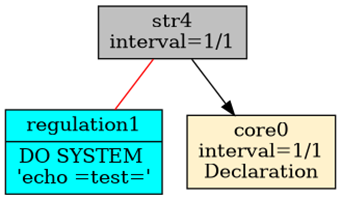

# Konstrukcja mechanizmu

Przez alarmowanie rozumiemy proces przetwarzania danych bieżących i bieżącego reagowania systemu w razie rozpoznania zaistniałego zjawiska przez system. Aby alarmowanie mogło funkcjonować, musza w systemie istnieć mechanizmy wspierające ten proces. W systemie RetractorDB opracowałem model alarmowania oparty na deklaracji reguł związanych z obserwacją strumieni danych. Reguły te zawierają operacje matematyczne umożliwiające analizę warunków logicznych i uruchomienie zewnętrznych procesów lub realizację zrzutu danych w wybranym oknie czasowym.

> **_NOTE:_** Opisana funkcjonalność ma pokrycie w testach: `issue42_rule` opisanych w załączniku pt. [Testy Integracyjne](../../zalaczniki/testy-integracyjne.md).

Prezentacji składni polecenia RULE na stronie 24 wspomina o tej funkcjonalności. W tym rozdziale chciałbym przybliżyć zasady działania tego rozwiązania.

Budując przykład przedstawiający zasadę działania alarmowania stwórzmy następujący plik zapytania – query.rql:

```
DECLARE a UINT STREAM core0, 1 FILE 'datafile1.txt'
SELECT str4[0] STREAM str4 FROM core0>1

RULE regulation1
ON str4
WHEN str4[0] = 20 or str4[0] = 23
DO SYSTEM 'echo "test"'
```

W pliku datafile1.txt znajdują się liczby w postaci tekstowej od 20 do 28.

```
$ seq 20 28 > datafile1.txt
```

Powyższe 3 polecenia deklarują efemeryczne źródło danych, jedno polecenie przetwarzania danych poprzez przesunięcie w czasie o jedną próbkę w czasie. Oraz regułę alarmowania. Wykonanie następującego polecenia:

```
$ xretractor -c query.rql -d -u -p -i > out.dot &&
dot -Tpng out.dot -o out.png
```

Wyświetlając plik out.png zobaczymy na ekranie coś zbliżonego (Rys. 6):

<figure><figcaption><p>Rys. 6 Zależność obiektów w przypadku użycia alarmowania</p></figcaption></figure>

Obraz zaprezentuje jaka zachodzi zależność pomiędzy procesami odpowiedzialnymi za artefakty, alarmowanie oraz efemerydy. Równie dobrze powinno się udać podłączyć proces odpowiedzialny za alarmowanie do substratu.

Obiekty alarmowania przedstawiane są w kolorze błękitnym i połączone z obiektami, które monitorują za pomocą czerwonych, nieskierowanych linii.

Obiektów odpowiedzialnych za alarmowanie można podłączyć więcej niż jeden. Można podać więcej poleceń RULE skojarzonych z danym poleceniem tworzącym strumień danych.

Jeśli przyjrzymy się bliżej zobaczymy, że z procesem odpowiedzialnym za alarmowanie jest uruchamiany warunkiem. Następującym poleceniem możemy podejrzeć co tam właściwie się dzieje:

```
$ xretractor -c query.rql -d -u -p > out.dot &&
dot -Tpng out.dot -o out.png
```

Plik wyjściowy prezentuje się w następujący sposób (Rys. 7):

<figure><figcaption><p>Rys. 7 Kod odpowiedzialny za warunek uruchomienia alarmowania.</p></figcaption></figure>

Ten warunek musi zostać w ostatecznej formie wyliczony do wyrażenie reprezentującego prawdę lub fałsz.
