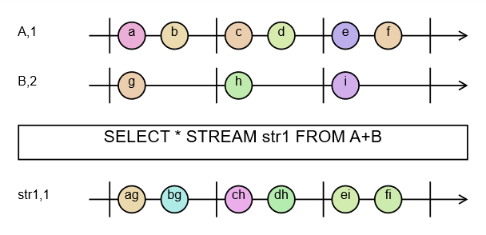

# Sekwencjonowanie operacji sumowania

Do systemu napływają i są przetwarzane w nim dane. Określenie kolejności ich napływu i przetwarzania możemy opisać terminem - sekwencjonowanie. Sposób w jakim zostaną dane połączone opisywany jest przez wyrażenie algebraiczne umieszczone w klauzuli FROM. Wyrażenia te zapisane są w formie szeregu operacji algebraicznych, podlegającym ścisłym regułom. Podobne reguły poznaliśmy w trakcie nauki w szkole podstawowej – były to reguły dotyczące operacji arytmetycznych w zbiorze liczb takich jak dodawanie, mnożenie dzielenie i odejmowanie.

Na początku przeanalizujmy następujące zapytanie:

```rql
DECLARE a BYTE STREAM A, 1 FILE 'data1.txt'
DECLARE a BYTE STREAM B, 2 FILE 'data2.txt'
SELECT * STREAM str1 FROM A+B
```

Zapytanie zapiszę w pliku qplan1.rql. Następnie wykonam następujące polecenia:

```
$ xretractor -c qplan1.rql -w 1:3 > out.txt
$ swirly out.txt -o out.svg
```

Program swirly zainstalowany został z repozytorium GitHub \[[6](../../literatura.md#6)]. Program ten służy do generacji diagramów kulkowych stosowanych w wyjaśnianiu zachowania operacji asynchronicznych RxJs \[[7](../../literatura.md#7)].

Modyfikację jaką zastosowałem w moim przypadku użycia to alternatywne znaczenie pionowych linii. W moim przypadku pionowe linia oddzielają jednolite interwały czasowe – prezentujące ilość cykli o które poprosiliśmy przy wywołaniu (w tym przypadku to 3 cykle). Wygenerowany obraz przedstawia Rys. 5:

<figure><figcaption><p>Rys. 5 Schemat Kulkowy - Operacja sumy</p></figcaption></figure>

W tym miejscu konieczne jest kilka słów wyjaśnienia dotyczące tego generatora oraz sposobu generacji wytycznych dla tego generatora. Wbudowałem w kompilator opcję wizualizacji realizacji sekwencji operacji. Diagramy tworzone przez program Swirly są jednym z wygodnych sposobów prezentacji zależności czasowych. Na wejściu program Swirly oczekuje pliku tekstowego z opisem diagramu. Generator symulujący wskazaną ilość cykli w argumencie i budujący plik dla Swirly został wbudowany w kompilator.

Program xretractor po podaniu jako pierwszy parametr nazwy pliku z planem realizacji zapytania wymaga drugiego parametru ( -w \[--diagram] ) – co jest wskazaniem że oczekujemy na wyjściu opisu diagramu kulkowego. Wymaganym argumentem parametru -w są dwie liczby oddzielone dwukropkiem. Pierwsza informuje czy program ma wstawić separatory czasowe na diagramie (to te pionowe linie oddzielające cykle), drugim parametrem jest ile cykli ma zostać zaprezentowane na diagramie.

Jeśli zajrzysz do wygenerowanego pliku out.txt zobaczysz następującą zawartość:

```
{{#include ../../regen/out/sum-sequence.txt}}
```

W tym pliku proszę zwrócić uwagę na dane przedstawione w komentarzach. Są to czasy wyznaczone w trakcie generowania schematu a odnoszące się do skali prezentowanej na schemacie kulkowym. Jak widać, dla naszego zapytania minimalny interwał okna to 1 sekunda, maksymalny to 2 sekundy. Siatka jaka została zidentyfikowana i wyznaczona na pół sekundy. Na schemacie każda litera lub myślnik to właśnie półsekundowy czasokres pomiędzy kolejnymi operacjami.

Wygenerowaną zawartość możemy zawartość zmienić ręcznie. Jeśli zamienimy tą zawartość w następujący sposób:

```
-|a-b-|c-d-|e-f-|-
title = A,1

-|g---|h---|i---|-
title = B,2

> SELECT * STREAM str1 FROM A+B

-|j-k-|l-m-|n-o-|-
title = str1,1
j:=ag
k:=bg
l:=ch
m:=dh
n:=ei
o:=fi
```

Wywołamy następnie ponownie program swirly zobaczymy bardziej dokładny rysunek przedstawiający sekwencję zdarzeń występujących w systemie.

<figure><figcaption><p>Rys. 6 Schemat kulkowy - Suma, diagram zmodyfikowany</p></figcaption></figure>

Na diagramie przedstawionym na rysunku Rys. 6 widać, które kulki zostały połączone i z których kulek powstały. Przypominam jednak że to obraz poprawiony ręcznie, dla celów tego opracowania – generator wbudowany w kompilator nie realizuje tej funkcjonalności.

> **_NOTE:_** Opisana funkcjonalność ma pokrycie w testach: `Pattern1`, `issue167_triarg` opisanych w załączniku pt. [Testy Integracyjne](../../zalaczniki/testy-integracyjne.md).

## Ta sama nazwa w FROM więcej niż raz

Strumień może wystąpić w wyrażeniu `FROM` więcej niż raz - wprost i pod innym operatorem, np. `bar + MAX(bar)` albo `src + src>1`, lub dwukrotnie pod różnymi operatorami, np. `src@(1,5) + src@(2,3)`. Rekord wejściowy zawiera wtedy osobny blok pól dla każdego wystąpienia, a odwołanie po nazwie (`bar[0]`, `src[4]`) oraz rozwinięcie `SELECT *` muszą wskazać jeden z nich. Kompilator wybiera pierwsze wystąpienie w stałej kolejności: najpierw bezpośrednie operandy wyrażenia w kolejności zapisu, dopiero potem strumienie ukryte pod operatorami (reduktorem, przesunięciem, oknem), również w kolejności zapisu. Tę samą kolejność stosuje kontrola zakresu indeksu, więc granica `src[k]` jest mierzona na tym wystąpieniu, które odwołanie przeczyta.

```rql
DECLARE v INTEGER[3] STREAM bar, 1/50 FILE 'a.txt'
SELECT * STREAM chk FROM bar + MAX(bar)
```

Strumień `chk` ma cztery pola: trzy pola `bar` stojącego wprost w `FROM` i maksimum rekordu. Operand stojący wprost zawsze wskazuje własne pola, także wtedy, gdy zapisano go jako drugi: w `src>1 + src` odwołanie `src[0]` czyta próbkę bieżącą, a nie przesuniętą. W `src@(1,5) + src@(2,3)` nazwa `src` jest osiągalna tylko przez okna, więc wskazuje pierwsze z nich: `src[4]` jest poprawne, a `src[5]` jest błędem kompilacji. Aby odwołać się do pól drugiego wystąpienia, należy nadać mu własną nazwę osobnym zapytaniem, np. `SELECT * STREAM w2 FROM src@(2,3)`, i użyć `w2` w wyrażeniu `FROM`.

> **_NOTE:_** Regułę pierwszego wystąpienia sprawdzają testy jednostkowe `ut_compiler`: `direct_operand_keeps_its_own_slots_beside_a_nested_occurrence` oraz `range_check_and_offset_agree_on_a_name_reached_twice`.
