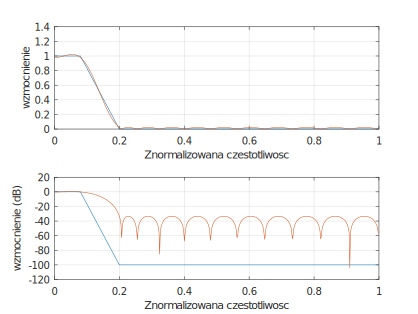
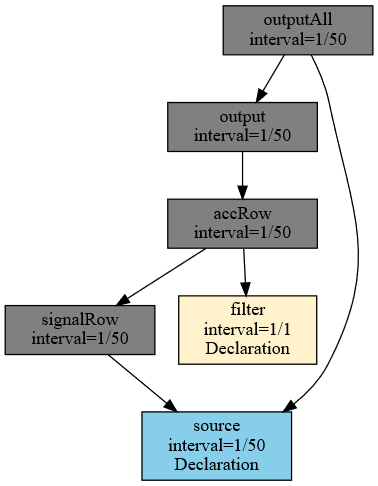
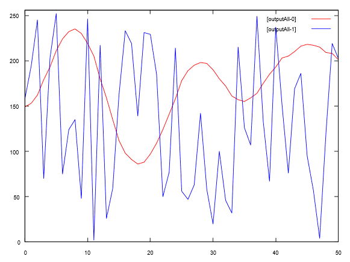

# Implementacja filtru sygnałowego

Zagadnienia związane z przetwarzaniem sygnałów cyfrowych zawierają w sobie problemy związane z filtracją. Celem filtracji jest rozdzielenie informacji zawartych wewnątrz sygnału. Zazwyczaj celem jest oddzielenie sygnału od jego zakłóceń.

Filtry mogą być analogowe oraz cyfrowe. W ramach proponowanego rozwiązania skupimy się na filtrach cyfrowych. Filtr cyfrowy implementowany jest jako ciąg operacji na kolejnych danych przetwarzanego sygnału w danym oknie czasowym. Z reguły dobierając filtr cyfrowy musimy zdecydować na jakie kompromisy musimy się zgodzić. Dodatkowo, możemy trafić na zabezpieczenia prawne związane z niektórymi algorytmami lub metodami \[[9](../literatura.md#9)].

### Projektowanie filtru w Octave

Projektując filtr cyfrowy musimy określić jaki zakres częstotliwości chcemy wytłumić a jaki wzmocnić lub pozostawić nienaruszony. Parametry te określamy jako pasmo zaporowe i przepustowe. Jednym ze znanych mi narzędzi używanych do konstrukcji filtrów cyfrowych jest program GNU Octave ([https://octave.org](https://octave.org)). Za pomocą tego narzędzia możemy wygenerować wymagane współczynniki do obliczeń prostego cyfrowego filtru sygnałowego.

Dla przykładu przyjmiemy następujące wartości wymagane do konstrukcji filtru sygnałowego:

* Częstotliwość próbkowania sygnału wejściowego 50Hz
* Pasmo przepustowe 0-2Hz
* Pasmo zaporowe 5-25Hz

Częstotliwość próbkowania sygnału wejściowego 50Hz oznacza że 50 próbek pojawi się w ciągu sekundy. W systemie RetractorDB oznacza to że sygnał źródłowy powinien napływać z szybkością Delta = 0,02. I taką częstotliwość powinno wspierać zdefiniowane źródło danych.

Dla takich założeń filtra sygnałowego program w języku Octave tworzący filtr sygnałowy przedstawia się następująco:

```
pkg signal load
filtord = 25 % Długość filtru
Fs = 50;     % Częstotliwość próbkowania 50Hz
FNq = Fs/2;  % Częstotliwość Nyquista
F1c = 2;     % Pasmo przepustowe 0 - 2Hz
F2c = 5;     % Pasmo zaporowe 5 Hz ->
F3c = 25;    % Pasmo zaporowe <- 25 Hz
f=[0,F1c/FNq,F2c/FNq,F3c/FNq]
m = [ 1 , 1 , 0, 0 ]
freqz ( remez(filtord,f,m) );
```

Tak przygotowany plik powinniśmy zapisać na dysku lub wkopiować bezpośrednio do okna terminala programu Octave.

Parametry zmiennoprzecinkowe filtru możemy wyświetlić wydając polecenie remez(filtord,f,m). Graficzną charakterystykę filtru uzyskamy wydając następujące polecenie:

```
octave:1> [h, w] = freqz ( remez(filtord,f,m) );
subplot(2,1,1);
plot (f, m, '', w/pi, abs (h), '');
xlabel('Znormalizowana częstotliwość')
ylabel('wzmocnienie')
grid on
subplot(2,1,2);
plot(f,20*log10(m+1e-5),'', w/pi,20*log10(abs(h)),'');
xlabel('Znormalizowana częstotliwość')
ylabel('wzmocnienie (dB)')
grid on
```

Uruchomienie powyższego kodu w programie Octave zaprezentuje następującą odpowiedź w postaci graficznej (Rys. 51):

<figure><figcaption><p>Rys. 51. Reprezentacja graficzna w dziedzinie częstotliwości wyznaczonego filtru cyfrowego</p></figcaption></figure>

Na osi rzędnych Octave przedstawia znormalizowaną częstotliwość. Zakres prezentowanej na rysunku częstotliwości na osi rzędnych od 0 do 1 odpowiada częstotliwości od 0Hz do 25Hz. Na osi odciętych pierwszy rysunek prezentuje liniowe wzmocnienie, drugi tą samą wielkość ale w skali logarytmicznej.

Parametry filtru można wyświetlić za pomocą polecenia:

```
octave:11> remez(filtord,f,m)
ans =
  -4.2689e-03
  -2.0148e-02
  -1.4865e-02
  -1.8188e-02
  -1.4031e-02
  -4.5861e-03
…
```

Chcąc otrzymać stałoprzecinkowe parametry 16 bitowego filtru należy wydać polecenie:

```
octave:12> floor(remez(filtord,f,m) * 32767)
ans =
   -140
   -661
   -488
   -596
   -460
```

### Implementacja w systemie RetractorDB

Uzyskane wartości powinniśmy przenieść do pliku tekstowego o nazwie filterremez.txt

Dla celów testowych sygnał źródłowy pobierzemy z generatora liczb pseudolosowych. Dane efemeryczne pobierzemy bezpośrednio ze źródła z częstotliwością 50Hz.

Początkowa część pliku query.rql zapytania zawierająca deklaracje źródeł dla systemu RetractorDB przedstawia się następująco:

```
DECLARE coef INTEGER[25]
STREAM filter, 1
FILE 'filterremez.txt'

DECLARE data BYTE
STREAM source, 0.02
FILE '/dev/urandom'
```

W kolejnej części znajdziemy polecenia tworzące proces przetwarzania sygnałów.

```
SELECT *
STREAM signalRow
FROM source@(1,25)

SELECT signalRow[_] * filter[_]
STREAM accRow
FROM signalRow+filter

SELECT accRow[0]
STREAM output
FROM accRow.sumc

SELECT (output[0]/25)/1000,source[0]
STREAM outputAll
FROM output+source
```

Widzimy tutaj 4 zapytania. Przeglądając rozdział dotyczący [rozwijania symbolu \_](../kompilacja-zapytan/przetwarzanie-symbolu-_.md) nie powinno na zdziwić że próba podejrzenia wyniku kompilacji tego pliku przewinie nam kilka ekranów. Możliwy do szybkiej analizy podgląd zachodzącego procesu możemy uzyskać wydając polecenie:

```
$ xretractor -c query.rql -p -d > out.dot && dot -Tsvg out.dot -o out.svg
```

Ujrzymy następujący obraz (Rys. 52):

<figure><figcaption><p>Rys. 52. Zależność przetwarzanych strumieni danych w trakcie realizacji filtru sygnałowego</p></figcaption></figure>

### Uruchomienie

Próba podejrzenia zawartych pól oraz typów danych spowoduje rozszerzenie wygenerowanego rysunku na tyle, że niemożliwe jest załączenie tutaj wygenerowanego wyniku bez utraty czytelności.

Pragnąc podejrzeć proces przetwarzania sygnałów w czasie rzeczywistym powinniśmy wydać następujący ciąg poleceń:

\- w pierwszym oknie uruchomić proces serwera przetwarzający zgromadzone dane. Powinny się w tym katalogu znajdować pliki query.rql oraz filterremez.txt za pomocą polecenia

```
$ xretractor query.rql
```

\- w drugim oknie wydać należy następujące polecenie:

```
$ xqry -s outputAll -p 50:256 | gnuplot
```

Na ekranie powinniśmy ujrzeć następujący wykres biegnący z lewa na prawo wypełniany na bieżąco danymi (Rys. 53):

<figure><figcaption><p>Rys. 53. Filtracja sygnału zrealizowana wewnątrz RetractorDB</p></figcaption></figure>

Na Rys. 53 widzimy dwa wykresy nałożone na siebie. Ten bardziej zróżnicowany – na ekranie komputera widoczny jako niebieska linia zawierająca dużą zmienność to wizualizacja sygnału wejściowego. Dane pobrane z generatora liczb pseudolosowych z częstotliwością 50 próbek na sekundę. Oraz drugi wykres opływający dane wejściowe – na ekranie komputera prezentowany w kolorze czerwonym, bardziej łagodny, opływający – to właśnie dane przefiltrowane opracowanym filtrem sygnałowym. Sygnał, którego pasmo przepustowe zostało ograniczone do 0-2Hz (niskich częstotliwości) i ograniczone zaporowo w obszarze (5-25Hz) w obszarze wysokich częstotliwości. Obrazowo można powiedzieć, że wyizolowaliśmy linię melodyczną dla basów.

Należy pamiętać, że na ekranie komputera ten wykres przesuwa się w prawo bardzo szybko, prezentując obraz możliwości bieżącego przetwarzania danych realizowanych w systemie RetractorDB.

Zapis ekranu w trakcie realizacji procesu przetwarzania ekranu:

<figure><figcaption><p>Rys. 54. Animacja procesu filtracji sygnału w czasie rzeczywistym</p></figcaption></figure>

> **_NOTE:_** Opisana funkcjonalność ma pokrycie w teście: `dsp` opisanym w załączniku pt. [Testy Integracyjne](../zalaczniki/testy-integracyjne.md).
