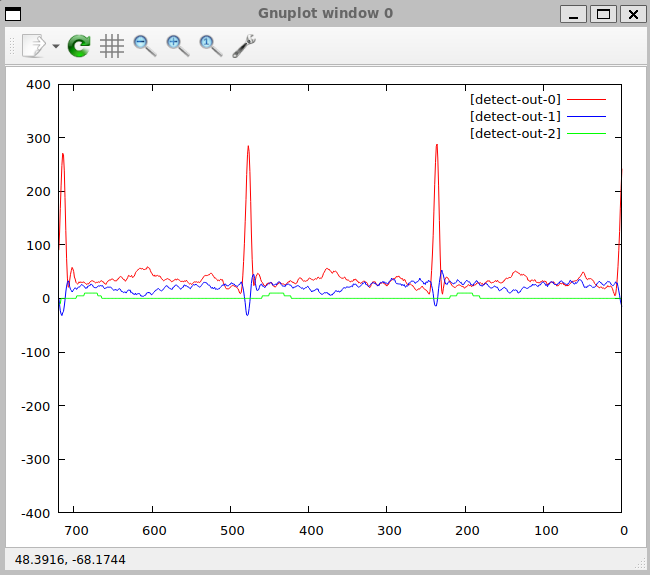
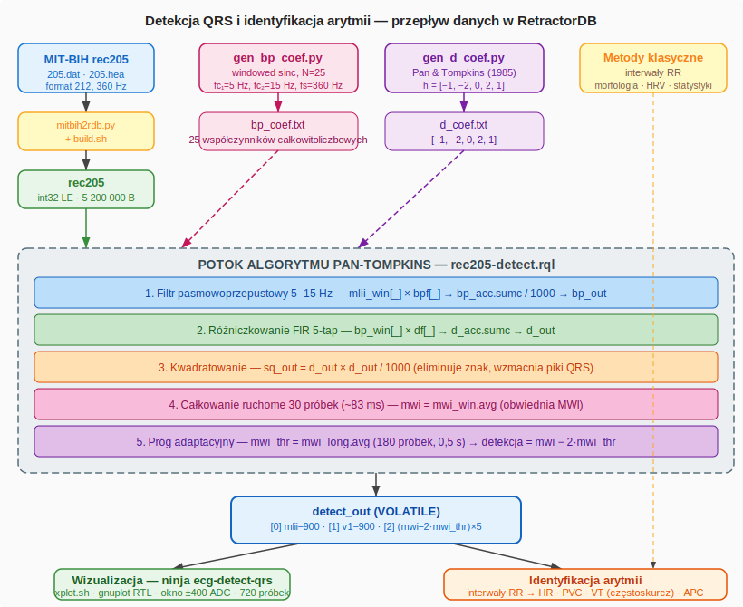

# Wizualizacja EKG i Detekcja Arytmii — baza MIT-BIH

## Źródło danych — PhysioNet MIT-BIH Arrhythmia Database

Baza MIT-BIH Arrhythmia Database jest publicznie dostępnym zbiorem nagrań elektrokardiograficznych opublikowanym przez PhysioNet pod adresem:

```
https://physionet.org/content/mitdb/1.0.0/
```

Zawiera 48 półgodzinnych nagrań dwukanałowych zebranych od 47 pacjentów w Beth Israel Hospital w Bostonie w latach 1975–1979. Nagrania zostały manualnie zaadnotowane przez co najmniej dwóch niezależnych kardiologów i są szeroko stosowane w badaniach nad automatyczną detekcją arytmii.

### Rekord 205

Przykład korzysta z rekordu **205** — nagrania 59-letniego mężczyzny leczonego Digoksyną i Quinaglutem. Rekord zawiera przypadki częstoskurczu komorowego (VT) i jest często cytowany w literaturze jako trudny diagnostycznie ze względu na dwie morfologicznie odmienne formy dodatkowych pobudzeń komorowych (PVC).

Parametry nagrania:

| Parametr                  | Wartość                                             |
| ------------------------- | --------------------------------------------------- |
| Czas trwania              | ≈ 30 min                                            |
| Częstotliwość próbkowania | 360 Hz                                              |
| Liczba próbek             | 650 000                                             |
| Kanał 1 (MLII)            | Zmodyfikowane odprowadzenie kończynowe II           |
| Kanał 2 (V1)              | Odprowadzenie przedsercowe V1                       |
| Rozdzielczość             | 12 bitów, wzmocnienie 200 LSB/mV, punkt zerowy 1024 |

Wartości surowe przechowywane są jako liczby całkowite bez jednostek (tzw. wartości ADC). Przeliczenie na miliwolty:

\\[\text{mV} = \frac{\text{ADC} - 1024}{200}\\]

Zakres rzeczywistych wartości w pliku rec205 mieści się w przedziale 589–1315 (MLII) i 718–1106 (V1), co odpowiada amplitudzie sygnału w granicach ok. ±1,5 mV.

## Przygotowanie danych

Oryginalne pliki nagrania (`205.hea`, `205.dat`, `205.atr`) są dostarczane w formacie MIT-BIH i wymagają konwersji do formatu binarnego rozpoznawanego przez RetractorDB.

### Format MIT-BIH 212

Sygnał w pliku `205.dat` jest spakowany dwanaście-bitowo w formacie 212: każde trzy bajty przechowują dwie kolejne próbki obu kanałów według schematu:

```
[B0][B1][B2] → MLII = B0  | ((B1 & 0x0F) << 8)
               V1   = B2  | ((B1 >>  4)  << 8)
```

Wartości są 12-bitowe ze znakiem (zakres –2048..2047).

### Konwersja do formatu RetractorDB

Skrypt `examples/ecg/mitbih2rdb.py` czyta nagłówek `205.hea`, dekoduje pary próbek i zapisuje je jako rekordy `int32` little-endian do pliku `rec205`:

```
650 000 rekordów × 2 pola × 4 bajty = 5 200 000 bajtów
```

Jednocześnie skrypt generuje skrypt RQL odtwarzający sygnał (`rec205-replay.rql`). Plik deskryptora `rec205.desc` jest tworzony przez `build.sh`.

Całość przygotowania uruchamia się jednym poleceniem z katalogu głównego projektu:

```bash
bash examples/ecg/build.sh
```

Wynikiem są trzy pliki w katalogu `examples/ecg/rec205/`:

| Plik                | Generuje        | Opis                    |
| ------------------- | --------------- | ----------------------- |
| `rec205`            | `mitbih2rdb.py` | Dane binarne (int32 LE) |
| `rec205.desc`       | `build.sh`      | Deskryptor strumienia   |
| `rec205-replay.rql` | `mitbih2rdb.py` | Skrypt RQL odtwarzania  |

## Zapytanie RQL

Plik `rec205-replay.rql` definiuje dwa strumienie:

```rql
DECLARE MLII INTEGER, V1 INTEGER STREAM ecg, 1/360 FILE 'rec205'

SELECT ecg.MLII, ecg.V1 STREAM s205out FROM ecg VOLATILE
```

Klauzula `STREAM ecg, 1/360` określa interwał czasowy jednej próbki jako 1/360 s, co odpowiada rzeczywistej częstotliwości próbkowania 360 Hz. Klauzula `TYPE DEVICE` w deskryptorze powoduje, że plik `rec205` jest czytany sekwencyjnie w pętli (po ostatniej próbce odczyt wraca do początku), co umożliwia ciągłe odtwarzanie nagrania.

Strumień wyjściowy `s205out` jest zadeklarowany jako `VOLATILE`, dlatego nie jest zapisywany na dysk — dane trafiają wyłącznie do procesu konsumenta (`xqry`).

## Wizualizacja na ekranie

Do wyświetlenia wykresu w czasie rzeczywistym służy cel `ecg` w systemie budowania. Uruchamia on skrypt `scripts/xplot.sh`, który startuje `xretractor` w tle, a następnie przepuszcza strumień danych przez `xqry` do `gnuplot`.

```bash
# z katalogu build/Debug
ninja ecg
```

Wywołanie rozwijane przez CMake:

```bash
scripts/xplot.sh s205out rec205-replay.rql 720,560,1360 --gnuplot-rtl
```

Znaczenie parametrów:

| Parametr            | Znaczenie                                                                  |
| ------------------- | -------------------------------------------------------------------------- |
| `s205out`           | Nazwa strumienia wynikowego                                                |
| `rec205-replay.rql` | Plik zapytań                                                               |
| `720`               | Szerokość okna danych (próbki widoczne jednocześnie)                       |
| `560,1360`          | Zakres osi Y (wartości ADC pasujące do rzeczywistego sygnału)              |
| `--gnuplot-rtl`     | Najnowsze próbki po prawej stronie, wykres przesuwa się od prawej do lewej |

Opcja `--gnuplot-rtl` jest parametrem `xqry` powodującym odwrócenie osi X gnuplota (`set xrange [720:0]`). Efekt jest taki, że najświeższe próbki pojawiają się po prawej stronie okna, a starsze przesuwają się w lewo — analogicznie do klasycznego wydruku EKG na taśmie papierowej.

<figure><figcaption><p>Rys. 55. Widok okna gnuplot z odtwarzanym sygnałem EKG (rekord 205)</p></figcaption></figure>

Okno prezentuje 720 próbek, czyli dokładnie 2 sekundy sygnału przy 360 Hz, co odpowiada typowej szerokości jednego paska EKG używanej w diagnostyce.

## Detekcja QRS i identyfikacja arytmii

### Kontekst — algorytm Pan-Tompkins

Detekcja zespołów QRS jest fundamentem automatycznej analizy EKG. Zespół QRS reprezentuje depolaryzację komór serca i odpowiada każdemu uderzeniu serca widocznemu jako ostry pik w sygnale. Znając położenia QRS w czasie, można wyliczyć interwały RR, a na ich podstawie rozpoznać podstawowe zaburzenia rytmu:

| Miara pochodna od QRS | Zastosowanie                                      |
| --------------------- | ------------------------------------------------- |
| Interwały RR          | Częstotliwość akcji serca (HR), VT, bradykardia   |
| Zmienność RR (HRV)    | Autonomiczny układ nerwowy, przewidywanie zdarzeń |
| Morfologia QRS        | Rozróżnienie PVC od normalnego rytmu, APC         |
| Czas trwania QRS      | Blok odnogi pęczka Hisa (BBB)                     |

Algorytm Pan-Tompkins (1985) jest klasycznym, pięcioetapowym potokowym algorytmem cyfrowego przetwarzania sygnałów realizowanym za pomocą filtrów FIR. RetractorDB implementuje go bezpośrednio jako strumień zapytań RQL, bez specjalistycznych bibliotek DSP.

### Generowanie filtrów sygnałowych (coef)

Algorytm wymaga dwóch zestawów współczynników FIR, przechowywanych jako pliki tekstowe (`bp_coef.txt`, `d_coef.txt`). Generowane są jednorazowo skryptami Pythona przed uruchomieniem detekcji.

#### Filtr pasmowoprzepustowy — `gen_bp_coef.py`

Krok 1 algorytmu wymaga filtru wycinającego szumy i artefakty poza pasmem QRS. Pasm przepustowe 5–15 Hz przy fs = 360 Hz daje odpowiedź zawierającą morfologię QRS przy jednoczesnym tłumieniu linii bazowej (< 5 Hz) i szumów mięśniowych (> 15 Hz).

Metoda projektowania to **okienkowy sinc** (windowed sinc):

```
h_bp[n] = (h_lp2[n] − h_lp1[n]) · w[n]
```

gdzie:

* `h_lp[n] = 2·fc·sinc(2·fc·(n−M))` — idealny filtr dolnoprzepustowy
* `w[n] = 0,54 − 0,46·cos(2πn/(N−1))` — okno Hamminga tłumiące efekty Gibbsa
* `M = (N−1)/2 = 12` — punkt centralny filtru (opóźnienie grupowe = 12 próbek)

Parametry:

| Parametr                | Wartość                      |
| ----------------------- | ---------------------------- |
| Długość filtru N        | 25 współczynników            |
| Dolna f. graniczna fc₁  | 5 Hz (znorm. 5/360)          |
| Górna f. graniczna fc₂  | 15 Hz (znorm. 15/360)        |
| Skala całkowitoliczbowa | ×1000 (dzielona /1000 w RQL) |

Uruchomienie skryptu:

```bash
cd examples/ecg/rec205
python3 gen_bp_coef.py
# Zapisano 25 współczynników do bp_coef.txt
# Współczynniki: [-2, -2, -1, 0, 3, 8, 14, 23, 32, 41, 49, 54, 56, ...]
# Suma (wzmocnienie DC): 5 / 1000 = 0.0050
```

Współczynniki są symetryczne względem centrum (n=12), co potwierdza fazę liniową filtru — niezbędną właściwość przy analizie EKG, gdyż gwarantuje brak zniekształceń fazowych morfologii QRS.

#### Filtr różniczkujący — `gen_d_coef.py`

Krok 2 algorytmu stosuje filtr podkreślający strome zbocza QRS. Pan i Tompkins zaproponowali 5-punktowy estymator pochodnej:

```
y[n] = (1/8T) · (−x[n−4] − 2·x[n−3] + 2·x[n−1] + x[n])
```

Współczynniki (od najstarszej do najnowszej próbki):

```
h = [−1, −2, 0, 2, 1]
```

Właściwości filtru:

| Właściwość           | Wartość                                           |
| -------------------- | ------------------------------------------------- |
| Suma współczynników  | 0 (zerowe wzmocnienie DC — eliminuje offsety)     |
| Maksymalna odpowiedź | f ≈ 10–25 Hz (zakres zbocza QRS)                  |
| Czynnik skali (1/8T) | 360/8 = 45 Hz (pomijany — nie wpływa na detekcję) |

```bash
cd examples/ecg/rec205
python3 gen_d_coef.py
# Zapisano 5 współczynników do d_coef.txt
# Współczynniki: [-1, -2, 0, 2, 1]
# Suma (wzmocnienie DC): 0  (powinno być 0)
```

### Implementacja potoku w RQL — `rec205-detect.rql`

Plik `rec205-detect.rql` implementuje kompletny pięcioetapowy potok dla dwóch kanałów EKG (MLII i V1):

```rql
DECLARE MLII INTEGER, V1 INTEGER STREAM ecg, 1/360 FILE 'rec205'
DECLARE bp_coef INTEGER[25] STREAM bpf, 1 FILE 'bp_coef.txt'
DECLARE d_coef INTEGER[5]   STREAM df,  1 FILE 'd_coef.txt'

# Wyodrębnienie kanałów
SELECT ecg.MLII STREAM mlii FROM ecg VOLATILE
SELECT ecg.V1   STREAM v1   FROM ecg VOLATILE

# 1. Filtr pasmowoprzepustowy (5-15 Hz) — splot FIR 25-tap
SELECT *                        STREAM mlii_win FROM mlii@(1,25)  VOLATILE
SELECT mlii_win[_]*bpf[_]       STREAM bp_acc   FROM mlii_win+bpf VOLATILE
SELECT bp_acc[0]/1000           STREAM bp_out   FROM bp_acc.sumc  VOLATILE

# 2. Różniczkowanie — splot FIR 5-tap
SELECT *                        STREAM bp_win   FROM bp_out@(1,5) VOLATILE
SELECT bp_win[_]*df[_]          STREAM d_acc    FROM bp_win+df    VOLATILE
SELECT d_acc[0]                 STREAM d_out    FROM d_acc.sumc   VOLATILE

# 3. Kwadrat (/1000 zapobiega przepełnieniu int32)
SELECT d_out[0]*d_out[0]/1000   STREAM sq_out   FROM d_out        VOLATILE

# 4. Całkowanie ruchome 30 próbek (~83 ms)
SELECT *                        STREAM mwi_win  FROM sq_out@(1,30) VOLATILE
SELECT mwi_win[0]               STREAM mwi      FROM mwi_win.avg   VOLATILE

# 5. Próg adaptacyjny — 2× średnia ruchoma 180 próbek (0,5 s)
SELECT *                        STREAM mwi_long FROM mwi@(1,180)  VOLATILE
SELECT mwi_long[0]              STREAM mwi_thr  FROM mwi_long.avg VOLATILE

# Wyjście: MLII wycentrowane, V1 wycentrowane, sygnał detekcji ×5
SELECT mlii[0]-900, v1[0]-900, (mwi[0]-mwi_thr[0]*2)*5 \
STREAM detect_out FROM mlii+v1+mwi+mwi_thr VOLATILE
```

#### Uzasadnienie parametrów

Operator `@(1,25)` tworzy ruchome okno 25 próbek, natomiast `[_]` i `sumc` realizują splot dyskretny — patrz rozdział [Przetwarzanie symbolu \_](../kompilacja-zapytan/przetwarzanie-symbolu-_.md).

Dzielenie `/1000` w kroku 3 kompensuje skalę całkowitoliczbową współczynników — bez tego iloczyn `d_out × d_out` osiągnąłby wartości przekraczające zakres `int32` (2 147 483 647) dla typowych amplitud EKG.

Wyrażenie wyjściowe `(mwi[0]-mwi_thr[0]*2)*5` implementuje próg adaptacyjny: wartość jest dodatnia tylko wówczas, gdy obwiednia MWI przekracza dwukrotność bieżącej średniej ruchomej — co wskazuje na wykryty QRS. Mnożnik `×5` skaluje sygnał detekcji do zakresu wizualnie porównywalnego z surowym EKG na wykresie.

### Uruchomienie — ninja ecg-detect-qrs

Proces uruchamia się jedną komendą z katalogu `build/Debug`:

```bash
cd build/Debug
ninja ecg-detect-qrs
```

CMake rozwinął ten cel do polecenia:

```bash
scripts/xplot.sh detect_out rec205-detect.rql 720,-400,400 --gnuplot-rtl
```

Znaczenie parametrów:

| Parametr            | Znaczenie                                          |
| ------------------- | -------------------------------------------------- |
| `detect_out`        | Nazwa strumienia wynikowego (3 pola)               |
| `rec205-detect.rql` | Plik zapytań z powyższym potokiem                  |
| `720`               | Szerokość okna: 720 próbek = 2 sekundy przy 360 Hz |
| `−400,400`          | Zakres osi Y w jednostkach ADC (≈ ±2 mV)           |
| `--gnuplot-rtl`     | Najnowsze próbki po prawej stronie (prawo-lewo)    |

Skrypt `xplot.sh` uruchamia `xretractor` w tle (kompiluje i wykonuje zapytania), a następnie przez `xqry` przekazuje strumień `detect_out` do `gnuplot` w trybie ciągłym. Okno `gnuplot` odświeża się przy każdej nowej paczce próbek.

### Opis rysunku — okno gnuplot

<figure><figcaption><p>Rys. 56. Okno gnuplot uruchomionego celem <code>ninja ecg-detect-qrs</code> — rekord 205 MIT-BIH, 720 próbek (2 s), RTL</p></figcaption></figure>

Na rysunku widoczne są trzy sygnały odpowiadające trzem polom strumienia `detect_out`:

**\[detect-out-0] linia czerwona — MLII wycentrowane (mlii − 900)**

Surowy sygnał EKG z odprowadzenia MLII przesunięty o punkt bazowy 900 ADC tak, że oś zerowa odpowiada izolinii. Dwa ostre piki (amplituda ≈ 280 ADC ≈ 1,4 mV) w okolicach próbek 520 i 350 od prawej krawędzi reprezentują dwa kolejne zespoły QRS. Wyraźna morfologia QRS z dominującym pikiem R potwierdza prawidłowe działanie filtru pasmowoprzepustowego — szumy zostały stłumione, a pik zachował amplitudę.

**\[detect-out-1] linia niebieska — V1 wycentrowane (v1 − 900)**

Sygnał z odprowadzenia V1 tego samego nagrania. Morfologia QRS w V1 jest z reguły mniej wyrażona niż w MLII, co widać na rysunku — sygnał niebieski wykazuje mniejszą amplitudę piku R przy podobnych pozycjach czasowych QRS. Jednoczesna obecność obu kanałów pozwala różnicować pobudzenia nadkomorowe (APC) od komorowych (PVC), ponieważ QRS komorowe wykazują odmienną morfologię w V1.

**\[detect-out-2] linia zielona — sygnał detekcji QRS ((mwi − 2·mwi\_thr) × 5)**

Sygnał wyniku algorytmu. Wartość **dodatnia** oznacza wykryty zespół QRS — obwiednia całkowania ruchomego przekroczyła dwukrotność progu adaptacyjnego. Na rysunku widoczne są dwa wyraźne dodatnie impulsy pokrywające się w czasie z pikami QRS na kanale MLII. Między uderzeniami linia pozostaje blisko zera lub nieznacznie poniżej — potwierdzając specyficzność detekcji.

Odstęp między dwoma widocznymi QRS wynosi w przybliżeniu 170 próbek, co przy 360 Hz daje:

```
RR ≈ 170 / 360 ≈ 0,47 s  →  HR ≈ 127 bpm
```

Wartość ta mieści się w zakresie odnotowanego w rekordzie 205 częstoskurczu komorowego (VT, 79–216 bpm), co sugeruje że wizualizowany fragment nagrania pochodzi z jednego z 6 epizodów VT odnotowanych przez kardiologów MIT-BIH.

### Schemat przepływu procesu

Poniższy diagram pokazuje kompletny przepływ danych od surowego nagrania MIT-BIH do identyfikacji arytmii, ze wskazaniem miejsca, w którym RetractorDB realizuje algorytm Pan-Tompkins, oraz powiązania z klasycznymi metodami rozpoznawania arytmii:

<figure><figcaption><p>Rys. 57. Przepływ danych — od nagrania MIT-BIH przez potok Pan-Tompkins w RQL do wizualizacji i identyfikacji arytmii</p></figcaption></figure>

Prawa gałąź diagramu — **Identyfikacja arytmii** — reprezentuje klasyczne metody analizy po detekcji QRS, które można zbudować jako kolejne zapytania RQL nadbudowane na strumieniu `detect_out`:

| Metoda           | Opis                                   | Powiązanie z QRS                |
| ---------------- | -------------------------------------- | ------------------------------- |
| Interwały RR     | Czas między kolejnymi QRS → HR         | bezpośrednio z pozycji detekcji |
| HRV (zmienność)  | Odchylenie standardowe RR              | statystyki strumienia RR        |
| Klasyfikacja PVC | Szerokość QRS > 120 ms, morfologia V1  | szerokość okna `mwi`            |
| Detekcja VT      | Sekwencja ≥ 3 PVC z HR > 100 bpm       | RULE na strumieniu HR+PVC       |
| Detekcja APC     | Wczesny, wąski QRS poprzedzający pauzę | morfologia MLII vs V1           |

RetractorDB udostępnia operatory `RULE` oraz agregaty okienkowe (`.avg`, `.sumc`), które umożliwiają implementację powyższych metod w tym samym języku zapytań RQL, bez wychodzenia poza środowisko systemu. Detekcja QRS jest pierwszym i niezbędnym etapem tej hierarchii.
