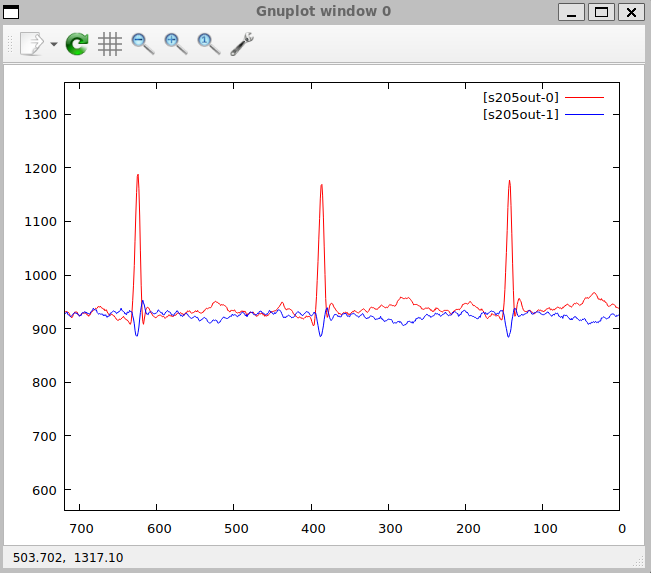

# Wizualizacja EKG — baza MIT-BIH

## Źródło danych — PhysioNet MIT-BIH Arrhythmia Database

Baza MIT-BIH Arrhythmia Database jest publicznie dostępnym zbiorem nagrań
elektrokardiograficznych opublikowanym przez PhysioNet pod adresem:

```
https://physionet.org/content/mitdb/1.0.0/
```

Zawiera 48 półgodzinnych nagrań dwukanałowych zebranych od 47 pacjentów w Beth
Israel Hospital w Bostonie w latach 1975–1979. Nagrania zostały manualnie
zaadnotowane przez co najmniej dwóch niezależnych kardiologów i są szeroko
stosowane w badaniach nad automatyczną detekcją arytmii.

### Rekord 205

Przykład korzysta z rekordu **205** — nagrania 59-letniego mężczyzny leczonego
Digoksyną i Quinaglutem. Rekord zawiera przypadki częstoskurczu komorowego (VT)
i jest często cytowany w literaturze jako trudny diagnostycznie ze względu na dwie
morfologicznie odmienne formy dodatkowych pobudzeń komorowych (PVC).

Parametry nagrania:

| Parametr | Wartość |
|---|---|
| Czas trwania | ≈ 30 min |
| Częstotliwość próbkowania | 360 Hz |
| Liczba próbek | 650 000 |
| Kanał 1 (MLII) | Zmodyfikowane odprowadzenie kończynowe II |
| Kanał 2 (V1) | Odprowadzenie przedsercowe V1 |
| Rozdzielczość | 12 bitów, wzmocnienie 200 LSB/mV, punkt zerowy 1024 |

Wartości surowe przechowywane są jako liczby całkowite bez jednostek (tzw. wartości
ADC). Przeliczenie na miliwolty:

$$\text{mV} = \frac{\text{ADC} - 1024}{200}$$

Zakres rzeczywistych wartości w pliku rec205 mieści się w przedziale 589–1315
(MLII) i 718–1106 (V1), co odpowiada amplitudzie sygnału w granicach ok. ±1,5 mV.

## Przygotowanie danych

Oryginalne pliki nagrania (`205.hea`, `205.dat`, `205.atr`) są dostarczane w
formacie MIT-BIH i wymagają konwersji do formatu binarnego rozpoznawanego przez
RetractorDB.

### Format MIT-BIH 212

Sygnał w pliku `205.dat` jest spakowany dwanaście-bitowo w formacie 212: każde
trzy bajty przechowują dwie kolejne próbki obu kanałów według schematu:

```
[B0][B1][B2] → MLII = B0  | ((B1 & 0x0F) << 8)
               V1   = B2  | ((B1 >>  4)  << 8)
```

Wartości są 12-bitowe ze znakiem (zakres –2048..2047).

### Konwersja do formatu RetractorDB

Skrypt `examples/ecg/mitbih2rdb.py` czyta nagłówek `205.hea`, dekoduje pary
próbek i zapisuje je jako rekordy `int32` little-endian do pliku `rec205`:

```
650 000 rekordów × 2 pola × 4 bajty = 5 200 000 bajtów
```

Jednocześnie skrypt generuje skrypt RQL odtwarzający sygnał (`rec205-replay.rql`).
Plik deskryptora `rec205.desc` jest tworzony przez `build.sh`.

Całość przygotowania uruchamia się jednym poleceniem z katalogu głównego projektu:

```bash
bash examples/ecg/build.sh
```

Wynikiem są trzy pliki w katalogu `examples/ecg/rec205/`:

| Plik | Generuje | Opis |
|---|---|---|
| `rec205` | `mitbih2rdb.py` | Dane binarne (int32 LE) |
| `rec205.desc` | `build.sh` | Deskryptor strumienia |
| `rec205-replay.rql` | `mitbih2rdb.py` | Skrypt RQL odtwarzania |

## Zapytanie RQL

Plik `rec205-replay.rql` definiuje dwa strumienie:

```rql
DECLARE MLII INTEGER, V1 INTEGER STREAM ecg, 1/360 FILE 'rec205'

SELECT ecg.MLII, ecg.V1 STREAM s205out FROM ecg VOLATILE
```

Klauzula `STREAM ecg, 1/360` określa interwał czasowy jednej próbki jako 1/360 s,
co odpowiada rzeczywistej częstotliwości próbkowania 360 Hz. Klauzula
`TYPE DEVICE` w deskryptorze powoduje, że plik `rec205` jest czytany sekwencyjnie
w pętli (po ostatniej próbce odczyt wraca do początku), co umożliwia ciągłe
odtwarzanie nagrania.

Strumień wyjściowy `s205out` jest zadeklarowany jako `VOLATILE`, dlatego nie jest
zapisywany na dysk — dane trafiają wyłącznie do procesu konsumenta (`xqry`).

## Wizualizacja na ekranie

Do wyświetlenia wykresu w czasie rzeczywistym służy cel `ecg` w systemie budowania.
Uruchamia on skrypt `scripts/xplot.sh`, który startuje `xretractor` w tle, a
następnie przepuszcza strumień danych przez `xqry` do `gnuplot`.

```bash
# z katalogu build/Debug
ninja ecg
```

Wywołanie rozwijane przez CMake:

```bash
scripts/xplot.sh s205out rec205-replay.rql 720,560,1360 --gnuplot-rtl
```

Znaczenie parametrów:

| Parametr | Znaczenie |
|---|---|
| `s205out` | Nazwa strumienia wynikowego |
| `rec205-replay.rql` | Plik zapytań |
| `720` | Szerokość okna danych (próbki widoczne jednocześnie) |
| `560,1360` | Zakres osi Y (wartości ADC pasujące do rzeczywistego sygnału) |
| `--gnuplot-rtl` | Najnowsze próbki po prawej stronie, wykres przesuwa się od prawej do lewej |

Opcja `--gnuplot-rtl` jest parametrem `xqry` powodującym odwrócenie osi X gnuplota
(`set xrange [720:0]`). Efekt jest taki, że najświeższe próbki pojawiają się po
prawej stronie okna, a starsze przesuwają się w lewo — analogicznie do klasycznego
wydruku EKG na taśmie papierowej.

<figure><figcaption><p>Rys. 48 Widok okna gnuplot z odtwarzanym sygnałem EKG (rekord 205)</p></figcaption></figure>

Okno prezentuje 720 próbek, czyli dokładnie 2 sekundy sygnału przy 360 Hz, co
odpowiada typowej szerokości jednego paska EKG używanej w diagnostyce.
