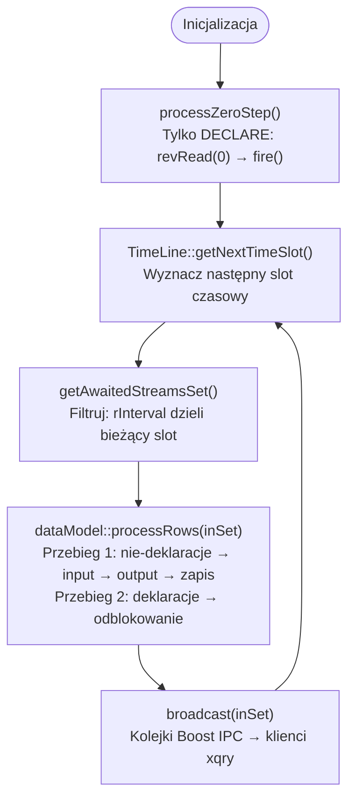
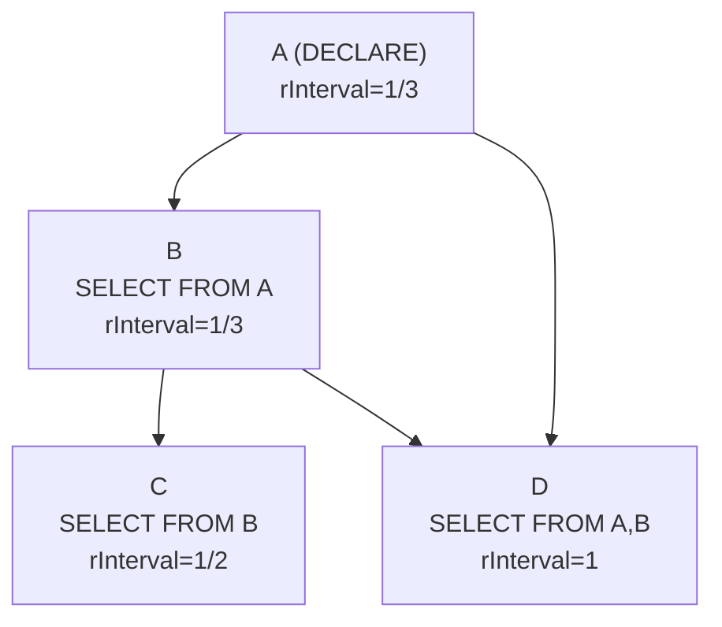
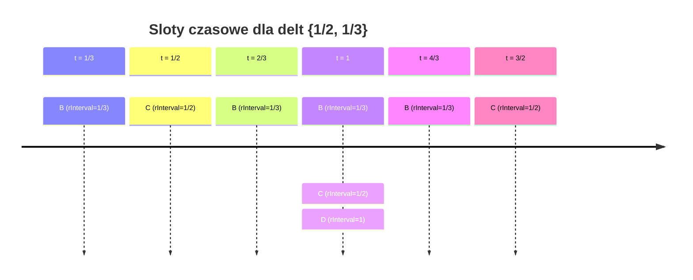
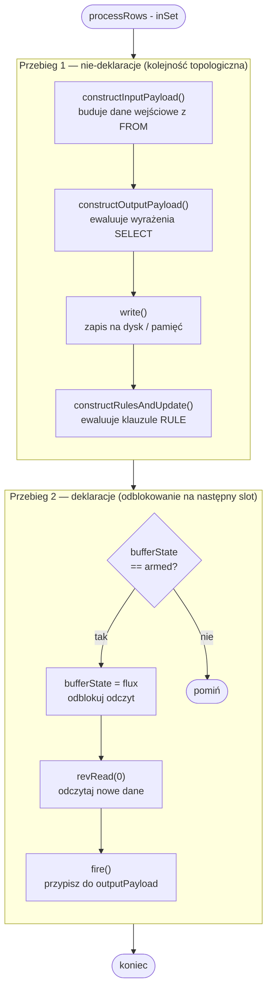
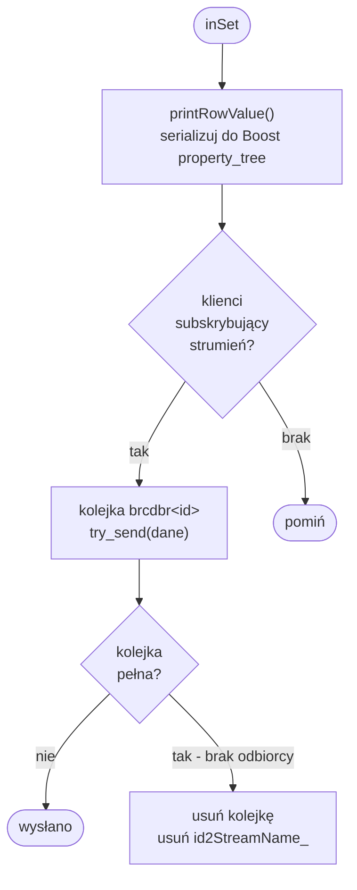
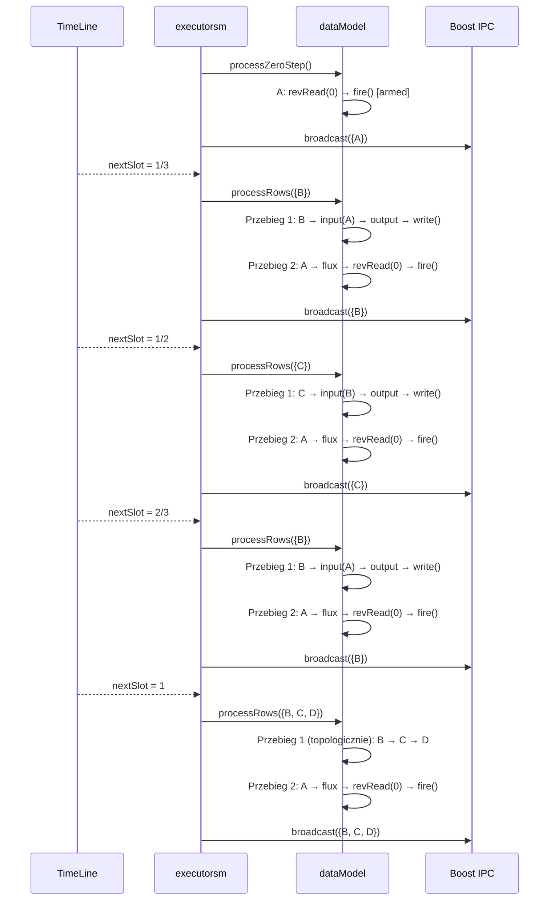

# Algorytm przeglądu drzewa zapytań

## Przegląd ogólny

Algorytm przeglądu drzewa zapytań realizowany jest przez dwa współpracujące komponenty: `dataModel` (logika przetwarzania) oraz `executorsm` (pętla czasowa i IPC). Przed wejściem w główną pętlę system wykonuje **krok zerowy**, po czym cyklicznie iteruje po minimalnym zbiorze interwałów czasowych.



_Rys. 26. Algorytm przeglądu drzewa zapytań – przegląd ogólny_

***

## Struktura danych: qTree

`qTree` (`src/retractor/lib/qTree.cpp`) rozszerza `std::vector<query>` i jest **wektorem topologicznie posortowanych zapytań**. Sortowanie odbywa się przez DFS po grafie zależności budowanym z `query.getDepStream()`.



_Rys. 27. Przykładowy graf zależności dla qTree_

Po sortowaniu topologicznym kolejność w wektorze: `[A, B, C, D]`. Zapytanie C zależne od B zawsze trafi po B w iteracji — gwarantuje poprawność obliczeń.

Metoda `getAvailableTimeIntervals()` wyodrębnia ze wszystkich zapytań unikalne wartości `rInterval` (z pominięciem dyrektyw kompilatora i wartości zerowych) — wynik to wejście do konstruktora `TimeLine`.

***

## Minimalna siatka czasowa: TimeLine / CRSMath

`TimeLine` (`src/retractor/lib/CRSMath.cpp`) zarządza racjonalnymi interwałami czasowymi. Konstruktor redukuje zbiór interwałów — usuwa wielokrotności, zachowując tylko koprimalne:

```
Wejście: {1/2, 1, 4}  →  Wyjście: {1/2}
(1 = 2 × 1/2, więc redundantne; 4 = 8 × 1/2, więc redundantne)

Wejście: {1/2, 1/3}  →  Wyjście: {1/2, 1/3}
(żadne nie jest wielokrotnością drugiego)
```

`getNextTimeSlot()` wyznacza kolejny slot jako `min(delta × counter[delta])` po wszystkich deltach. Poniższy diagram ilustruje sloty dla delt `{1/2, 1/3}` i aktywne zapytania w każdym z nich:



_Rys. 28. Minimalna siatka czasowa dla delt {1/2, 1/3}_

Sprawdzenie `isThisDeltaAwaitCurrentTimeSlot(inDelta)` zwraca `true`, gdy `ctSlot_ / inDelta` ma mianownik równy 1 (slot jest całkowitą wielokrotnością delty zapytania).

***

## Krok zerowy: `processZeroStep()`

Przed wejściem w pętlę `executorsm::run()` wywołuje `processZeroStep()` (`dataModel.cpp`, linia \~85). Przetwarza **wyłącznie deklaracje** (strumienie wejściowe `DECLARE`):

```cpp
for (auto &q : coreInstance_) {
    if (!q.isDeclaration()) continue;
    qSet[q.id]->bufferState = flux;   // odblokuj odczyt fizyczny
    qSet[q.id]->revRead(0);           // wczytaj z indeksu 0
    qSet[q.id]->fire();               // przepisz chamber_ → outputPayload
    assert(qSet[q.id]->bufferState == armed);
}
```

Po tym kroku każda deklaracja ma `bufferState = armed` — dane z fizycznego źródła są w `outputPayload`.

***

## Główna pętla: filtrowanie i przetwarzanie

### Filtrowanie zapytań: `getAwaitedStreamsSet()`

Dla bieżącego slotu `tl` (`executorsm.cpp`, linia \~88):

```cpp
std::set<std::string> retVal;
for (auto &q : *coreInstancePtr)
    if (TimeLine::isThisDeltaAwaitCurrentTimeSlot(q.rInterval))
        retVal.insert(q.id);
return retVal;
```

Wynik `inSet` to identyfikatory zapytań aktywnych w tym slocie — podzbiór wszystkich zapytań.

### Przetwarzanie: `processRows(inSet)`

Funkcja wykonuje **dwa przejścia** przez `inSet` (`dataModel.cpp`, linia \~98):



_Rys. 29. Algorytm processRows – dwa przejścia przetwarzania_

Deklaracje są odblokowywane dopiero po tym, jak wszystkie zależne zapytania skonsumowały ich `outputPayload` w przejściu 1.

***

## Rozgłaszanie wyników: `broadcast()`

Po każdym `processRows()` wywoływane jest `broadcast(inSet)` (`executorsm.cpp`, linia \~449):



_Rys. 30. Algorytm broadcast – rozsyłanie wyników przez Boost IPC_

`printRowValue()` buduje strukturę z nazwą strumienia, liczbą pól, wartościami i bitmapą null, zapisuje jako Boost info format i wysyła przez `boost::interprocess::message_queue`.

***

## Pełny przykład: zapytania A, B, C, D dla delt {1/2, 1/3}



_Rys. 31. Pełny przykład wykonania dla zapytań A, B, C, D przy deltach {1/2, 1/3}_

Drzewo zależności determinuje kolejność przejścia 1. Interwały czasowe z algebry Beatty'ego wyznaczają, które węzły drzewa są aktywne w danym slocie.
