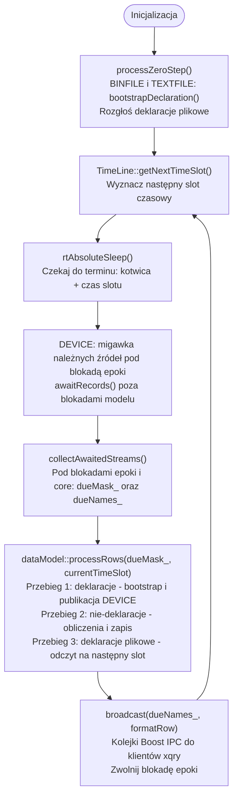
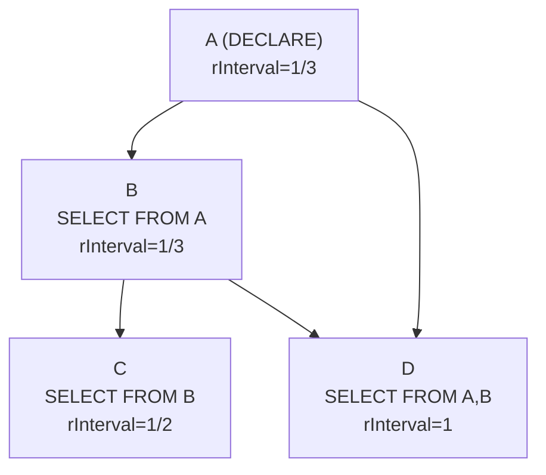
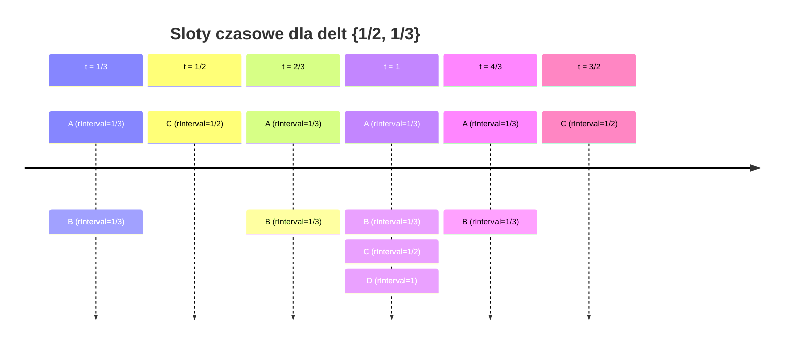
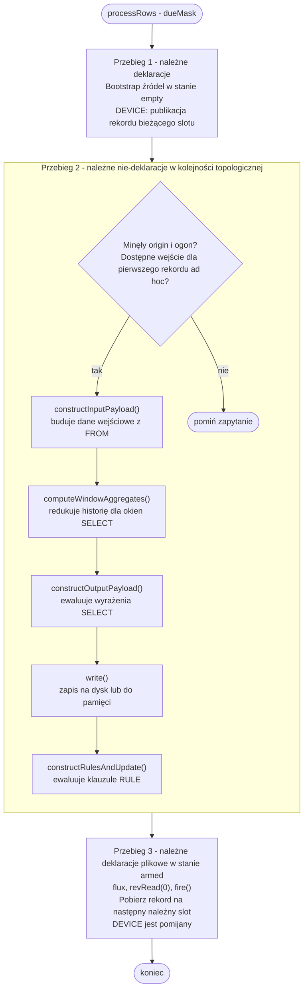
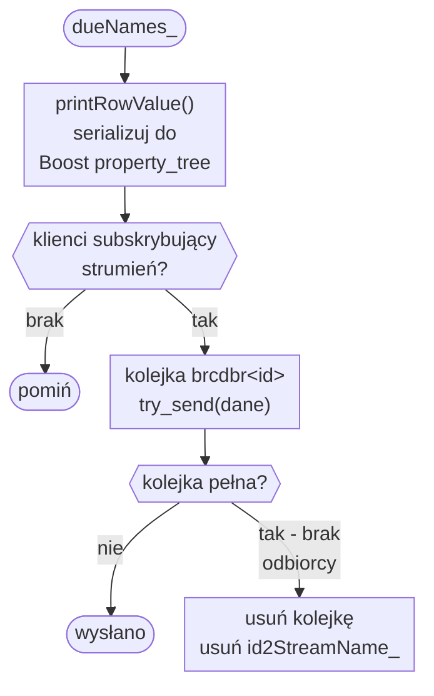
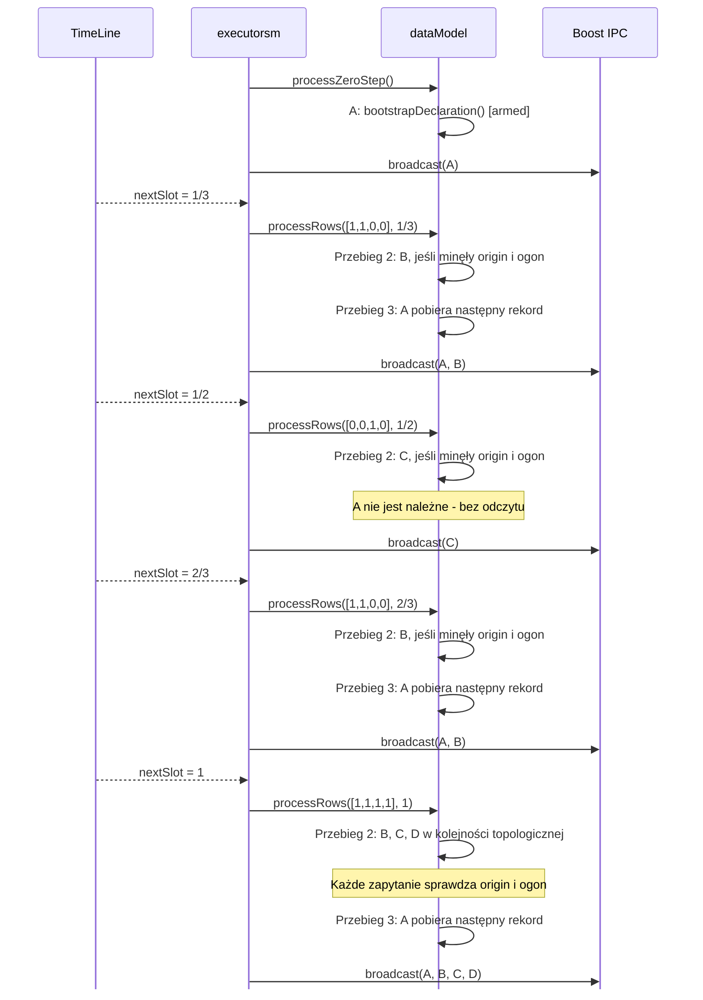

# Algorytm przeglądu drzewa zapytań

## Przegląd ogólny

Algorytm przeglądu drzewa zapytań realizowany jest przez dwa współpracujące komponenty: `dataModel` (logika przetwarzania) oraz `executorsm` (pętla czasowa i IPC). Przed wejściem w główną pętlę system wykonuje **krok zerowy**, po czym cyklicznie iteruje po minimalnym zbiorze interwałów czasowych (Rys. 42).


```mermaid
%% pdf-height: 55%
%%{init: {"markdownAutoWrap": false}}%%
flowchart TD
    A([Inicjalizacja]) --> B
    B["processZeroStep()<br/>BINFILE i TEXTFILE: bootstrapDeclaration()<br/>Rozgłoś deklaracje plikowe"] --> C
    C["TimeLine::getNextTimeSlot()<br/>Wyznacz następny slot czasowy"] --> W
    W["rtAbsoluteSleep()<br/>Czekaj do terminu: kotwica + czas slotu"] --> V
    V["DEVICE: migawka należnych źródeł pod blokadą epoki<br/>awaitRecords() poza blokadami modelu"] --> D
    D["collectAwaitedStreams()<br/>Pod blokadami epoki i core: dueMask_ oraz dueNames_"] --> E
    E["dataModel::processRows(dueMask_, currentTimeSlot)<br/>Przebieg 1: deklaracje - bootstrap i publikacja DEVICE<br/>Przebieg 2: nie-deklaracje - obliczenia i zapis<br/>Przebieg 3: deklaracje plikowe - odczyt na następny slot"] --> F
    F["broadcast(dueNames_, formatRow)<br/>Kolejki Boost IPC do klientów xqry<br/>Zwolnij blokadę epoki"] --> C
```

_Rys. 42. Algorytm przeglądu drzewa zapytań – przegląd ogólny_

***

## Struktura danych: qTree

`qTree` (`src/retractor/lib/qTree.cpp`) rozszerza `std::vector<query>` i jest **wektorem topologicznie posortowanych zapytań**. Sortowanie odbywa się przez DFS po grafie zależności budowanym z `query.getDepStream()` (Rys. 43).


```mermaid
%%{init: {"markdownAutoWrap": false}}%%
graph TD
    A["A (DECLARE)<br/>rInterval=1/3"] --> B["B<br/>SELECT FROM A<br/>rInterval=1/3"]
    A --> D["D<br/>SELECT FROM A,B<br/>rInterval=1"]
    B --> C["C<br/>SELECT FROM B<br/>rInterval=1/2"]
    B --> D
```

_Rys. 43. Przykładowy graf zależności dla qTree_

Po sortowaniu topologicznym kolejność w wektorze: `[A, B, C, D]`. Zapytanie C zależne od B zawsze trafi po B w iteracji - gwarantuje poprawność obliczeń.

Metoda `getAvailableTimeIntervals()` wyodrębnia ze wszystkich zapytań unikalne wartości `rInterval` (z pominięciem dyrektyw kompilatora i wartości zerowych) - wynik to wejście do konstruktora `TimeLine`.

***

## Minimalna siatka czasowa: TimeLine / CRSMath

`TimeLine` (`src/retractor/lib/CRSMath.cpp`) zarządza racjonalnymi interwałami czasowymi. Konstruktor redukuje zbiór interwałów - usuwa wielokrotności, zachowując tylko koprimalne:

```
Wejście: {1/2, 1, 4}  →  Wyjście: {1/2}
(1 = 2 × 1/2, więc redundantne; 4 = 8 × 1/2, więc redundantne)

Wejście: {1/2, 1/3}  →  Wyjście: {1/2, 1/3}
(żadne nie jest wielokrotnością drugiego)
```

`getNextTimeSlot()` wyznacza kolejny slot jako `min(delta × counter[delta])` po wszystkich deltach. Poniższy diagram ilustruje sloty dla delt `{1/2, 1/3}` i aktywne zapytania w każdym z nich (Rys. 44):


```mermaid
%% pdf-width: 100%
timeline
    title Sloty czasowe dla delt {1/2, 1/3}
    section t = 1/3
        A (rInterval=1/3) : B (rInterval=1/3)
    section t = 1/2
        C (rInterval=1/2)
    section t = 2/3
        A (rInterval=1/3) : B (rInterval=1/3)
    section t = 1
        A (rInterval=1/3) : B (rInterval=1/3) : C (rInterval=1/2) : D (rInterval=1)
    section t = 4/3
        A (rInterval=1/3) : B (rInterval=1/3)
    section t = 3/2
        C (rInterval=1/2)
```

_Rys. 44. Minimalna siatka czasowa dla delt {1/2, 1/3}_

Sprawdzenie `isThisDeltaAwaitCurrentTimeSlot(inDelta)` zwraca `true`, gdy `ctSlot_ / inDelta` ma mianownik równy 1 (slot jest całkowitą wielokrotnością delty zapytania).

***

## Krok zerowy: `processZeroStep()`

Przed wejściem w pętlę `executorsm::run()` wywołuje `dataModel::processZeroStep()`. Metoda przetwarza **wyłącznie deklaracje plikowe** (`BINFILE` i `TEXTFILE`):

```cpp
for (const auto &q : coreInstance_)
    if (q.isDeclaration() && q.kind != sourceKind::device)
        bootstrapDeclaration(q);
```

`bootstrapDeclaration()` przełącza bufor ze stanu `empty` do `flux`, wykonuje `revRead(0)` i `fire()`, po czym sprawdza stan `armed`. Po kroku zerowym rekord deklaracji plikowej jest w `outputPayload`, gotowy dla konsumentów. Pod tą samą blokadą epoki następuje rozgłoszenie deklaracji plikowych.

`DEVICE` nie ma kroku zerowego ani rozgłoszenia w tej fazie. Jego pierwszy rekord trafia do modelu dopiero na początku pierwszego należnego slotu, przed obliczeniem zależnych zapytań. Deklaracja plikowa dołączona ad hoc jest inicjalizowana przed konsumentami w swoim pierwszym należnym slocie, ponieważ nie uczestniczyła w kroku zerowym.

***

## Główna pętla: filtrowanie i przetwarzanie

### Harmonogram slotów

Przed przetworzeniem slotu pętla czeka na jego termin \\(T_k = T_0 + t_k\\). \\(T_0\\) to kotwica epoki, odczytana z zegara monotonicznego (`CLOCK_MONOTONIC`) tuż przed pierwszym slotem, a \\(t_k\\) to czas logiczny slotu zwrócony przez `TimeLine::getNextTimeSlot()`. Pętla śpi tylko przez czas pozostały do terminu (`rtAbsoluteSleep()`), w każdym trybie taktowanym - z opcją `--realtime` i bez niej. Termin jest wyznaczany od nowa z wymiernej osi planu z dokładnością do milisekundy: ułamek milisekundy obcina się w każdym terminie osobno, więc błąd zaokrąglenia się nie sumuje.

- **Czas pracy slotu nie przesuwa harmonogramu.** Obliczenia, reguły i czekanie na źródło `DEVICE` zużywają część okresu. Dopóki mieszczą się w okresie, następny slot zaczyna się w swoim terminie, a opóźnienie nie narasta.
- **Chwilowe spóźnienie jest nadrabiane.** Jeżeli slot skończy się po terminie następnego (np. długie czekanie na `DEVICE` albo reguła `DO SYSTEM`), zaległe sloty są przetwarzane kolejno i bez snu, aż wykonanie dogoni harmonogram. Potem pętla znów śpi do terminów pierwotnej siatki. Żaden slot ani rekord nie jest pomijany, a kolejność przetwarzania się nie zmienia.
- **Trwałe przeciążenie nie jest ukrywane.** Gdy średni czas pracy slotu przekracza jego okres, zaległość rośnie bez końca: sloty są nadal liczone wszystkie i w tej samej kolejności, ale coraz później względem terminów. Kotwica nie jest przesuwana, więc opóźnienie pozostaje widoczne (np. w sondzie `wake_lag_ns`). Nadrobienie następuje dopiero wtedy, gdy praca slotów znów mieści się w okresie z zapasem.
- **Wstrzymanie procesu zostawia zaległość.** Proces wznowiony po `SIGSTOP` od razu przetwarza zaległe sloty seriami. Na Linuksie `CLOCK_MONOTONIC` nie płynie w czasie uśpienia systemu; na macOS płynie, więc tam także uśpienie maszyny zostawia zaległość do odrobienia.

Kotwica należy do epoki planu. Przyjęcie nowego planu (`xqry --reset`) buduje nową oś czasu i odczytuje nową kotwicę, więc nowa epoka nie dziedziczy zaległości poprzedniej. Import ad hoc nie przewija osi: nowe interwały dołączają do bieżącej osi od pierwszego wystąpienia po bieżącym slocie, a ich terminy liczą się od tej samej kotwicy.

Termin `TIMEOUT` źródła `DEVICE` liczy się od chwili rzeczywistej pobudki slotu, nie od jego terminu. W trybie `--no-clock` pętla nie śpi wcale. Opcja `--realtime` nie zmienia harmonogramu, tylko dodaje szeregowanie `SCHED_FIFO`, blokowanie stron pamięci i powinowactwo CPU (patrz *Opcje wywołania - xretractor*).

Sygnał zatrzymania (`SIGINT`, `SIGTERM`, `SIGHUP`), który przerwie sen pętli, kończy przebieg przed slotem, którego termin jeszcze nie nadszedł. Sen przerwany w inny sposób jest ponawiany do tego samego terminu, bez wyznaczania nowego okresu. Na Linuksie sygnał wysłany do procesu przerywa sen pętli; na macOS może trafić do wątku komunikacyjnego i wtedy, podobnie jak przy `xqry -k`, przebieg kończy się dopiero po bieżącym okresie.

> **_NOTE:_** Harmonogram slotów ma pokrycie w teście integracyjnym `slot_schedule` i w teście jednostkowym `ut_executor_rt`.

### Filtrowanie zapytań: `collectAwaitedStreams()`

Dla bieżącego slotu `executorsm::collectAwaitedStreams()` tworzy dwie równoległe reprezentacje należnych zapytań:

```cpp
dueMask_.assign(coreInstancePtr->size(), 0);
dueNames_.clear();
std::size_t position = 0;
for (const auto &q : *coreInstancePtr) {
    if (tl.isThisDeltaAwaitCurrentTimeSlot(q.rInterval)) {
        dueMask_[position] = 1;
        dueNames_.emplace_back(q.id);
    }
    ++position;
}
```

`dueMask_` jest wektorem `char` o długości całego planu: element równy 1 wskazuje należne zapytanie na tej samej pozycji w `qTree`. `dueNames_` jest wektorem `std::string_view` z nazwami tych zapytań, używanym do rozgłaszania. Oba wektory zachowują pojemność między slotami.

Maska musi opisywać **ten sam układ planu**, który przetworzy `processRows()`. Dlatego powstaje pod blokadami w kolejności `plan_epoch_mutex`, potem `core_mutex`; blokada epoki pozostaje zajęta przez obliczenie slotu i rozgłoszenie. Import ad hoc może zmienić kolejność topologiczną planu, więc wyznaczenie maski przed zajęciem blokady epoki naruszałoby ten warunek. Ochrona epoki zabezpiecza również czas życia widoków nazw.

### Przetwarzanie: `processRows(dueMask, currentTimeSlot)`

`dataModel::processRows(std::span<const char> dueMask, currentTimeSlot)` zajmuje `core_mutex`, sprawdza długość maski i odświeża tablicę uchwytów instancji po zmianie `qTree::planRevision()`. Uchwyty odpowiadają pozycjom w planie, co eliminuje powtarzane wyszukiwanie nazw w obliczeniach slotu. Instancje są przechowywane w `qSet` przez `std::unique_ptr`, więc zmiana układu mapy zachowuje ich adresy.

Przed wywołaniem `processRows()` wykonawca zbiera migawkę należnych źródeł `DEVICE` pod krótką blokadą epoki, a następnie wywołuje `rdb::awaitRecords()` **poza blokadami modelu**. Oczekiwanie wypełnia prywatne bufory akcesorów; publikacja danych do modelu odbywa się dopiero w `processRows()`.

Funkcja wykonuje **trzy przejścia** po planie, uwzględniając tylko pozycje zaznaczone w masce (Rys. 45):


```mermaid
%%{init: {"markdownAutoWrap": false}}%%
flowchart TB
    S([processRows - dueMask]) --> P1
    P1["Przebieg 1 - należne deklaracje<br/>Bootstrap źródeł w stanie empty<br/>DEVICE: publikacja rekordu bieżącego slotu"] --> P2

    subgraph P2["Przebieg 2 - należne nie-deklaracje w kolejności topologicznej"]
        direction TB
        X0{"Minęły origin i ogon?<br/>Dostępne wejście dla pierwszego rekordu ad hoc?"} -->|tak| X1
        X0 -->|nie| X5([pomiń zapytanie])
        X1["constructInputPayload()<br/>buduje dane wejściowe z FROM"] --> XW
        XW["computeWindowAggregates()<br/>redukuje historię dla okien SELECT"] --> X2
        X2["constructOutputPayload()<br/>ewaluuje wyrażenia SELECT"] --> X3
        X3["write()<br/>zapis na dysk lub do pamięci"] --> X4
        X4["constructRulesAndUpdate()<br/>ewaluuje klauzule RULE"]
    end

    P2 --> P3
    P3["Przebieg 3 - należne deklaracje plikowe w stanie armed<br/>flux, revRead(0), fire()<br/>Pobierz rekord na następny należny slot<br/>DEVICE jest pomijany"] --> E([koniec])
```

_Rys. 45. Algorytm processRows - trzy przejścia przetwarzania_

Rekordy `DEVICE` są publikowane przed konsumentami bieżącego slotu. Deklaracje plikowe przechodzą do kolejnego rekordu dopiero po konsumentach, i tylko w slotach należnych danemu źródłu. Zapytanie zaznaczone w masce może jeszcze nie emitować wyniku z powodu ogona lub początku logicznego (`origin`).

### Okna rekordowe listy SELECT

Jeżeli zapytanie zawiera `MIN`/`MAX`/`AVG`/`SUMC(wyrażenie : W)`, etap `computeWindowAggregates()` działa po zbudowaniu payloadu `FROM`, ale przed ewaluacją pól wynikowych. Dla indeksu logicznego `n` czyta rekordy wskazanego źródła od `n-(W-1)` do `n`. Gołe pole korzysta z bezpośredniego odczytu płaskiego slotu; ogólne wyrażenie jest obliczane osobno na payloadzie każdego rekordu historii.

Wartości `NULL` są pomijane, a okno bez wartości obecnych zapisuje `NULL` dla wszystkich czterech statystyk. Grupy o tym samym źródle, programie wyrażenia i szerokości współdzielą jedno przejście po historii. Wyniki trafiają do `streamInstance::windowValues` i stają się zwykłymi operandami `constructOutputPayload()`, dlatego można pisać na przykład `2*MIN(a : 5)+1` albo `null2zero(AVG(a+b : 5))`.

***

## Rozgłaszanie wyników: `broadcast()`

Po każdym `processRows()` wywoływane jest `broadcast(dueNames_, formatRow)` pod nadal zajętą blokadą epoki - algorytm przedstawia Rys. 46:


```mermaid
%% pdf-width: 85%
%% pdf-height: 60%
%%{init: {"markdownAutoWrap": false, "flowchart": {"nodeSpacing": 25, "rankSpacing": 30, "padding": 6}}}%%
flowchart TB
    A([dueNames_]) --> B["printRowValue()<br/>serializuj do<br/>Boost property_tree"]
    B --> C{{"klienci subskrybujący<br/>strumień?"}}
    C -->|brak| H([pomiń])
    C -->|tak| D["kolejka brcdbr&lt;id&gt;<br/>try_send(dane)"]
    D --> E{{"kolejka pełna?"}}
    E -->|nie| F([wysłano])
    E -->|"tak - brak<br/>odbiorcy"| G["usuń kolejkę<br/>usuń id2StreamName_"]
```

_Rys. 46. Algorytm broadcast – rozsyłanie wyników przez Boost IPC_

`printRowValue()` buduje strukturę z nazwą strumienia, liczbą pól, wartościami i bitmapą null, zapisuje jako Boost info format i wysyła przez `boost::interprocess::message_queue`.

***

## Pełny przykład: zapytania A, B, C, D dla delt {1/2, 1/3}

Rys. 47 przedstawia wybór należnych zapytań i kolejność faz dla planu `[A, B, C, D]` z grafu na Rys. 43. A jest źródłem plikowym z interwałem `1/3`. Diagram opisuje harmonogram; faktyczna emisja wyniku zależy również od ogona i początku logicznego zapytania.


```mermaid
%% pdf-width: 85%
%% pdf-height: 65%
%%{init: {"markdownAutoWrap": false, "sequence": {"mirrorActors": false, "messageMargin": 22, "boxMargin": 6}}}%%
sequenceDiagram
    participant TL as TimeLine
    participant ES as executorsm
    participant DM as dataModel
    participant IPC as Boost IPC

    ES->>DM: processZeroStep()
    DM->>DM: A: bootstrapDeclaration() [armed]
    ES->>IPC: broadcast(A)

    TL-->>ES: nextSlot = 1/3
    ES->>DM: processRows([1,1,0,0], 1/3)
    DM->>DM: Przebieg 2: B, jeśli minęły origin i ogon
    DM->>DM: Przebieg 3: A pobiera następny rekord
    ES->>IPC: broadcast(A, B)

    TL-->>ES: nextSlot = 1/2
    ES->>DM: processRows([0,0,1,0], 1/2)
    DM->>DM: Przebieg 2: C, jeśli minęły origin i ogon
    Note over DM: A nie jest należne - bez odczytu
    ES->>IPC: broadcast(C)

    TL-->>ES: nextSlot = 2/3
    ES->>DM: processRows([1,1,0,0], 2/3)
    DM->>DM: Przebieg 2: B, jeśli minęły origin i ogon
    DM->>DM: Przebieg 3: A pobiera następny rekord
    ES->>IPC: broadcast(A, B)

    TL-->>ES: nextSlot = 1
    ES->>DM: processRows([1,1,1,1], 1)
    DM->>DM: Przebieg 2: B, C, D w kolejności topologicznej
    Note over DM: Każde zapytanie sprawdza origin i ogon
    DM->>DM: Przebieg 3: A pobiera następny rekord
    ES->>IPC: broadcast(A, B, C, D)
```

_Rys. 47. Harmonogram przetwarzania zapytań A, B, C, D przy deltach {1/2, 1/3}_

Nazwy przy `broadcast` oznaczają argument `dueNames_`, a nie gwarancję wysłania rekordu przez każde zapytanie. Drzewo zależności determinuje kolejność obliczeń w przejściu 2, a interwały wyznaczają maskę aktywnych węzłów. Gdy A jest źródłem `DEVICE`, pomija krok zerowy, oczekuje na dane przed obliczeniem należnego slotu i publikuje rekord w przejściu 1; przejście 3 wtedy go pomija.

***

## Realizacja algebraiczna - powiązanie kodu z równaniami

Każdy kluczowy fragment algorytmu opisanego na tej stronie jest bezpośrednią realizacją równań z [algebry regularnych serii czasowych](../podstawy-matematyczne/algebra-regularnych-serii-czasowych.md) i [formalnych dowodów](../podstawy-matematyczne/formalne-podstawy-i-dowody.md).

### Operatory algebraiczne w `SOperations.hpp`

Plik `src/include/SOperations.hpp` koduje operatory algebry wprost jako funkcje na liczbach wymiernych:

| Operator | Symbol | Funkcja w kodzie |
|---|---|---|
| Przeplot | φ | `Hash(Δa, Δb, i, retPos)` |
| Rozplątanie lewostronne | Θ | `Div(Δa, Δb, i)` |
| Rozplątanie prawostronne | ∼Θ | `Mod(Δa, Δb, i)` |
| Różnica | δ | `Subtract(Δa, Δb, i)` |
| Agregacja i serializacja | Ψ | `agse(offset, step)` |

Każda z tych funkcji jest dosłownym przekładem wzoru z algebry. `Div` realizuje rozplątanie lewostronne:

```cpp
return i + ceilR((i + 1) * deltaA / deltaB);
```

\\[
a_{n} = c_{n+\left\lceil \frac{(n+1)\Delta_{a}}{\Delta_{b}} \right\rceil}
\\]

`Mod` realizuje rozplątanie prawostronne:

```cpp
return i + floorR(i * deltaB / deltaA);
```

\\[
b_{n} = c_{n+\left\lfloor \frac{n\Delta_{b}}{\Delta_{a}} \right\rfloor}
\\]

`Hash` implementuje test z definicji przeplotu - warunek \\(\left\lfloor iz \right\rfloor = \left\lfloor (i+1)z \right\rfloor\\) przy \\(z = \Delta_{b}/(\Delta_{a}+\Delta_{b})\\) - i zwraca odpowiedni offset do strumienia A albo B.

Pomocnicze funkcje `floorR()` i `ceilR()` operują wyłącznie na `boost::rational<int>`, nigdy nie przechodząc przez `double`. Jest to bezpośrednia realizacja wymagania z [Twierdzenia 2](../podstawy-matematyczne/formalne-podstawy-i-dowody.md): niejawne rzutowanie na `float` łamie założenia twierdzenia Fraenkela - materializacja do postaci zmiennoprzecinkowej musi być odłożona do momentu jawnego zastosowania podłogi lub sufitu.

### `TimeLine` jako minimalna baza układu pokrywającego

Konstruktor `TimeLine` wyznacza **pierwotny zbiór interwałów** - usuwa wszystkie delty będące całkowitą wielokrotnością innej delty ze zbioru. Interwał jest pierwotny, gdy żaden mniejszy interwał z zestawu nie jest jego dzielnikiem z ilorazem naturalnym. Jest to wyznaczanie minimalnego układu pokrywającego (_covering system_) w rozumieniu twierdzenia Fraenkela: tylko pierwotne delty generują niezależne sekwencje Beatty'ego i tylko one są potrzebne do wyznaczenia pełnej siatki czasowej.

Metoda `getNextTimeSlot()` - opatrzona komentarzem `// MAGIC Warning` w źródle - generuje kolejne punkty siatki jako:

\\[
t_{k} = \min_{\delta \in \mathrm{sr}} \left(\delta \cdot \mathrm{counter}[\delta]\right)
\\]

gdzie `sr` to pierwotny zbiór interwałów, a \\(\mathrm{counter}[\delta]\\) zlicza dotychczasowe „trafienia" każdej delty. Pętla dwufazowa - osobno wyznaczenie minimum, osobno inkrementacja liczników - gwarantuje poprawną obsługę kolizji: kilka delt może wyznaczać ten sam slot jednocześnie.

> **ℹ️ Info**
>
> Komentarz `// MAGIC Warning` w źródle `CRSMath.cpp` oznacza, że algorytm jest poprawny z nieoczywistego powodu. Nie wystarczy intuicja - poprawność gwarantuje twierdzenie Fraenkela. Ponieważ `sr` zawiera wyłącznie pierwotne interwały (żaden nie jest wielokrotnością innego), liczniki poszczególnych delt nigdy nie „wychodzą przed siebie" w sposób, który pominąłby lub zdublował slot. Kolizja - gdy dwie delty wskazują na ten sam slot - jest przypadkiem legalnym i jest obsługiwana przez drugą pętlę. „Magia" polega na tym, że prosta formuła `min(δ·counter[δ])` z automatyczną inkrementacją jest równoważna pełnemu generatorowi sekwencji Beatty'ego dla całego układu pokrywającego.

### `isThisDeltaAwaitCurrentTimeSlot()` jako test przynależności do sekwencji Beatty'ego

```cpp
boost::rational<int> value = ctSlot_ / inDelta;
return (value.denominator() == 1);
```

Test sprawdza, czy \\(t_{\mathrm{slot}} / \Delta \in \mathbb{N}\\) - czy bieżący slot jest całkowitą wielokrotnością delty zapytania. W języku teorii sekwencji Beatty'ego: punkt \\(t\\) należy do sekwencji o gęstości \\(\Delta\\) wtedy i tylko wtedy, gdy \\(t/\Delta\\) jest liczbą naturalną. Warunek na mianownik równy 1 wynika z arytmetyki `boost::rational` - ułamek jest zawsze w postaci zredukowanej, więc mianownik 1 oznacza dokładnie liczbę całkowitą bez żadnych zaokrągleń.
