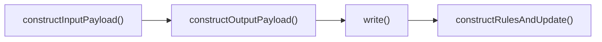
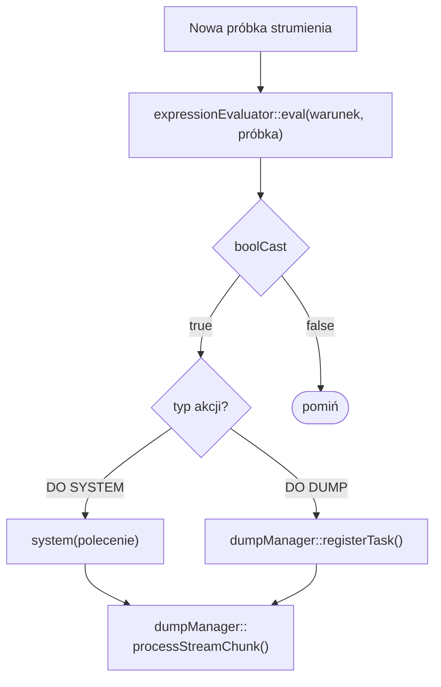
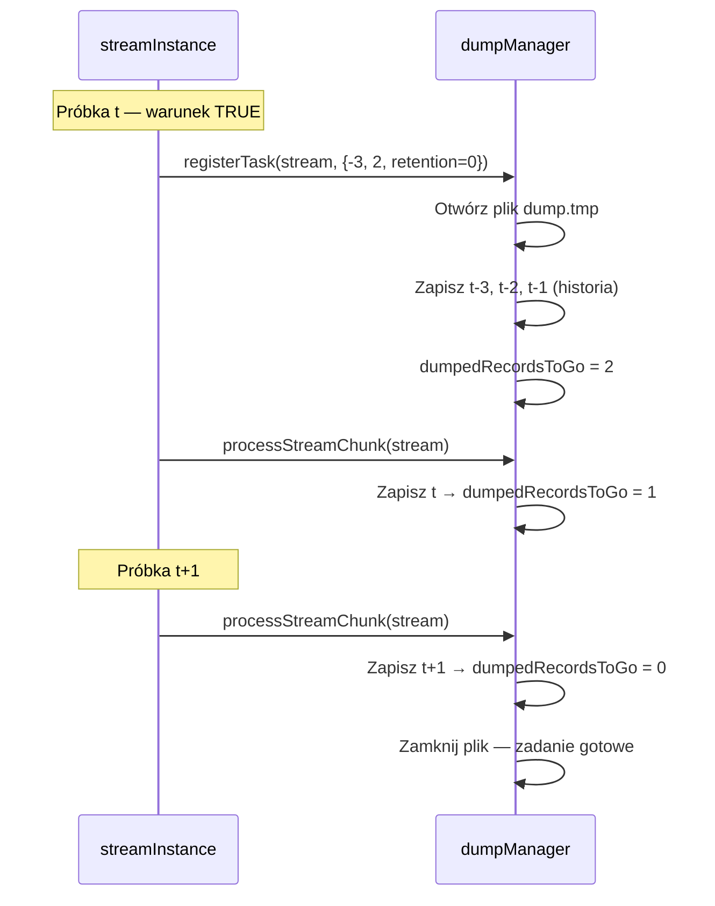
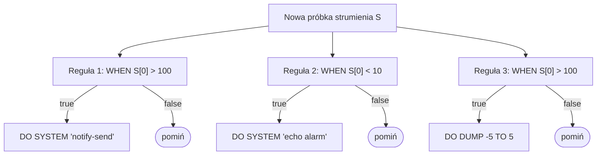

# Realizacja alarmowania

Mechanizm alarmowania (dyrektywa `RULE`) jest nieodłączną częścią głównej pętli przetwarzania. Nie jest osobnym procesem działającym w tle — reguły są ewaluowane **synchronicznie**, w tej samej iteracji siatki czasowej co obliczenia `SELECT`. Daje to pewność, że alarm zawsze odnosi się do danych właśnie obliczonych, a nie z poprzedniego cyklu.

***

## Miejsce RULE w cyklu przetwarzania

Przypomnijmy schemat funkcji `processRows()` opisanej w rozdziale [Algorytm przeglądu drzewa zapytań](algorytm-przegladu-drzewa-zapytan.md). Dla każdego zapytania nie będącego deklaracją wykonywane są kolejno cztery kroki (Rys. 45):



_Rys. 45. Kolejność kroków przetwarzania jednego zapytania_

Krok czwarty — `constructRulesAndUpdate()` — to właśnie wykonanie wszystkich reguł przypiętych do bieżącego zapytania. Wywoływany jest po zapisaniu wyników `SELECT` na dysk, co oznacza, że reguła zawsze ocenia **gotową, właśnie obliczoną próbkę** strumienia.

***

## Ewaluacja warunku WHEN

Każda reguła zawiera listę tokenów opisujących wyrażenie logiczne (pole `condition` struktury `rule`). W momencie ewaluacji system:

1. Pobiera `outputPayload` bieżącego zapytania — to bieżąca próbka strumienia.
2. Przekazuje warunek do silnika `expressionEvaluator::eval()` — **tego samego silnika**, który oblicza wyrażenia `SELECT`.
3. Rzutuje wynik na wartość logiczną (`boolCast`): każda niezerowa wartość liczbowa to `true`, zero to `false`.

Jeśli warunek jest spełniony, wykonywana jest skojarzony z regułą akcja (`DO SYSTEM` lub `DO DUMP`). Jeśli niespełniony — reguła jest pomijana bez żadnych efektów ubocznych. Pełny przepływ przedstawia Rys. 46.



_Rys. 46. Przepływ ewaluacji reguły_

***

## Akcja DO SYSTEM

Wywołanie `DO SYSTEM` jest najprostsze: system wywołuje `::system(polecenie)` bezpośrednio w wątku przetwarzania. Wywołanie jest **synchroniczne** — xretractor czeka na zakończenie procesu przed przejściem do następnej reguły.

Kod wyjścia polecenia jest sprawdzany:
- `0` — sukces, brak wpisu w logu.
- `≠ 0` — xretractor loguje błąd przez spdlog z kodem wyjścia.
- Niepowodzenie `system()` (np. brak powłoki) — logowany jako błąd krytyczny.

> **⚠️ Ostrzeżenie**
>
> Polecenie wykonywane jest synchronicznie. Długo trwające skrypty (np. wysyłanie dużych plików, wywołania sieciowe z timeoutem) opóźnią cały cykl przetwarzania. W takich przypadkach zaleca się uruchamianie procesu w tle: `DO SYSTEM 'mój_skrypt &'`.


***

## Akcja DO DUMP — szczegółowy algorytm

`DO DUMP` jest bardziej złożona, ponieważ wymaga zebrania danych **z przeszłości** (chwile przed zdarzeniem) i **z przyszłości** (chwile po zdarzeniu). Obsługuje to klasa `dumpManager`.

### Faza 1: dane historyczne (przy rejestracji zadania)

W chwili wyzwolenia reguły — zaraz po stwierdzeniu, że warunek jest prawdziwy — `dumpManager::registerTask()`:

1. Tworzy plik docelowy na dysku (POSIX `open()` z flagą `O_CREAT | O_TRUNC`).
2. Jeśli `step_back < 0`, odczytuje `|step_back|` próbek z historycznego bufora strumienia.  
   Dane historyczne istnieją, bo każdy strumień przechowuje okno poprzednich próbek niezbędne do obliczeń w oknach AGSE.
3. Zapisuje próbki historyczne do pliku **od najstarszej do najnowszej** (tzn. od `step_back` do `–1`).
4. Oblicza, ile próbek z przyszłości jeszcze pozostało do zebrania (`dumpedRecordsToGo = |step_forward - step_back| - |step_back|`).
5. Jeśli `step_back ≥ 0` (opóźnienie startu), ustawia `delayDumpRecordsToGo = step_back`.

```
Przykład: DUMP -3 TO 2
  Przy rejestracji: zapisz próbki t-3, t-2, t-1  (history)
  Do zebrania z przyszłości: 2 próbki (t, t+1)
  dumpedRecordsToGo = 2
```

### Faza 2: dane przyszłe (kolejne iteracje pętli)

Po rejestracji zadanie trafia do kolejki `bookOfTasks[streamName]`. W każdej kolejnej iteracji siatki czasowej (gdy strumień produkuje nową próbkę) wywoływane jest `dumpManager::processStreamChunk()`:

1. Dla każdego aktywnego zadania w kolejce (`dumpedRecordsToGo > 0`):
   - Jeśli `delayDumpRecordsToGo > 0` — dekrementuj i pomiń (opóźnienie startu).
   - Wpp. — zapisz bieżącą próbkę do pliku i dekrementuj `dumpedRecordsToGo`.
2. Gdy `dumpedRecordsToGo` osiągnie 0 — zamknij deskryptor pliku i usuń zadanie z kolejki.

Pełna sekwencja dla `DUMP -3 TO 2` przedstawiona jest na Rys. 47.



_Rys. 47. Sekwencja zbierania danych przez DO DUMP –3 TO 2_

### Przypadek opóźnionego startu (step\_back ≥ 0)

Gdy `step_back` jest nieujemny, zrzut nie zaczyna się od chwili zdarzenia, lecz od `step_back` próbek **po** zdarzeniu:

```
Przykład: DUMP 2 TO 5
  Przy rejestracji: delayDumpRecordsToGo = 2
  Próbka t   → pomiń (delay=2→1)
  Próbka t+1 → pomiń (delay=1→0)
  Próbka t+2 → zapisz (dumpedRecordsToGo = 3→2)
  Próbka t+3 → zapisz (dumpedRecordsToGo = 2→1)
  Próbka t+4 → zapisz (dumpedRecordsToGo = 1→0) — koniec
```

***

## Retencja (RETENTION N)

Bez klauzuli `RETENTION` każde wyzwolenie reguły nadpisuje jeden plik `<strumień>_<reguła>_dump.tmp`. Pojemność kolejki `bookOfTasks` wynosi wtedy 1 — nowe zadanie wypycha stare (i zamyka jego deskryptor).

Z klauzulą `RETENTION N`:
- Pojemność kolejki `bookOfTasks` ustawiana jest na `N`.
- Numer pliku rotuje modulo `N`: `_dump_0.tmp`, `_dump_1.tmp`, …, `_dump_(N-1).tmp`.
- Gdy `N`-te zadanie trafia do kolejki, najstarsze (jeszcze niezakończone) jest **usuwane** — destruktor `dumpTask` zamyka otwarty deskryptor.

Oznacza to, że przy częstych zdarzeniach i małym `N` nieukończony zrzut może zostać przerwany. Wartość `N` powinna być dobrana tak, aby czas zbierania jednego zrzutu (`|step_back| + step_forward` cykli) był mniejszy niż interwał między zdarzeniami pomnożony przez `N`.

***

## Format pliku zrzutu

Plik zawiera surowe rekordy binarne bez żadnego nagłówka — każdy rekord ma rozmiar określony przez deskryptor (`descriptor.getSizeInBytes()`). Format jest identyczny z formatem używanym przez artefakty strumienia, co pozwala odczytać go narzędziem `xtrdb` po ręcznym podaniu schematu:

```
$ xtrdb
> storage <ścieżka>
> open <strumień>_<reguła>_dump { <typ> <pole> }
> list
> quit
```

***

## Wiele reguł — kolejność ewaluacji

Do jednego strumienia można przypiąć wiele reguł. Wszystkie ewaluowane są w jednej iteracji `constructRulesAndUpdate()`, w kolejności ich deklaracji w pliku `.rql`. Każda reguła jest niezależna — spełnienie jednej nie wpływa na ewaluację pozostałych (Rys. 48).



_Rys. 48. Niezależna ewaluacja wielu reguł na tym samym strumieniu_

***

## Ograniczenia i uwagi praktyczne

| Sytuacja | Zachowanie |
|---|---|
| Warunek spełniony dwa razy z rzędu (np. pomiar stale powyżej progu) | Każda próbka rejestruje nowe zadanie DUMP — pliki nakładają się przy braku RETENTION |
| Strumień wejściowy `DECLARE` jako cel `ON` | Błąd kompilacji — reguły można podpiąć wyłącznie pod `SELECT` |
| Niedostateczna historia (bufor krótszy niż `|step_back|`) | Zapis zawiera tyle próbek, ile jest dostępnych; brak błędu |
| Plik docelowy niedostępny (brak katalogu STORAGE) | Błąd krytyczny `FatalError` — xretractor kończy działanie |
| DO SYSTEM zwraca niezerowy kod | Błąd w logu spdlog; przetwarzanie kontynuuje |
