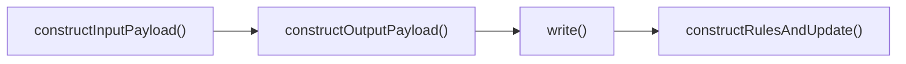
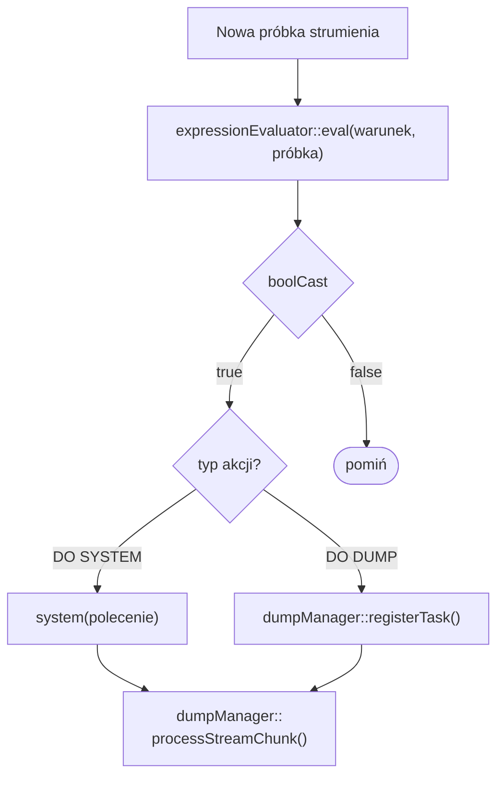
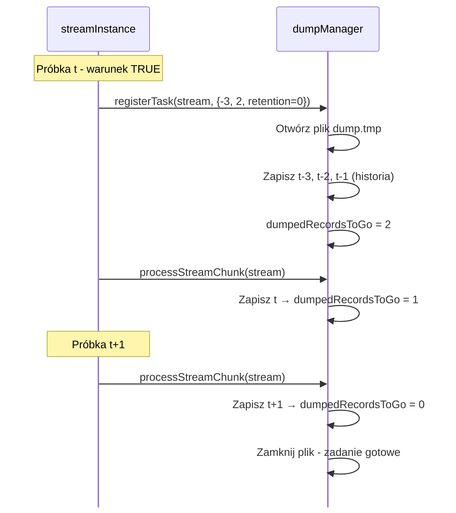
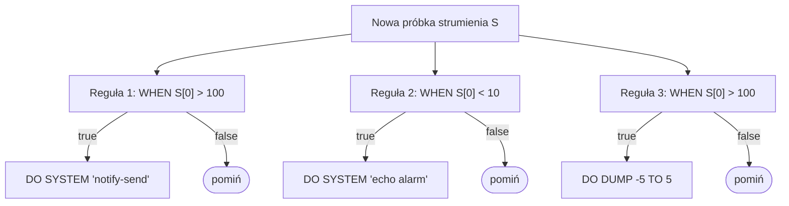

# Realizacja alarmowania

Mechanizm alarmowania (dyrektywa `RULE`) jest nieodłączną częścią głównej pętli przetwarzania. Nie jest osobnym procesem działającym w tle - reguły są ewaluowane **synchronicznie**, w tej samej iteracji siatki czasowej co obliczenia `SELECT`. Daje to pewność, że alarm zawsze odnosi się do danych właśnie obliczonych, a nie z poprzedniego cyklu.

***

## Miejsce RULE w cyklu przetwarzania

Przypomnijmy schemat funkcji `processRows()` opisanej w rozdziale [Algorytm przeglądu drzewa zapytań](algorytm-przegladu-drzewa-zapytan.md). Dla każdego zapytania nie będącego deklaracją wykonywane są kolejno cztery kroki (Rys. 49):


```mermaid
%%{init: {"markdownAutoWrap": false}}%%
flowchart LR
    A["constructInputPayload()"] --> B["constructOutputPayload()"]
    B --> C["write()"]
    C --> D["constructRulesAndUpdate()"]
```

_Rys. 49. Kolejność kroków przetwarzania jednego zapytania_

Krok czwarty - `constructRulesAndUpdate()` - to właśnie wykonanie wszystkich reguł przypiętych do bieżącego zapytania. Wywoływany jest po zapisaniu wyników `SELECT` na dysk, co oznacza, że reguła zawsze ocenia **gotową, właśnie obliczoną próbkę** strumienia.

***

## Ewaluacja warunku WHEN

Każda reguła zawiera listę tokenów opisujących wyrażenie logiczne (pole `condition` struktury `rule`). W momencie ewaluacji system:

1. Pobiera `outputPayload` bieżącego zapytania - to bieżąca próbka strumienia.
2. Przekazuje warunek do silnika `expressionEvaluator::eval()` - **tego samego silnika**, który oblicza wyrażenia `SELECT`.
3. Rzutuje wynik na wartość logiczną (`boolCast`): każda niezerowa wartość liczbowa to `true`, zero to `false`.

Jeśli warunek jest spełniony, wykonywana jest skojarzony z regułą akcja (`DO SYSTEM` lub `DO DUMP`). Jeśli niespełniony - reguła jest pomijana bez żadnych efektów ubocznych. Pełny przepływ przedstawia Rys. 50.


```mermaid
%%{init: {"markdownAutoWrap": false}}%%
flowchart TD
    A["Nowa próbka strumienia"] --> B["expressionEvaluator::eval(warunek, próbka)"]
    B --> C{boolCast}
    C -->|true| D{typ akcji?}
    C -->|false| E([pomiń])
    D -->|DO SYSTEM| F["system(polecenie)"]
    D -->|DO DUMP| G["dumpManager::registerTask()"]
    F --> H["dumpManager::<br/>processStreamChunk()"]
    G --> H
```

_Rys. 50. Przepływ ewaluacji reguły_

***

## Akcja DO SYSTEM

Wywołanie `DO SYSTEM` jest najprostsze: system wywołuje `::system(polecenie)` bezpośrednio w wątku przetwarzania. Wywołanie jest **synchroniczne** - xretractor czeka na zakończenie procesu przed przejściem do następnej reguły.

Kod wyjścia polecenia jest sprawdzany:
- `0` - sukces, brak wpisu w logu.
- `≠ 0` - xretractor loguje błąd przez spdlog z kodem wyjścia.
- Niepowodzenie `system()` (np. brak powłoki) - logowany jako błąd krytyczny.

> **⚠️ Ostrzeżenie**
>
> Polecenie wykonywane jest synchronicznie. Długo trwające skrypty (np. wysyłanie dużych plików, wywołania sieciowe z timeoutem) opóźnią cały cykl przetwarzania. W takich przypadkach zaleca się uruchamianie procesu w tle: `DO SYSTEM 'mój_skrypt &'`.


***

## Akcja DO DUMP - szczegółowy algorytm

`DO DUMP` jest bardziej złożona, ponieważ wymaga zebrania danych **z przeszłości** (chwile przed zdarzeniem) i **z przyszłości** (chwile po zdarzeniu). Obsługuje to klasa `dumpManager`.

<div class="timeline compact">

- **Zdarzenie** - warunek `WHEN` prawdziwy dla próbki `t`, reguła wywołuje `dumpManager::registerTask()`
- **Faza 1** - zapis `|step_back|` próbek historycznych z bufora strumienia (albo ustawienie opóźnienia startu)
- **Faza 2** - w kolejnych iteracjach `processStreamChunk()` dopisuje próbki przyszłe
- **Koniec** - `dumpedRecordsToGo` osiąga 0, plik zostaje zamknięty, zadanie opuszcza kolejkę

</div>

### Faza 1: dane historyczne (przy rejestracji zadania)

W chwili wyzwolenia reguły - zaraz po stwierdzeniu, że warunek jest prawdziwy - `dumpManager::registerTask()`:

1. Usuwa istniejący wpis pod nazwą pliku zrzutu (`unlink()`) i tworzy nowy plik przez POSIX `open()` z flagami `O_RDWR | O_CREAT | O_EXCL | O_NOFOLLOW | O_CLOEXEC`.
2. Jeśli `step_back < 0`, odczytuje `|step_back|` próbek z historycznego bufora strumienia.  
   Dane historyczne istnieją, bo każdy strumień przechowuje okno poprzednich próbek niezbędne do obliczeń w oknach AGSE.
3. Zapisuje próbki historyczne do pliku **od najstarszej do najnowszej** (tzn. od `step_back` do `–1`).
4. Oblicza, ile próbek z przyszłości jeszcze pozostało do zebrania (`dumpedRecordsToGo = |step_forward - step_back| - |step_back|`).
5. Jeśli `step_back ≥ 0` (opóźnienie startu), ustawia `delayDumpRecordsToGo = step_back`.

```
Przykład: DUMP -3 TO 2
  Przy rejestracji: zapisz próbki t-3, t-2, t-1  (history)
  Do zebrania z przyszłości: 2 próbki (t, t+1)
  dumpedRecordsToGo = 2
```

Dla reguły dołączonej ad hoc historia musi powstać w całości po jej dołączeniu. Przy zakresie `DUMP -H TO M` reguła może po raz pierwszy ocenić warunek `WHEN` na rekordzie `H+1` po dołączeniu: poprzednie `H` rekordów stanowi historię, a nowy rekord jest próbką bieżącą. Bez części historycznej (`H=0`) warunek jest oceniany już dla pierwszego nowego rekordu. Strumień `MEMORY` musi przechowywać co najmniej `H+1` rekordów; żądanie sięgające głębiej jest odrzucane bez dołączenia reguły.

### Faza 2: dane przyszłe (kolejne iteracje pętli)

Po rejestracji zadanie trafia do kolejki `bookOfTasks[streamName]`. W każdej kolejnej iteracji siatki czasowej (gdy strumień produkuje nową próbkę) wywoływane jest `dumpManager::processStreamChunk()`:

1. Dla każdego aktywnego zadania w kolejce (`dumpedRecordsToGo > 0`):
   - Jeśli `delayDumpRecordsToGo > 0` - dekrementuj i pomiń (opóźnienie startu).
   - Wpp. - zapisz bieżącą próbkę do pliku i dekrementuj `dumpedRecordsToGo`.
2. Gdy `dumpedRecordsToGo` osiągnie 0 - zamknij deskryptor pliku i usuń zadanie z kolejki.

Pełna sekwencja dla `DUMP -3 TO 2` przedstawiona jest na Rys. 51.


```mermaid
%% pdf-width: 85%
%% pdf-height: 55%
%%{init: {"markdownAutoWrap": false, "sequence": {"mirrorActors": false, "messageMargin": 22, "boxMargin": 6}}}%%
sequenceDiagram
    participant SI as streamInstance
    participant DM as dumpManager

    note over SI: Próbka t - warunek TRUE
    SI->>DM: registerTask(stream, {-3, 2, retention=0})
    DM->>DM: Otwórz plik dump.tmp
    DM->>DM: Zapisz t-3, t-2, t-1 (historia)
    DM->>DM: dumpedRecordsToGo = 2
    SI->>DM: processStreamChunk(stream)
    DM->>DM: Zapisz t → dumpedRecordsToGo = 1

    note over SI: Próbka t+1
    SI->>DM: processStreamChunk(stream)
    DM->>DM: Zapisz t+1 → dumpedRecordsToGo = 0
    DM->>DM: Zamknij plik - zadanie gotowe
```

_Rys. 51. Sekwencja zbierania danych przez DO DUMP –3 TO 2_

### Przypadek opóźnionego startu (step\_back ≥ 0)

Gdy `step_back` jest nieujemny, zrzut nie zaczyna się od chwili zdarzenia, lecz od `step_back` próbek **po** zdarzeniu:

```
Przykład: DUMP 2 TO 5
  Przy rejestracji: delayDumpRecordsToGo = 2
  Próbka t   → pomiń (delay=2→1)
  Próbka t+1 → pomiń (delay=1→0)
  Próbka t+2 → zapisz (dumpedRecordsToGo = 3→2)
  Próbka t+3 → zapisz (dumpedRecordsToGo = 2→1)
  Próbka t+4 → zapisz (dumpedRecordsToGo = 1→0) - koniec
```

***

## Retencja (RETENTION N)

Bez klauzuli `RETENTION` każde wyzwolenie reguły zapisuje zrzut pod jedną nazwą `<strumień>_<reguła>_dump.tmp`. Z klauzulą `RETENTION N` pierwsze wyzwolenie reguły w danym przebiegu silnika tworzy `_dump_0.tmp`, a kolejne numery plików rotują modulo `N`: `_dump_0.tmp`, `_dump_1.tmp`, …, `_dump_(N-1).tmp`.

Plik zrzutu zawsze powstaje od nowa. Silnik kasuje to, co leży pod jego nazwą - także dowiązanie symboliczne albo twarde, za którym nie podąża - i tworzy nowy plik na wyłączność (`O_EXCL | O_NOFOLLOW`). Zapis nie trafia więc do celu dowiązania podstawionego pod końcową nazwę zrzutu. Ta ochrona nie obejmuje podmiany katalogów nadrzędnych podczas rozwiązywania ścieżki; nie jest gwarancją atomowego ograniczenia zapisu do katalogu magazynu. Proces, który trzymał poprzedni zrzut otwarty, nadal widzi jego dawną zawartość. Gdy pliku nie da się utworzyć, silnik kończy pracę błędem krytycznym z nazwą pliku i przyczyną.

Zadania zrzutu czekają w kolejce `bookOfTasks`, jednej na strumień i wspólnej dla wszystkich jego reguł `DO DUMP`. Jej pojemność to największe wymaganie wśród tych reguł: `N` dla reguły z `RETENTION N`, 1 dla reguły bez tej klauzuli. Pojemność tylko rośnie - zmniejszenie skasowałoby zadania już przyjęte. Gdy kolejka jest pełna, nowe zadanie wypycha najstarsze niezakończone, niezależnie od tego, z której reguły pochodzi, a destruktor `dumpTask` zamyka jego deskryptor.

Wynikają z tego dwa przypadki dla reguły bez `RETENTION`:
- Jest jedyną regułą `DO DUMP` na strumieniu: pojemność wynosi 1, więc nowe wyzwolenie przerywa poprzedni, nieukończony zrzut.
- Na tym samym strumieniu inna reguła ma `RETENTION N`: kolejne wyzwolenia mogą zbierać dane równocześnie. Każde pisze do własnego pliku, pod nazwą `_dump.tmp` zostaje zrzut najnowszego, a starsze dokańczają zapis do plików już usuniętych z katalogu.

Przy częstych zdarzeniach i małej pojemności nieukończony zrzut może zostać przerwany. Pojemność powinna być dobrana tak, aby czas zbierania jednego zrzutu (`|step_back| + step_forward` cykli) był mniejszy niż interwał między zdarzeniami pomnożony przez pojemność.

***

## Format pliku zrzutu

Plik zawiera surowe rekordy binarne bez żadnego nagłówka - każdy rekord ma rozmiar określony przez deskryptor (`descriptor.getSizeInBytes()`). Format jest identyczny z formatem używanym przez artefakty strumienia, co pozwala odczytać go narzędziem `xtrdb` po ręcznym podaniu schematu:

```
$ xtrdb
> storage <ścieżka>
> open <strumień>_<reguła>_dump { <typ> <pole> }
> list
> quit
```

### Kontrakt zrzutu: same wartości, bez NULL i bez przerw

Zrzut jest **bezgłowym blokiem bajtów**. `dumpManager` zapisuje wprost `payload->span()`, rekord po rekordzie, i nie tworzy przy nim żadnego pliku towarzyszącego: nie ma `.desc`, więc schemat trzeba znać z zewnątrz, i nie ma `.meta`, więc mapa `NULL` oraz przerwy w transmisji nie mają gdzie trafić. Rozszerzenie `.tmp` sugeruje plik roboczy, ale to artefakt końcowy - po zamknięciu deskryptora nie następuje żadne przemianowanie.

Wynika z tego jedna konsekwencja, którą trzeba znać przed użyciem zrzutu jako wejścia dla czegokolwiek:

| Co silnik wie o rekordzie | Co widzi czytelnik zrzutu |
| ------------------------- | ------------------------- |
| pole ma wartość `NULL` - z nullfill, z luki transmisji, z przepełnienia arytmetyki, z dzielenia przez zero | wartość zastępcza typu: `0` dla `BYTE`, `INTEGER`, `UINT`, `FLOAT` i `DOUBLE`, `0/1` dla `RATIONAL`, bajty zerowe dla `STRING` |
| przed rekordem była przerwa w transmisji (wpis `gap` w indeksie `.meta`) | nic - rekordy leżą jeden za drugim, bez znacznika |
| rekordu nie ma w ogóle, bo żądane okno sięga głębiej niż zgromadzona historia | rekord wyzerowany, nieodróżnialny od rekordu o wartościach zerowych |

Zero w pliku zrzutu jest więc **nierozróżnialne** od prawdziwego zera, od `NULL` i od rekordu, którego silnik nigdy nie miał. Nie jest to przeoczenie implementacji, lecz granica formatu: `NULL` i przerwa są pojęciami **wnętrza silnika** - żyją w mapie `NULL` payloadu i w indeksie `.meta` towarzyszącym artefaktowi, tam są przechowywane i tam są przetwarzane - a jednolitego sposobu zapisania ich na zewnątrz system na dziś nie ma. Zrzut jest migawką wartości, nie zapisem tego, co silnik wiedział.

Gdy potrzebna jest wierność, informację o braku niosą dwie inne drogi:

* **artefakt strumienia** (`SELECT … STREAM`) wraz ze swoim plikiem `.meta` - `xtrdb` wypisuje mapę `NULL` i przerwy poleceniami `meta` oraz `metaraw` (→ [Pliki](../architektura-systemu-przetwarzania-danych/format-zapisu-danych/pliki.md));
* **kanał klienta** `xqry --jsonl`, w którym brak wartości jest osobnym `null` JSON-owym, per element pola tablicowego (→ [API monitorowania strumieni](../zalaczniki/api-monitorowania-strumieni.md)).

Funkcja `null2zero` w zapytaniu trzecią drogą nie jest: zamienia brak na zero jawnie i w zapytaniu, więc jest konwersją stratną, a nie sposobem eksportu informacji o braku (→ [Operatory agregujące](../konstrukcja-jezyka-zapytan/polecenie-select/operatory-agregujace.md)).

***

## Wiele reguł - kolejność ewaluacji

Do jednego strumienia można przypiąć wiele reguł. Wszystkie ewaluowane są w jednej iteracji `constructRulesAndUpdate()`, w kolejności ich deklaracji w pliku `.rql`. Każda reguła jest niezależna - spełnienie jednej nie wpływa na ewaluację pozostałych (Rys. 52).


```mermaid
%%{init: {"markdownAutoWrap": false}}%%
%% pdf-width: 100%
flowchart TD
    A["Nowa próbka strumienia S"] --> R1["Reguła 1: WHEN S[0] > 100"]
    A --> R2["Reguła 2: WHEN S[0] < 10"]
    A --> R3["Reguła 3: WHEN S[0] > 100"]
    R1 -->|true| A1["DO SYSTEM 'notify-send'"]
    R2 -->|true| A2["DO SYSTEM 'echo alarm'"]
    R3 -->|true| A3["DO DUMP -5 TO 5"]
    R1 -->|false| X1([pomiń])
    R2 -->|false| X2([pomiń])
    R3 -->|false| X3([pomiń])
```

_Rys. 52. Niezależna ewaluacja wielu reguł na tym samym strumieniu_

***

## Ograniczenia i uwagi praktyczne

| Sytuacja | Zachowanie |
|---|---|
| Warunek spełniony dwa razy z rzędu (np. pomiar stale powyżej progu) | Każda próbka rejestruje nowe zadanie DUMP - pliki nakładają się przy braku RETENTION |
| Strumień wejściowy `DECLARE` jako cel `ON` | Błąd kompilacji - reguły można podpiąć wyłącznie pod `SELECT` |
| Reguła z pliku planu żąda rekordów sprzed początku strumienia | Część historyczna zrzutu nie jest skracana; nieistniejące rekordy są zastępowane zerami |
| Za mało rekordów po dołączeniu reguły ad hoc (`DUMP -H TO M`) | Reguła czeka z oceną `WHEN` na rekord `H+1` po dołączeniu; dla `H=0` ocenia pierwszy nowy rekord |
| Reguła ad hoc z historią `H > 0` na `MEMORY` o pojemności `N <= H` | Żądanie jest odrzucane bez dołączenia reguły; potrzeba `H+1` slotów na historię i rekord bieżący |
| Plik docelowy niedostępny (brak katalogu STORAGE) | Błąd krytyczny `FatalError` - xretractor kończy działanie |
| DO SYSTEM zwraca niezerowy kod | Błąd w logu spdlog; przetwarzanie kontynuuje |

Automatyczne wyznaczanie pojemności dla historycznego `DUMP` w regule z pliku planu pozostaje osobnym problemem opisanym w [#419](https://github.com/michalwidera/retractordb/issues/419): kompilator uwzględnia `H` zamiast `H+1`. Kontrola pojemności przy dołączaniu reguły ad hoc wymaga już `H+1` slotów.
