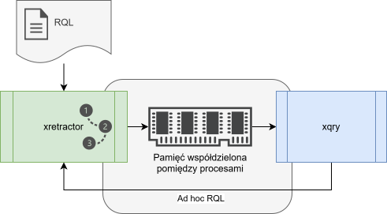

# Zapytania Ad hoc

Przez zapytania Ad hoc rozumiemy zapytania kierowane do działającego systemu. W typowym scenariuszu jaki zakładano w przypadku rozwoju systemu, założono we wstępnie rozpatrywanych scenariuszach, że użytkownik systemu będzie znał wszystkie zapytania i źródła danych wymagane do uzyskania przetworzonych serii czasowych.

W trakcie rozwoju systemu pojawiły się jednak dodatkowe scenariusze, zakładające, że praca systemu nie powinna być przerywana a dodatkowe zapytania powinny zostać dołączone do planu realizacji zapytań. Tego typu funkcjonalność będziemy nazywać zapytaniami Ad hoc, dołączanymi do systemu w trakcie jego działania bez przerywania jego pracy.

<figure><figcaption><p>Rys. 48. Przepływ sterowania dla zapytań Ad Hoc</p></figcaption></figure>

Na Rys. 48 przedstawiono opisany powyżej przepływ sterowania. Plik z zapytaniami i dyrektywami najpierw jest kierowany do procesu xretractor. Następnie poprzez pamięć współdzieloną proces xqry pobiera dane z xretractor. Tym samym procesem możemy wysłać do procesu xretractor polecenie. W tym poleceniu zawieramy tekst dodatkowego zapytania, które xretractor powinien dołączyć do przetwarzanego drzewa.

### Co można dołączyć w locie

Kanałem ad hoc można dołączyć **dokładnie jedno polecenie `SELECT`, `DECLARE`
albo `RULE`**. Dyrektywy kompilatora oraz program zawierający kilka poleceń są
odrzucane bez zmiany aktywnego planu.

Nowe źródło można zadeklarować bez zatrzymywania pracującego silnika:

```
$ xqry -a "DECLARE a BYTE STREAM C, 1 FILE 'data3.txt'"
```

Kod wyjścia `0` bez komunikatu oznacza przyjęcie deklaracji. Deklaracja otrzymuje bazę
indeksu logicznego w pierwszym należnym jej slocie.
Jeżeli dołączone później zapytanie wymaga okna albo przesunięcia, emisja czeka,
aż źródło zgromadzi pełną wymaganą historię. `HOLD` nie jest do tego potrzebny;
pozostaje opcjonalną dyrektywą opóźniającą fizyczny odczyt. Ponowne `DECLARE`
istniejącej nazwy jest odrzucane, a nie traktowane jako zmiana konfiguracji.

Przy kilku działających instancjach samo `DECLARE` nie wskazuje właściciela,
ponieważ nie ma klauzuli `FROM`. Trzeba wtedy podać cel jawnie:

```
$ xqry --server pomiary -a "DECLARE a BYTE STREAM C, 1 FILE 'data3.txt'"
```

Dołączanie pierwszej deklaracji do serwera uruchomionego z pustym planem nie
jest jeszcze obsługiwane; kanał ad hoc wymaga aktywnego modelu danych.

Reguła dołączana w locie może wykonywać wyłącznie `DO DUMP`. `DO SYSTEM`
pozostaje dostępne w pliku pełnego planu, ponieważ udostępnienie go przez IPC
pozwalałoby klientowi wykonywać dowolne polecenia powłoki na koncie serwera.
Cel `ON` musi być istniejącym strumieniem utworzonym przez `SELECT`. Reguła
zaczyna działać dopiero po zgromadzeniu od chwili dołączenia całej wymaganej
historii; jeżeli pamięciowy strumień przechowuje jej za mało, żądanie jest
odrzucane.

```bash
xqry --server pomiary -a \
  "RULE alarm ON temperatura WHEN temperatura[0] > 80 DO DUMP -10 TO 5"
```

Przy wielu instancjach klient kieruje `SELECT` według właścicieli strumieni z
`FROM`, a `RULE` według strumienia z `ON`. Zapytanie łączące źródła z kilku
serwerów jest odrzucane. Nowe nazwy strumieni i pliki magazynu są zgłaszane w
magistrali przed modyfikacją aktywnego planu, więc ad hoc nie może nadpisać
zasobu innej instancji.

Ad hoc powiększa istniejący plan. Do jego pełnego, atomowego zastąpienia — także
w instancji bezczynnej — służy `xqry --reset plik.rql`.

### Kiedy zaczyna się strumień dołożony ad hoc

Plan zbudowany od początku pracy systemu numeruje rekordy od początku
logicznego wyliczonego przez kompilator. Zapytanie dołożone ad hoc nie ma
takiej przeszłości — jego pierwszym rekordem jest **pierwszy slot, w którym
runtime je zobaczył**, a nie slot zerowy planu. Import jest przy tym atomowy:
skompilowane drzewo i jego instancje strumieni są publikowane pod wspólnym
zamkiem, a pętla wykonania przebudowuje siatkę czasu bez cofania się, nawet
jeśli nowe zapytanie wnosi do systemu nowe tempo.

> **_NOTE:_** Zachowanie to ma pokrycie w teście `issue227_join_alignment`
> (przypadek `adhoc-origin`).

### Przykład

Przykład rozpoczniemy od przygotowania prostego zapytania:

```
DECLARE a BYTE STREAM A, 1 FILE 'data1.txt'
DECLARE a BYTE STREAM B, 2 FILE 'data2.txt'
SELECT * STREAM str1 FROM A+B
```

Plik z zapytaniem zapiszemy pod nazwą qplan1.rql. Do poprawnej realizacji zapytania konieczne jest również przygotowanie plików data1.txt i data2.txt. Proponuję wypełnić data1.txt kolejnymi liczbami od 1 do 6 każda w nowej linii, a w pliku data2.txt liczby od 10 do 15. W tak przygotowanym katalogu uruchamiamy polecenie

```
$ xretractor qplan1.rql
```

Jeśli poprzednio w tym katalogu wykonywaliśmy jakieś operacje i stworzyliśmy strumień str1 o innym schemacie – otrzymamy błąd pt. „Error in data descriptor file”. Pojawi się tam również informacja o różnicach pomiędzy dwoma deskryptorami. W takim przypadku plik str1 oraz str1.desc powinniśmy usunąć i ponownie wykonać polecenie.

Proces xretractor rozpocznie przetwarzanie danych. Należy w tym momencie uruchomić kolejny terminal i wydać w nim polecenie:

```
$ xqry -d
name | duration | size | count | location  | cap
-----+----------+------+-------+-----------+----
str1 | 1        | 48   | 24    |           | 0
A    | 1        | -1   | 3     | data1.txt | 1
B    | 2        | -1   | 2     | data2.txt | 1
```

W postaci tabelarycznej wyświetli się co w danym systemie się przetwarza. Ile bajtów już napłynęło, z jakich plików dane są czytane. Ile danych zostało już przetworzonych. Oczekując bardziej opisowej formy możemy wydać następujące polecenie:

```
$ xqry -d -y
---
apiVersion: xqry/v1
streams:
  - name: str1
    delta: 1
    size: 214
    count: 107
  - name: A
    delta: 1
    count: 86
    location: data1.txt
  - name: B
    delta: 2
    count: 43
    location: data2.txt
```

Udzielona odpowiedź jest w formie yaml.

Aby dołożyć do systemu kolejne zapytanie musimy wydać polecenie:

```
$ xqry -a "SELECT * STREAM str2 FROM A#B"
```

Polecenie w tej formie wysyła do procesu xretractor nowe zapytanie. Brak komunikatu i kod
wyjścia `0` oznaczają przyjęcie. System otrzymując je prowadzi kompilację i złączy drzewa
planów zapytań; przy odmowie `xqry` zwraca kod niezerowy i zapisuje przyczynę diagnostyczną.

Jeśli zajrzymy ponownie do stanu systemu, zobaczymy następujący obraz:

```
$ xqry -d
name | duration | size | count | location  | cap
-----+----------+------+-------+-----------+----
str2 | 2/3      | 10   | 10    |           | 0
A    | 1        | -1   | 23    | data1.txt | 1
str1 | 1        | 312  | 156   |           | 0
B    | 2        | -1   | 12    | data2.txt | 1
```

Lub tak:

```
$ xqry -d -y
---
apiVersion: xqry/v1
streams:
  - name: str2
    delta: 2/3
    size: 7
    count: 7
  - name: A
    delta: 1
    count: 16
    location: data1.txt
  - name: str1
    delta: 1
    size: 298
    count: 149
  - name: B
    delta: 2
    count: 8
    location: data2.txt
```

Przyglądając się dokładniej zapytaniom za pomocą polecenia xqry zobaczymy następującą odpowiedź systemu dla zapytania str1:

```
$ xqry -t str1 -y
---
apiVersion: xqry/v1
stream:
  name: str1
  delta: 1
query: SELECT * STREAM str1 FROM A+B
fields:
  str1.A_0:
    type: BYTE
  str1.B_1:
    type: BYTE
```

oraz dla zapytania str2:

```
$ xqry -t str2 -y
---
apiVersion: xqry/v1
stream:
  name: str2
  delta: 2/3
query: SELECT * STREAM str2 FROM A#B
fields:
  str2.a:
    type: BYTE
```

Jak widać dodatkowe zapytanie str2 zostało poprawnie złączone z istniejącym planem realizacji zapytania. Widać też że zebranych danych jest o wiele mniej w porównaniu z str1.

> **_NOTE:_** Opisana funkcjonalność ma pokrycie w teście: `issue6_adhoc` opisanym w załączniku pt. [Testy Integracyjne](../zalaczniki/testy-integracyjne.md).
