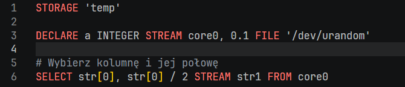
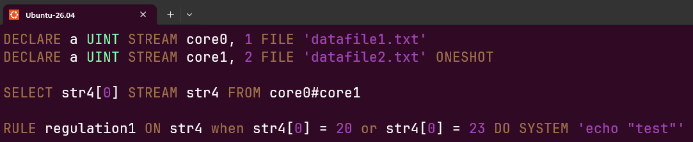
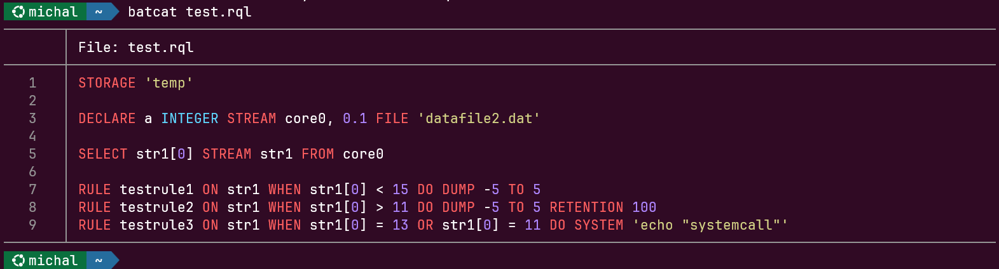

# Kolorowanie składni RQL

Pliki zapytań RetractorDB mają rozszerzenie `.rql`. Repozytorium dostarcza gotowe definicje kolorowania składni dla trzech środowisk: Visual Studio Code, Vim oraz narzędzia `bat`/`batcat`. Wszystkie potrzebne pliki znajdują się w katalogu `scripts/` projektu.

## Visual Studio Code

Rozszerzenie `rql-vscode` dodaje do VS Code pełną obsługę języka RQL: kolorowanie składni, rozpoznawanie rozszerzenia `.rql` oraz ikonę pliku.

**Instalacja z repozytorium GitHub:**

```bash
git clone https://github.com/michalwidera/rql-vscode.git
cd rql-vscode
npm install
npm run compile
code --install-extension *.vsix
```

Jeżeli repozytorium zawiera gotowy plik `.vsix`, można pominąć kompilację i zainstalować go bezpośrednio:

```bash
code --install-extension rql-vscode-*.vsix
```

Po instalacji VS Code automatycznie rozpozna pliki `.rql` i zastosuje kolorowanie składni. Brak konieczności modyfikacji ustawień użytkownika.

**Przykład podświetlonego zapytania w VS Code:**

```rql
STORAGE 'temp'

DECLARE a INTEGER STREAM core0, 0.1 FILE '/dev/urandom'

# Wybierz kolumnę i jej połowę
SELECT str[0], str[0] / 2 STREAM str1 FROM core0
```



Słowa kluczowe (`STORAGE`, `DECLARE`, `SELECT`, `FROM`) są podświetlane jako komendy, typy danych (`INTEGER`) jako typy, a komentarze zaczynające się od `#` lub `//` jako komentarze.

***

## Vim

Repozytorium zawiera dwa pliki Vima w katalogu `scripts/.vim/`:

| Plik                            | Opis                                                        |
| ------------------------------- | ----------------------------------------------------------- |
| `scripts/.vim/syntax/rql.vim`   | Definicja grup składniowych i ich przypisań kolorystycznych |
| `scripts/.vim/ftdetect/rql.vim` | Automatyczne wykrywanie typu pliku po rozszerzeniu `.rql`   |

### Instalacja przez buildrdb.sh

Najwygodniejsza metoda — skrypt kopiuje oba pliki do odpowiednich podkatalogów `~/.vim/`:

```bash
scripts/buildrdb.sh vimsyntax
```

Skrypt tworzy brakujące katalogi i informuje o lokalizacji docelowej:

```
-- RetractorQL vim syntax installed to /home/user/.vim
```

### Instalacja przez CMake

Cel `vimconf` z `scripts/CMakeLists.txt` kopiuje cały katalog `.vim` do katalogu domowego:

```bash
cmake --build build --target vimconf
```

### Instalacja ręczna

```bash
mkdir -p ~/.vim/syntax ~/.vim/ftdetect
cp scripts/.vim/syntax/rql.vim   ~/.vim/syntax/
cp scripts/.vim/ftdetect/rql.vim ~/.vim/ftdetect/
```

Po instalacji Vim automatycznie aktywuje kolorowanie dla każdego pliku z rozszerzeniem `.rql`. Plik `ftdetect/rql.vim` zawiera jedną linię:

```vim
au BufRead,BufNewFile *.rql set filetype=rql
```

### Podświetlane elementy

| Grupa Vima | Przykłady                                                                 |
| ---------- | ------------------------------------------------------------------------- |
| `Keyword`  | `SELECT`, `DECLARE`, `STREAM`, `FROM`, `FILE`, `RULE`, `ON`, `WHEN`, `DO` |
| `PreProc`  | `STORAGE`, `ROTATION`, `SUBSTRAT`                                         |
| `Operator` | `AND`, `OR`, `NOT`                                                        |
| `Constant` | `MEMORY`, `POSIX`, `DIRECT`, `GENERIC`, `TEXTSOURCE`                      |
| `Type`     | `INTEGER`, `FLOAT`, `BYTE`, `CHAR`, `UINT`, `STRING`, `DOUBLE`            |
| `Function` | `MIN`, `MAX`, `AVG`, `Count`, `Sqrt`, `Abs`, `ToNumber`                   |
| `Comment`  | `# komentarz`, `// komentarz`, `/* blok */`                               |
| `String`   | `'ścieżka/do/pliku.dat'`                                                  |
| `Number`   | `42`, `3.14`, `1/2`, `1e5`                                                |

**Przykład pliku zapytania z zaznaczonymi fragmentami:**

```rql
DECLARE a UINT STREAM core0, 1 FILE 'datafile1.txt'
DECLARE a UINT STREAM core1, 2 FILE 'datafile2.txt' ONESHOT

SELECT str4[0] STREAM str4 FROM core0#core1

RULE regulation1 \
ON str4 \
WHEN str4[0] = 20 OR str4[0] = 23 \
DO SYSTEM 'echo "test"'
```

Widok tekstu w edytorze vim.



***

## bat / batcat

Narzędzie `bat` (na niektórych dystrybucjach dostępne jako `batcat`) to ulepszony zamiennik `cat` z wbudowaną obsługą podświetlania składni. Obsługuje definicje syntaktyczne w formacie Sublime Text 3, które repozytorium RetractorDB dostarcza pod ścieżką `scripts/sublime/retractorql.sublime-syntax`.

### Wymaganie wstępne

Upewnij się, że `bat` jest zainstalowany:

```bash
# Debian/Ubuntu
sudo apt-get install bat

# Sprawdzenie polecenia (może być bat lub batcat zależnie od dystrybucji)
command -v batcat || command -v bat
```

### Instalacja przez buildrdb.sh

```bash
scripts/buildrdb.sh batsyntax
```

Skrypt samodzielnie wykrywa polecenie (`bat` lub `batcat`), kopiuje plik składni do właściwego katalogu konfiguracyjnego i przebudowuje pamięć podręczną syntaktyk:

```
-- RetractorQL syntax installed to /home/user/.config/bat/syntaxes
```

### Instalacja ręczna

```bash
# Wykryj nazwę polecenia
BAT=$(command -v batcat || command -v bat)

# Utwórz katalog na definicje syntaktyk
mkdir -p "$($BAT --config-dir)/syntaxes"

# Skopiuj definicję
cp scripts/sublime/retractorql.sublime-syntax "$($BAT --config-dir)/syntaxes/"

# Przebuduj pamięć podręczną
$BAT cache --build
```

### Użycie

Po instalacji `bat` automatycznie koloruje pliki `.rql`:

```bash
bat query.rql
```

Rozpoznawane jest też rozszerzenie `.desc` (pliki deskryptorów strumieni). Można wymusić podświetlanie ręcznie, jeśli plik ma inne rozszerzenie:

```bash
bat --language rql dowolny-plik.txt
```

**Weryfikacja instalacji — dostępne języki:**

```bash
bat --list-languages | grep -i rql
# RetractorQL:rql,desc
```

### Przykład wywołania

Dla pliku `query.rql` zawierającego:

```rql
STORAGE 'temp'

DECLARE a INTEGER STREAM core0, 0.1 FILE 'datafile2.dat'

SELECT str1[0] STREAM str1 FROM core0

RULE testrule1 ON str1 WHEN str1[0] < 15 DO DUMP -5 TO 5
RULE testrule2 ON str1 WHEN str1[0] > 11 DO DUMP -5 TO 5 RETENTION 100

RULE testrule3 \
ON str1 \
WHEN str1[0] = 13 OR str1[0] = 11 \
DO SYSTEM 'echo "systemcall"'
```

Wywołanie `bat query.rql` wyświetli zawartość pliku z numeracją linii i podświetleniem składni w terminalu, gdzie słowa kluczowe, typy, komentarze i literały łańcuchowe będą miały odrębne kolory zgodne z aktywnym motywem `bat` (Rys. 60).

<figure><figcaption><p>Rys. 60. Podświetlenie składni RQL w terminalu — polecenie batcat</p></figcaption></figure>
